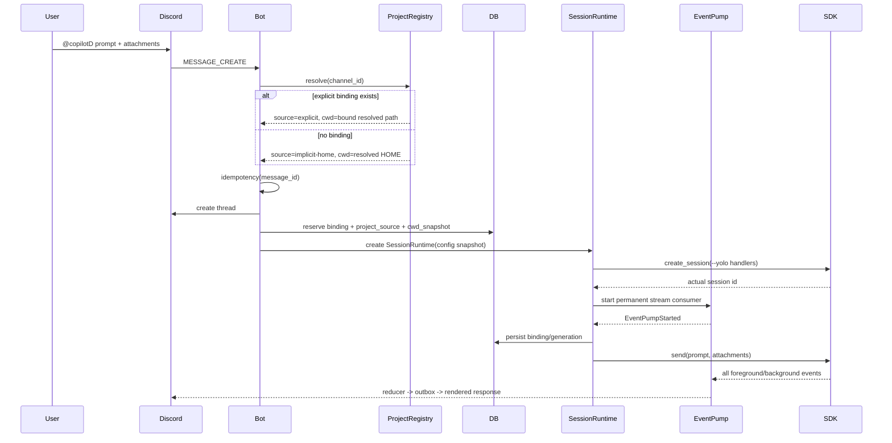
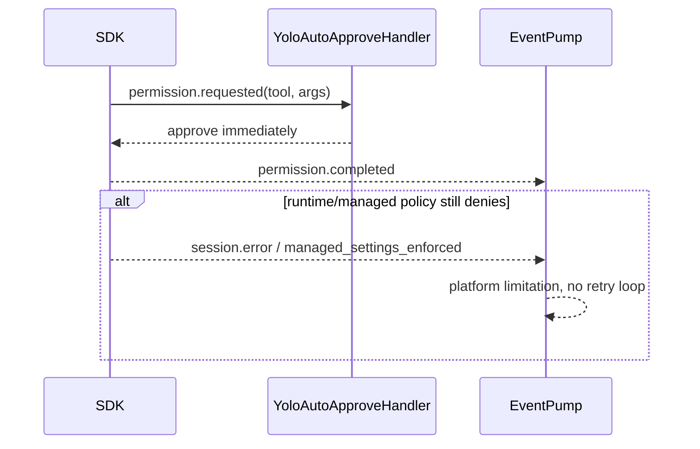
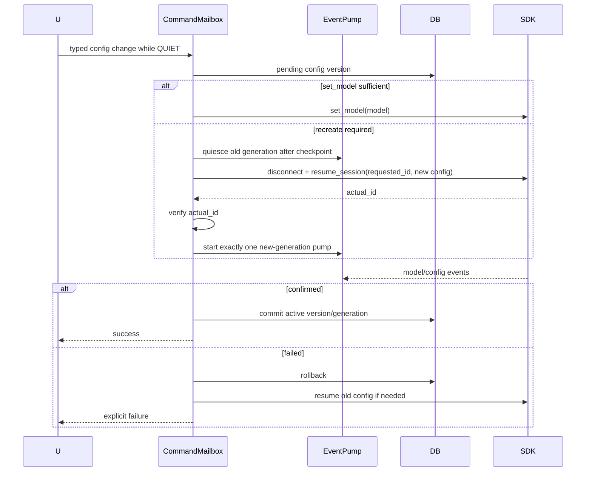
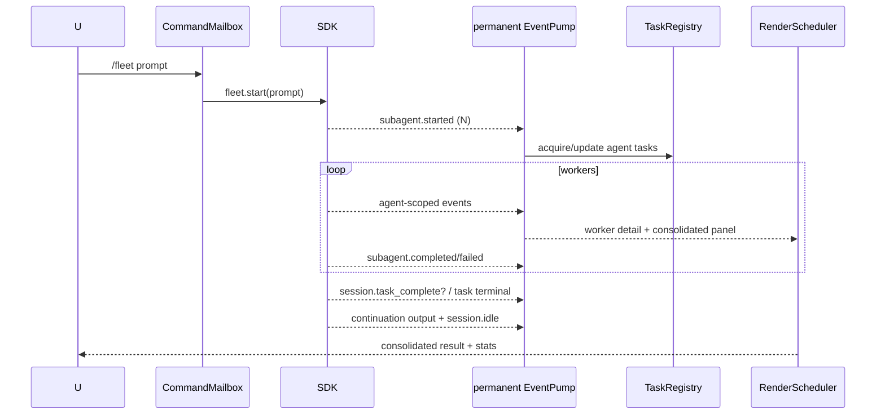

# copilotD 详细设计与实施计划

> 当前阶段：详细设计 v2.3，待审批。审批前不执行 SDK 原型、不创建项目代码。
>
> 本版固定前提：单用户、私有部署、Copilot runtime 全程 `--yolo`，不设计多用户共享、
> 工具确认流程、安全沙箱或租户隔离。
>
> 审批交付格式：仓库 `docs/` 内同时提交 Markdown 内容源和 standalone HTML。

## 目标

新建一个 `copilotD` 项目：借鉴 `HXYerror/claudeD` 的产品结构——Discord 频道可绑定
本地项目、Discord 线程对应独立 Agent 会话；频道未绑定时固定以当前 OS 用户的 `$HOME`
作为 cwd。项目不复制 claudeD 代码，也不追求 Claude 专属功能的一比一复刻；Agent 能力、
命令名称、计费展示和交互语义都按 GitHub Copilot SDK 重新设计。

## 调研结论

结论：**可行，且核心能力覆盖度高，但不是替换一个依赖就能完成。**

GitHub 已提供官方 Python SDK：

- 包名：`github-copilot-sdk`
- Python：3.11+
- 状态：GitHub 于 2026-06-02 宣布 GA
- 许可证：MIT
- 架构：Python SDK 通过 JSON-RPC 驱动 Copilot CLI Agent Runtime
- Runtime：Python wheel 对应的 CLI runtime 可自动下载，也可连接独立 headless runtime
- 鉴权：已登录的 Copilot 用户、GitHub token/OAuth、GitHub App 或 BYOK
- 主要能力：流式输出、工具调用、文件编辑、持久会话、权限回调、MCP、Hooks、
  自定义 Agent、Skills、Plugins、图片输入、模型切换、上下文压缩、用量指标

需要注意：官方整体已 GA，但 PyPI 元数据仍保留 `Development Status :: 3 - Alpha`，
部分低层 RPC（例如 usage metrics、fork/compact 等）仍应视为需要版本固定和契约测试的
接口。实施时必须同时固定 SDK 和 bundled runtime 的兼容版本。

### 与 claudeD 的能力映射

| claudeD 能力 | Copilot 对应方案 | 结论 |
|---|---|---|
| Discord 消息双向桥接 | `session.send()` + session event subscription | 直接支持 |
| 实时打字机输出 | `assistant.message_delta` | 直接支持 |
| Thinking 展示 | `assistant.reasoning(_delta)` | 支持，是否产生取决于模型 |
| 工具状态、结果、Diff | `tool.execution_start/progress/complete`，读取 structured result | 直接支持，Renderer 要重写 |
| 线程对应会话 | 自定义 `session_id` + `create_session`/`resume_session` | 直接支持 |
| 重启后恢复 | `~/.copilot/session-state` 或自定义 `COPILOT_HOME`/session FS | 直接支持 |
| 中断当前任务 | `session.abort()` | 直接支持 |
| 切换模型/推理强度 | `list_models()` + `session.set_model()` | 直接支持 |
| 自动/手动 compact | infinite sessions + `session.rpc.history.compact()` | 支持，手动 RPC 需原型验证 |
| Fork 会话 | `client.rpc.sessions.fork(...)` | 可实现，低层 RPC 需原型验证 |
| 无确认工具执行 | runtime `--yolo` + SDK raw confirmation callback 自动批准 | 直接支持；组织托管策略仍可能拒绝 |
| 交互式提问 | `on_user_input_request` / `user_input.requested` | 直接支持，可映射 Discord 按钮和菜单 |
| 图片附件 | file/blob image attachments | 直接支持 |
| 代码、文档附件 | 异步落盘，再使用 SDK file attachment | 应用层生命周期管理 |
| MCP server | `mcp_servers`，支持 stdio 和 HTTP | 直接支持 |
| Custom Agents/Subagents | `custom_agents` + subagent events | 直接支持 |
| Skills | `skill_directories` / `disabled_skills` | 直接支持 |
| Plugins | `plugin_directories` 或 runtime `--plugin-dir` | 直接支持 |
| Hooks | Copilot session hooks | 支持；Hook 名称和 payload 需适配 |
| Context 展示 | `session.usage_info` / context-info RPC | 直接支持 |
| 用量 | `/usage`、AI Credits、premium request multiplier、account quota | 只读展示 Copilot 原生语义，不提供 limits 配置 |
| worktree | 应用层调用 Git 创建并绑定新工作目录 | copilotD durable extension |
| Plan/Fleet/Tasks | `agent_mode="plan"`、Fleet RPC、task RPC | Copilot 专属能力；Fleet/tasks 需 capability gate |
| Code/security review | 官方 Copilot CLI `/review`、`/security-review` | Copilot 原生命令；runtime command capability gate |
| Scheduler | 保留应用层 scheduler，并注册 custom tool/MCP | 可复用产品思路 |

### 不应照搬的 Claude 语义

- 不保留 `ClaudeBridge`、Claude message block 和 Claude tool name；改为
  `CopilotBridge` + 统一内部事件模型。
- `/cost`、`/budget`、`/limits` 和 fallback-model 直接删除；只保留只读 `/usage`，
  model 使用 `Auto` 或显式选择。
- `/review`、`/security-review` 使用 Copilot 原生术语；PR/Delegate 不进入产品面；
  durable scheduler/worktree 明确标为 copilotD extension。
- 不创建 `/workflow`、`/max-turns`、`/goal`、`/bare` 等无 Copilot 原生对象的命令。
- Claude 的可切换运行模式和审批 UI 不迁移；copilotD 固定使用 `--yolo`，SDK raw
  confirmation callback 只做自动批准和遥测。
- 不依赖宿主机中“碰巧存在”的插件、工具或个人配置；生产配置必须显式、可复现。

## 推荐架构

```text
Discord
  -> DiscordIngress
      -> ProjectRegistry
        channel -> explicit project；无 binding -> implicit $HOME project
      -> SessionRegistry
         thread -> SessionRuntime -> Copilot session_id
      -> SessionRuntime（每个 thread 唯一且常驻）
         -> CommandMailbox（唯一 SDK 写入者、持久 FIFO）
         -> EventPump（整个连接生命周期唯一 SDK stream 消费者）
         -> LivenessController（foreground/background/continuation leases）
         -> TaskRegistry（强引用 asyncio tasks + SDK background task reducer）
      -> CopilotBridge
         create/resume/send/abort/model + capability-gated compact/fleet/tasks/runtime commands
      -> EventAdapter -> SessionReducer
         raw SDK events -> versioned internal events -> durable state/render intents
      -> RenderScheduler -> RenderOutbox
         Markdown block assembler、表格缓冲/PNG、流式文本、任务面板、final flush
      -> InteractionGateway
         ask_user、elicitation、plan；不处理工具确认
      -> UsageService / Scheduler / RuntimeSupervisor
```

两个核心边界：

1. Discord、SessionActor 或单次 turn 都不能直接读取 SDK stream；只有永久
   `EventPump` 可以读取。这样前台 turn、后台 task 和 continuation 不需要切换 reader，
   从结构上消除双消费者、cancel-and-forget 和 buffered frame 丢失。
2. `session.idle` 只结束当前前台 turn 的 UI，不结束 EventPump、不 disconnect session、
   不回收 Actor。SessionRuntime 只会因显式 `/session close` 或 `/session delete`、进程退出或
   不可恢复 transport failure 停止。

## 单用户 `--yolo` 与常驻部署基线

- 只有一个可信操作者和一个 Copilot 身份；bot 所在私有 Discord 即操作面。
- runtime 固定以 `--yolo` 启动；SDK raw tool-confirmation request 自动返回 approve，不生成
  Discord 审批卡，也不存在任何可切换配置。
- 不实现 guild/user/role allowlist、Owner/Admin 区分、路径沙箱、URL/MCP policy、
  SecretStore、内容脱敏审计或多租户隔离。
- 宿主进程用户能访问的文件、命令、网络和凭据，Agent 都可能访问。这是明确产品前提，
  不是待补安全项。
- 每个未显式停止的 session 默认常驻；没有 idle reaper，没有“运行满 N 分钟”的硬生命周期
  上限。
- channel 有显式 binding 时使用绑定 cwd；没有 binding 时使用启动账号的 resolved
  `$HOME`。该行为固定启用，没有 fail-closed 或 fallback 开关。
- 优先验证独立 headless runtime/sidecar，使 Discord bot 重启时 runtime 和后台任务仍可
  继续；若 SDK/runtime 不支持连接重放，则把“进程重启会中断 in-flight task”明确标为
  capability 限制，不伪装为无损恢复。
- SDK、runtime 和 protocol 固定版本；启动时做 capability、event replay、frame size 和
  session resume 探测。

## macOS / Windows 默认自启动与进程保活

`copilotd setup` 是标准首次配置入口，默认完成平台 service 安装、立即启动并验证状态。
只有显式 `copilotd run --foreground` 才以前台开发模式运行。不会要求用户另外执行保活
脚本。

统一 service graph：

```text
OS service manager
  ├─ copilotd-runtime   独立 headless Copilot runtime sidecar
  ├─ copilotd-bot       Discord gateway + SessionRuntime/EventPump
  └─ copilotd-watchdog  每 5 分钟检查 heartbeat、gateway、runtime 和 restart loop
```

如果 SDK spike 证明 headless runtime 不能独立存活，仍安装 bot + watchdog，但 capability
标记为 `bundled-runtime`；watchdog 在有 active liveness lease 时不得强杀 bot。

### 通用 service CLI

| 命令 | 行为 |
|---|---|
| `copilotd setup` | 生成配置、安装当前 OS service、立即启动、验证 heartbeat/runtime/Discord |
| `copilotd service install` | 幂等安装或更新 service definition；总是先卸载旧内存定义再注册 |
| `copilotd service status` | 显示 OS manager 状态、PID/generation、heartbeat age、gateway、runtime、active leases |
| `copilotd service restart` | 默认仅在无 active lease 时执行；`--force` 标记 in-flight outcome unknown |
| `copilotd service logs` | 输出 app、boot、watchdog 和 alerts 日志位置 |
| `copilotd service uninstall` | 停止并注销 service；保留 SQLite、session state 和 logs |
| `copilotd run --foreground` | 不注册 service 的显式开发入口 |

### Heartbeat 协议

bot 每 30 秒原子写入 heartbeat JSON；不是只 touch mtime：

```json
{
  "schema_version": 1,
  "pid": 1234,
  "process_generation": 7,
  "written_at": "RFC3339",
  "gateway_state": "ready|reconnecting|down",
  "runtime_state": "ready|reconnecting|down",
  "connected_sessions": 4,
  "foreground_turns": 1,
  "background_tasks": 2,
  "continuation_leases": 1,
  "last_event_at": "RFC3339",
  "sidecar_replay_capable": true
}
```

watchdog 默认每 5 分钟运行。heartbeat age > 120 秒视为 event-loop stale；系统刚从睡眠/
休眠恢复 60 秒内跳过一次，避免误杀。gateway 连续 down 600 秒才进入 restart 判断，短暂
Discord reconnect storm 不触发重启。

| 场景 | 自动动作 |
|---|---|
| bot 进程退出 | OS manager 30 秒节流后重启 bot |
| runtime sidecar 进程退出 | OS manager 重启 runtime；所有 in-flight task 标 outcome unknown，session eager resume |
| bot heartbeat stale、无 active lease | watchdog 只重启 bot，不重启健康 runtime |
| bot heartbeat stale、有 active lease、sidecar replay 已验证 | checkpoint 后只重启 bot，重连同一 runtime 并 replay |
| bot heartbeat stale、有 active lease、无 sidecar/replay | 不自动强杀；写 alert，保留进程和任务，等待人工 `--force` |
| gateway down > 600 秒、无 active lease | freeze heartbeat，由 watchdog 重启 bot |
| 5 分钟内重启 >= 3 次 | 停止主动 kick loop，写 alerts log，并发本机桌面通知 |

这比 claudeD 的固定 hard ceiling 更保守：后台工作优先，不因 watchdog 误杀 session。

### macOS：LaunchAgent

默认安装三个 user-level LaunchAgent 到 `~/Library/LaunchAgents/`，无需 sudo：

| Label | 关键配置 |
|---|---|
| `com.github.copilotd.runtime` | `RunAtLoad=true`、`KeepAlive=true`、`ThrottleInterval=30` |
| `com.github.copilotd.bot` | `RunAtLoad=true`、`KeepAlive=true`、`ThrottleInterval=30`、absolute argv/cwd/HOME/PATH |
| `com.github.copilotd.watchdog` | `StartInterval=300`，执行 `copilotd service watchdog` |

主 plist **不写 `ProcessType`**，保持 launchd 默认 `Standard`；设置
`LowPriorityBackgroundIO=false`。claudeD [#232](https://github.com/HXYerror/claudeD/issues/232)
实测 `ProcessType=Background` 会令长连接 bot 每 15–25 分钟因 “because inefficient” 被
launchd 回收，后续 `Interactive` 也未解决；当前模板最终删除该键。

安装/更新必须对三个 label 依次执行 `launchctl bootout`（不存在可忽略）后再
`bootstrap + enable + kickstart`，不能只覆盖磁盘 plist。claudeD
[#168](https://github.com/HXYerror/claudeD/issues/168) 的 healthcheck 因 launchd 保留旧
内存定义而从未按 `StartInterval` 运行。安装完成后同时验证：

1. `plutil` 读取 watchdog plist 的 `StartInterval=300`；
2. `launchctl print gui/<uid>/com.github.copilotd.watchdog` 包含
   `run interval = 300`；
3. bot/runtime state 为 running，heartbeat 在 45 秒内出现；
4. 运行满 60 分钟的 soak 中 launchd log 没有 `because inefficient`。

路径固定为：

```text
~/Library/Application Support/copilotd/   SQLite/session/runtime state
~/Library/Caches/copilotd/heartbeat.json
~/Library/Logs/copilotd/{copilotd.log,watchdog.log,alerts.log,boot.log}
```

app log 使用 10 MiB × 7 rotating files。watchdog 读取最近一次 `DarkWake/Wake`，60 秒内
不重启。restart loop 达阈值时使用 `osascript display notification`，同时始终写 alerts.log。

### Windows：Task Scheduler

claudeD [#289](https://github.com/HXYerror/claudeD/issues/289) 推荐 “Task Scheduler XML +
PowerShell install script”，但 merged [#290](https://github.com/HXYerror/claudeD/pull/290)
只完成跨平台运行 subtasks 1–5；当前 main 没有 Windows 自启动脚本。copilotD 首版直接
补齐该缺口，不引入 NSSM 或 pywin32 service。

`copilotd setup` 调用签入的 `install-service.ps1`，注册三个 current-user Scheduled Task：

| Task | Trigger/Settings |
|---|---|
| `copilotD Runtime` | AtLogOn；失败每 30 秒重启；`ExecutionTimeLimit=PT0S` |
| `copilotD Bot` | AtLogOn；失败每 30 秒重启；`MultipleInstancesPolicy=IgnoreNew` |
| `copilotD Watchdog` | AtLogOn 后每 5 分钟重复；`StartWhenAvailable=true` |

runtime/bot task 统一设置 `RestartCount=999`、`DisallowStartIfOnBatteries=false`、
`StopIfGoingOnBatteries=false`、`WakeToRun=false`，使用安装时解析出的绝对 Python/entrypoint
和 working directory。安装总是先 `Unregister-ScheduledTask` 再
`Register-ScheduledTask -Xml`，随后 `Start-ScheduledTask` 立即启动，避免磁盘 XML 已更新
但 Task Scheduler 仍使用旧定义。

安装后用 `Get-ScheduledTask` + `Export-ScheduledTask` 验证 AtLogOn、5 分钟 repetition、
restart interval/count、无 execution time limit，并在 45 秒内看到 heartbeat。路径固定为：

```text
%LOCALAPPDATA%\copilotd\state\
%LOCALAPPDATA%\copilotd\cache\heartbeat.json
%LOCALAPPDATA%\copilotd\logs\{copilotd.log,watchdog.log,alerts.log,boot.log}
```

watchdog 通过 PowerShell 查询最近的
`Microsoft-Windows-Power-Troubleshooter/Operational` resume event，60 秒内跳过。重启
风暴写 alerts.log，并尽力发送 Windows toast。TableRenderer 字体候选必须包含
`C:\Windows\Fonts\msyh.ttc`、`simsun.ttc`、`arial.ttf`，对应 #289 的中文表格 tofu 问题。

## 设计门禁

编码前必须先完成并审批本文件中的详细设计，设计内容至少覆盖：

- 产品范围、非目标、单用户 `--yolo` 执行模型；
- 组件架构、runtime 部署、SQLite 数据模型和持久化目录；
- 全部 copilotD 命令的参数、前置条件、SDK 映射、状态变化、响应和错误；
- claudeD 现有命令的保留、重命名、合并、删除或延期决策；
- 完整 SDK event -> copilotD internal event -> Discord UI 映射；
- connection、foreground turn、background task、continuation、interaction 和 scheduler
  状态机；
- 启动/eager resume、普通 turn、后台 completion/continuation、queue/steer、ask-user、
  attachment、abort、model switch、compact、fork、subagent、scheduler 和 runtime
  crash 时序；
- session 常驻、single-reader、timeout、retry、Discord rate limit、表格显示、quota、
  恢复和版本兼容策略；
- macOS LaunchAgent、Windows Task Scheduler、heartbeat/watchdog、默认自启动和
  active-task-safe restart；
- claudeD issues 中已验证故障的对应回归测试；
- event fixtures、契约测试、状态机测试和端到端验收标准。

设计审批后，低层 RPC 仍须通过技术原型才能从“能力候选”进入稳定命令面；不允许用近似
行为伪装 fork、compact、usage/context 或 fleet 成功。

## 详细设计

### 产品决策

1. 一个 Discord thread 对应一个 Copilot session；thread 是展示、队列和渲染边界。
2. channel cwd 解析顺序固定为：显式 `/project bind` > resolved `$HOME`。未绑定频道可直接
   创建 thread/session；session 持久化 cwd snapshot，后续 bind/unbind 不改变旧 session。
3. 所有会话共享一个可信 Copilot runtime，runtime 固定 `--yolo`。
4. 每个 thread 创建一个常驻 `SessionRuntime`。其中 `CommandMailbox` 是唯一 SDK 写入者，
   `EventPump` 是唯一 SDK stream 消费者；二者从 create/resume 存活到显式 close。
5. `session.idle` 只 finalize foreground turn；EventPump 继续等待 background completion、
   task notification、continuation 和后续用户消息。
6. 不设置绝对 max-life。任何 raw event、task set 变化、continuation 状态变化都刷新
   activity/progress heartbeat；长任务不会仅因运行时间长被回收。
7. 忙碌时普通消息进入持久 FIFO；显式 `/steer` 才使用 SDK immediate mode。
8. `abort` 取消当前 SDK turn；`close` 按顺序 interrupt -> drain -> final flush -> disconnect
   并保留 SDK history；`delete` 永久删除。
9. fork/worktree 创建新 Discord thread 和新的常驻 SessionRuntime；worktree 默认不继承
   history，只有 fork probe 成功才允许显式继承。
10. resume 后必须核验 runtime 返回的实际 session ID。失配时创建“恢复失败后新会话”记录，
   不静默覆盖原映射。
11. macOS LaunchAgent 和 Windows Scheduled Tasks 在 `copilotd setup` 时默认安装并立即启动。
12. 表格不能直接按普通 Markdown delta 输出；必须完整缓冲后一次性渲染。
13. raw reasoning 默认只展示 intent/concise summary，不展示 opaque/encrypted payload。
14. 只注册 Core 和 probe 成功的 Native-Gated commands；不为 claudeD 命令制造近似替代。

### 产品范围与非目标

首版包括可选项目绑定、未绑定 `$HOME` 默认 cwd、thread 会话、文本/图片/文件、
create/eager-resume/send/abort/set-model/disconnect、常驻 EventPump、后台 task/
continuation 状态、工具/diff/usage/subagent 渲染、表格 PNG/附件、ask-user/elicitation/
plan 交互、SQLite 状态、render outbox、macOS/Windows 默认 service/watchdog。
命令面优先交付 Copilot Core session/model/plan/steer/queue/context/usage，再按 probe 加入
Fleet、Tasks、agents、review/security-review、research、init、instructions、MCP/skills/plugins；
scheduler/worktree/ops 明确是 copilotD extension。

明确不做：

- 不复刻 Claude Code CLI 命令或 Claude message block。
- 不执行用户提交的任意 session settings JSON。
- 不保证所有模型都有 reasoning、vision、long context 或相同工具。
- 不做多用户共享、资源 ownership、审批、沙箱或可切换执行模式。
- 不承诺主机重启后 in-flight task 可继续；只有 SDK/runtime 能提供 detached runtime +
  replay 时才升级为该保证。
- 不把 `session.task_complete`、task 列表变空或第一个空 result 单独当作会话可停止信号。

### 固定 `--yolo`

这里没有权限层：没有配置对象、审批状态机、session/project 级切换或相关命令。唯一行为
就是 runtime 启动时启用 `--yolo`，SDK 若仍发送工具确认事件则立即 approve。

| 项目 | 固定行为 |
|---|---|
| Runtime 启动 | 传递 `--yolo`；技术原型记录实际 CLI 参数和版本 |
| 工具确认 callback | 立即 approve；只记录 event id、tool id 和 latency |
| Discord 确认 UI | 不存在 |
| Tool 集合 | 使用 runtime 全部可用工具；不提供 allow/deny/enable/disable 命令 |
| 平台强制限制 | 若 GitHub 组织策略仍拒绝操作，原样显示为 platform limitation |
| Ask user / plan | 仍需交互，因为它们是语义输入或执行方向 |
| 宿主能力 | bot 拥有运行 `copilotd` 的 OS 用户可用的全部能力 |

### 组件职责

| 组件 | 职责 |
|---|---|
| `DiscordIngress` | gateway、slash command、message/context-menu；慢命令立即 defer |
| `ProjectRegistry` | 显式 channel binding；无 binding 时生成 implicit `$HOME` project snapshot |
| `SessionRegistry` | thread binding、metadata、eager resume 和常驻 runtime 集合 |
| `SessionRuntime` | 聚合一个 SDK session、CommandMailbox、EventPump、liveness/task/render 状态 |
| `CommandMailbox` | 唯一 SDK 写入者；串行 send/steer/abort/reconfigure/close 与持久 FIFO |
| `EventPump` | 从 create/resume 到 explicit close 持续消费唯一 SDK event stream |
| `LivenessController` | foreground/background/continuation/interaction lease 与 stall watchdog |
| `TaskRegistry` | SDK task reducer；强引用所有 app `asyncio.Task`，done callback 回收/报错 |
| `RuntimeSupervisor` | runtime/transport 健康、sidecar capability、退避重连和版本探测 |
| `CopilotBridge` | SDK public API 与 capability-gated RPC facade |
| `CapabilityRegistry` | public API、低层 RPC 和模型 capability 探测 |
| `EventAdapter` | raw SDK event 到 versioned internal event |
| `SessionReducer` | 去重、顺序、task/turn/continuation 状态和 durable render intent |
| `RenderScheduler` | 单 session 顺序队列、coalescing、Discord rate limit 和 final flush |
| `MarkdownAssembler` | block-aware streaming；保护 fence、blockquote 和 table |
| `TableRenderer` | 完整表格解析、code block/PNG/MD/CSV 输出和降级 |
| `RenderOutbox` | 持久化未发送/待编辑/final render，Discord 失败不重跑 Agent |
| `InteractionGateway` | ask-user、elicitation、plan、MCP OAuth |
| `AttachmentService` | 异步下载/读盘/编码、临时文件和 Discord attachment batching |
| `ExtensionRegistry` | MCP、skills、plugins、custom agents 配置 |
| `UsageService` | event 聚合、experimental RPC snapshot、quota、本地统计 |
| `Scheduler` | schedule、lease、fire、catch-up、幂等 |
| `WorktreeService` | Git worktree 创建、绑定和清理 |
| `Diagnostics` | event pump、task、stderr tail、outbox、rate limit 和 resume 诊断 |

首选部署为常驻 bot + 独立 headless runtime sidecar。SDK spike 必须验证 sidecar 是否在
Discord client 断开后继续运行 task、是否保留 event buffer、重连后是否可从 sequence/
checkpoint replay。若不支持，首版回落为 bundled stdio，但禁止主动重启有 liveness lease
的进程。runtime crash 使用 `1s, 2s, 5s, 10s, 30s` 抖动退避；恢复时 eager resume 所有
未显式 STOPPED 的 binding，绝不自动重发结果未知的 prompt。

### 持久化与目录

| 表 | 关键字段 |
|---|---|
| `global_config` | key, value；包含 resolved_home、default mode/mention、global extension config |
| `channel_settings` | channel_id, layout, mention_required, config_version；不等同 project binding |
| `projects` | id, channel_id, root_path, cwd, layout, mention_required, config_version, state(active/retired)；只存显式 binding，旧 session 引用的 retired snapshot 不删除 |
| `project_prompts` | project_id, prompt, version |
| `project_env` | project_id, name, value |
| `mcp_servers` | project_id, name, transport, config_json, enabled, version |
| `skill_dirs` / `plugin_dirs` | project_id, path, enabled |
| `custom_agents` | project_id, name, description, prompt, tools_json, enabled |
| `session_bindings` | thread_id, project_id?, project_source(explicit/home), cwd_snapshot, requested_session_id, actual_session_id, connection_state, activity_state, runtime_generation, last_event_seq, last_event_at, config_version, model, effort |
| `turns` | turn_id, session_id, discord_message_id, kind(foreground/continuation/scheduled), state, started_at, idle_at |
| `session_tags` | copilot_session_id, tag |
| `message_queue` | id, thread_id, discord_message_id, prompt, position, state |
| `background_tasks` | session_id, runtime_generation, task_id, parent_turn_id, state, last_progress_at, terminal_event_id |
| `liveness_leases` | session_id, lease_id, kind, source_id, acquired_at, refreshed_at, released_at |
| `event_journal` | session_id, generation, receive_seq, event_id, raw_type, reducer_hash, received_at |
| `render_outbox` | id, session_id, logical_seq, lane, coalesce_key, payload, state, attempts, next_attempt_at |
| `render_messages` | session_id, logical_key, discord_message_id, content_hash, finalized |
| `pending_interactions` | request_id, thread_id, kind, expires_at, state, payload |
| `usage_samples` | session_id, turn_id, model, token fields, nano_aiu, premium_requests |
| `schedules` | id, project_id, thread_id?, kind, expression, timezone, payload, state |
| `schedule_runs` | schedule_id, planned_at, lease_owner, status, result_session_id, idempotency_key |
| `capabilities` | runtime_version, sdk_version, capability, supported, probe_detail |
| `runtime_incidents` | timestamp, runtime_generation, session_id?, kind, stderr_tail, last_event_seq, detail |

SQLite 使用 WAL、foreign keys 和 migrations。EventPump 每批事件在同一短事务中更新
`event_journal`、reducer 状态和 `render_outbox`，先持久化再通知 Renderer；Discord API、
SDK 调用和文件 IO 不得发生在事务内。event journal 可按 session 压缩，但 background/
continuation/terminal/resume mismatch/runtime error 永久保留。

```text
COPILOTD_DATA_DIR/
  copilotd.sqlite3
  runtime/
  sessions/<session-id>/{attachments,exports,renderer,tables}/
  worktrees/<project-id>/<session-id>/
  logs/copilotd.jsonl
  cache/event-fixtures/
```

启动时将 `Path.home().expanduser().resolve()` 保存为 `global_config.resolved_home`。每次
创建 session 都把最终 cwd 写入 `cwd_snapshot`；之后 channel binding 变化不会漂移既有
session。路径只做 resolve 以获得稳定 cwd，不做访问限制。attachment、table image 和
export 由 session manifest 跟踪；成功发送后按 retention 清理，失败项由 outbox 保留到
重试完成。

### Session、turn 与 schedule 状态

三个正交状态机，禁止压成一个 `RUNNING/IDLE` 布尔值。

**Connection**

```text
ABSENT -> STARTING -> CONNECTED -> RECONNECTING -> CONNECTED
                        \-> STOPPING -> STOPPED -> STARTING
                        \-> FAILED -> RECONNECTING
STOPPED -> DELETING -> ABSENT
```

**Activity**

```text
QUIET -> FOREGROUND -> WAITING_INPUT -> FOREGROUND
             |                |
             +-> BACKGROUND_PENDING -> CONTINUATION_INFLIGHT -> QUIET
             +-> STALLED -> FOREGROUND/BACKGROUND_PENDING
any active state -> ABORTING -> QUIET/BACKGROUND_PENDING
```

**Background task**

```text
DISCOVERED -> RUNNING -> TERMINAL_NOTIFIED -> CONTINUATION_EXPECTED -> CLOSED
                     \-> FAILED/CANCELLED -> CONTINUATION_EXPECTED -> CLOSED
UNKNOWN -> RUNNING/FAILED/CLOSED
```

关键不变量：

1. 一个 SessionRuntime 始终只有一个 EventPump；foreground/background 不交接 reader。
2. `session.idle` 关闭当前 foreground/continuation turn，但不停止 EventPump。
3. task 集合变空不代表 QUIET；若刚收到 terminal task notification 或 assistant output，
   `continuation_expected` lease 仍保持，直到 continuation 自己的 terminal + idle。
4. liveness lease 来源至少包括 foreground turn、非终态 background task、
   continuation window、pending interaction、正在提交的 queued message。
5. 没有 idle reaper。lease 只用于状态、graceful shutdown、watchdog 和“是否允许主动升级/
   重启”判断，不用于普通空闲回收。
6. 所有 raw event、task-set hash 变化和成功 stream read 都刷新 heartbeat。watchdog 只诊断
   inactivity，不按 session 年龄终止。

一个 CommandMailbox 同时最多提交一个 foreground turn。QUIET 收到消息立即发送；
FOREGROUND/WAITING/BACKGROUND/CONTINUATION 收到普通消息写入 FIFO；只有观察到 foreground
terminal + `session.idle` 且没有 continuation 抢占时才发送下一项。`/steer` 走
SDK immediate。重启后保留 queued 项；eager resume 成功后继续 FIFO，但绝不重发 state
为 `submitted_unknown` 的项。

Schedule 状态为：

```text
enabled -> leased -> running -> succeeded -> enabled/completed
                         \-> failed -> retry_wait/dead
enabled -> disabled
enabled/disabled -> deleted
```

同一 `(schedule_id, planned_at)` 只有一个 idempotency key。非幂等执行已开始但结果未知时
不自动重跑，标记 `unknown` 并通知当前 thread。

### 通用命令契约

所有 slash command 进入 callback 后第一步 `defer()`，目标 500ms、硬上限 2.5 秒；之后
解析 thread/project、做参数/capability 校验、向 CommandMailbox 提交 idempotent
operation、持久化并返回结果。Discord `10062 Unknown interaction` 记 warning 并改走
thread follow-up；不能让 ACK 失败中止已经运行的 SDK task。

| 错误码 | 含义 |
|---|---|
| `CD-SCOPE-001` | 不在要求的 channel/thread scope |
| `CD-PROJECT-001` | 显式 project binding 损坏/禁用；普通对话无 binding 时不会触发此错误 |
| `CD-PATH-001` | 路径不存在或当前 OS 用户无法访问 |
| `CD-SESSION-001` | session 不存在 |
| `CD-SESSION-002` | 当前状态不允许操作 |
| `CD-CONFLICT-001` | operation 重复或配置版本冲突 |
| `CD-CAP-001` | SDK/runtime/model 不支持 |
| `CD-RUNTIME-001` | runtime unavailable/degraded |
| `CD-INPUT-001` | user input/plan 超时或取消 |
| `CD-QUOTA-001` | account quota/rate limit |
| `CD-DISCORD-001` | Discord API 最终失败，session 结果仍保留 |
| `CD-RESUME-001` | requested/actual session ID 不一致 |
| `CD-LIVE-001` | EventPump/transport stalled 或后台结果状态未知 |

### 命令设计原则

不再以 claudeD 命令表为模板。一个 Discord 命令只有同时满足以下条件才存在：

1. 是当前官方 Copilot CLI/SDK 的明确概念，或者是 copilotD 必需的 daemon/Discord 能力；
2. 在 Discord 中需要独立、确定的操作语义，不能用普通自然语言消息同样清楚地完成；
3. 有可验证的 SDK/CLI 映射；generated/experimental RPC 必须经过当前 pinned runtime probe；
4. 名称使用 Copilot 当前术语，不为了“命令数量对齐”发明别名。

命令直接使用顶层 `/session`、`/model`、`/plan` 等名称，不增加 `/copilot` 前缀。
`/project`、`/schedule`、`/worktree`、`/ops` 是明确的 copilotD 扩展。Copilot-native
surface 共 23 个 top-level command，加 4 个 extension groups 后仍低于 Discord application
command 上限。标记含义：

| 标记 | 注册规则 |
|---|---|
| **Core** | 官方 GA high-level SDK 可直接实现；首版固定注册 |
| **Native-Gated** | 官方 Copilot CLI 概念，但 SDK 为 generated/experimental、runtime command 或 entitlement gated；probe 成功才注册 |
| **Extension** | copilotD 持久化/Discord/运维能力；名称不冒充 Copilot 原生命令 |

普通 thread 消息就是主对话入口，不额外造 `/ask` 来重复 `session.send()`；Native-Gated
`/ask` 仅指官方“不写入主 conversation history”的 side question。

### Copilot 原生命令

#### Core：稳定 SDK 面

| 命令与参数 | Scope/前置 | SDK 映射与行为 |
|---|---|---|
| `/session new prompt?` | channel/thread | `create_session()`；总是创建新 Discord thread，保存 explicit/home cwd snapshot |
| `/session list` | 任意 | `list_sessions()` + app binding；显示 active/closed、cwd、model、last event |
| `/session info` | thread | metadata + app state；显示 actual ID、EventPump、tasks、continuation、queue、context、usage |
| `/session resume session-id?` | thread 或 channel | thread 内省略 ID 时固定读取该 thread 原 `requested_session_id`；channel 调用必须提供 ID 并创建新 thread；核验 actual ID |
| `/session rename name` | thread | 更新 SDK/app metadata 和 Discord thread name |
| `/session abort clear-queue=true` | active turn | `session.abort()`；可清 app FIFO；EventPump 与 session 继续存活 |
| `/session close force=false` | thread | copilotD lifecycle：drain -> final flush -> `disconnect()` -> internal STOPPED/UI closed；active lease 时拒绝，force 才标 outcome unknown；保留 SDK history |
| `/session delete session-id?` | closed/quiet | thread 内省略 ID 使用原 session；`delete_session()` 后永久删除；命令本身即明确删除意图 |
| `/model list` | 任意 | `list_models()`；显示 model capabilities、multiplier、reasoning/context support |
| `/model set model effort? context-tier? reasoning-summary?` | thread QUIET | `set_model()`；其他字段按 stable session config/generation 更新，失败回滚 |
| `/plan prompt` | thread QUIET | `send(..., agent_mode="plan")`；plan-exit 用 Discord buttons 返回 interactive/autopilot/fleet |
| `/steer text` | active turn | `send(text, mode="immediate")`；用于修正当前执行 |
| `/queue add text` | thread | `send(text, mode="enqueue")`；同时写 app idempotency/FIFO checkpoint |
| `/queue list` | thread | 显示 queued/submitted-unknown 项；不依赖 TUI |
| `/queue clear` | thread | 只清尚未提交 SDK 的项，不撤销 current turn |
| `/context` | thread | `session.usage_info`；显示 context window 与 compaction 状态 |
| `/usage` | thread/runtime | public usage events/checkpoints；tokens、AI Credits、premium requests、account quota；无 USD、无 limit 设置 |

`close` 是唯一非 Copilot 原生但不可省略的 session 子命令：它停止常驻 daemon 资源而不删除
SDK history。`abort`、`close`、`delete` 三者不再使用含糊的 `stop/clear` 别名。

`/session resume` 是 thread-first：无参数时不能打开 picker、不能选择“最近 session”，只能恢复
当前 thread 持久化的原 session ID 和 cwd snapshot。若 thread 已 CONNECTED 则幂等返回当前
状态；thread 内显式 ID 与原 ID 不同时返回 `CD-CONFLICT-001`，不能重绑到另一 session。
resume 失败或 actual ID 失配时保留原 mapping，不静默创建新 session。

#### Native-Gated：有用的 Copilot 专属能力

| 命令与参数 | 官方概念 | 注册与实现门禁 |
|---|---|---|
| `/session compact focus?` | CLI `/compact` | `session.rpc.history.compact()` 为 generated RPC；probe 后注册 |
| `/session fork name?` | CLI experimental `/fork` | fork RPC 成功且 session ID 可核验后注册；新建 thread |
| `/ask question` | CLI `/ask` side question | SDK 无 high-level “不写主历史”API；只有 runtime command dispatch 或等价隔离语义验证后注册 |
| `/fleet prompt` | Copilot Fleet | `session.rpc.fleet.start()` 明确 experimental；渲染 parent/subagent/todo dependency panel |
| `/tasks list` | CLI `/tasks` | generated task snapshot；显示 agent/shell task、state、progress、parent |
| `/tasks show task-id` | CLI `/tasks` | generated detail/timeline |
| `/tasks message task-id text` | task messaging | generated RPC；只对支持 messaging 的 active task 注册 |
| `/tasks cancel task-id` | task control | generated cancel；不映射为 abort 整个 parent，结果事件确认后更新 |
| `/agent list` | CLI `/agent` | runtime agent list probe；显示 builtin/custom/inferable 来源 |
| `/agent select name` | CLI `/agent` | generated select/get-current/deselect；事件确认后更新 |
| `/review prompt?` | CLI `/review` | runtime command capability；review 当前 active changes，可限定 path/pattern |
| `/security-review prompt?` | CLI `/security-review` | runtime command capability；只描述为 active local changes review，不冒充全仓审计 |
| `/research topic` | CLI `/research` | runtime command probe；输出引用与附件 |
| `/rubber-duck prompt?` | CLI `/rubber-duck` | runtime command probe；以 constructive critic 作为第二意见 |
| `/init` | CLI/cmd `copilot init` | repository 初始化 instructions/agentic files；runtime command probe |
| `/chronicle action` | CLI `/chronicle` | `standup`、`tips`、`improve` 仅按 installed runtime manifest 注册；guide/reference 有版本漂移 |
| `/env` | CLI `/env` | 只读显示 discovered instructions、MCP、skills、agents、hooks、plugins、LSP/extensions |
| `/instructions` | CLI `/instructions` | 显示 discovered instruction files 和启用状态 |
| `/skills action` | CLI `/skills` | `list`、`info`、`add`、`remove`、`reload` 按 runtime capability 注册 |
| `/plugins action` | CLI `/plugin(s)` | list/install/update/uninstall/enable/disable/marketplace；显式命令直接执行 |
| `/mcp action` | CLI `/mcp` + stable SDK config | `list`、`show`、`add`、`edit`、`delete`、`disable`、`enable`、`auth`、`reload`、`search`；OAuth 用组件交互 |
| `/remote enabled` | CLI `/remote` | remote session capability/auth/repo gate；Mission Control 连接状态可见 |

这些命令不是首版全部强行上线。启动时从 pinned CLI/SDK capability manifest 生成注册集合；
probe 失败的命令从 Discord autocomplete 中消失，而不是保留一个永远返回 unavailable 的壳。

### copilotD 扩展命令

#### `/project`

| 命令与参数 | 行为 |
|---|---|
| `/project bind path layout? mention-required?` | resolve path；原 active project retired；未来 session 使用 explicit cwd |
| `/project info` | 显示 source 为 `explicit` 或 `implicit-home`、最终 cwd、配置版本和常驻 session；thread 另显示 immutable snapshot |
| `/project unbind` | active project retired；未来 session 回落 `$HOME`；已有 SessionRuntime 不停止、不迁移 |
| `/project layout value` | value 为 `text` 或 `forum`；只控制后续 Discord thread 组织，不叫 Copilot mode |
| `/project mention required` | 更新 channel trigger；默认 false |
| `/project variable set name value` | 保存项目进程环境变量；显式 project only |
| `/project variable list reveal=false` | 与 Copilot 原生 `/env` diagnostics 明确区分 |
| `/project variable remove name` | 删除项目环境变量；已有 session snapshot 不热变更 |

不提供 project system-prompt/add-dir 命令。仓库指令使用 Copilot 原生
`.github/copilot-instructions.md`、`.github/instructions/**/*.instructions.md`、`AGENTS.md`
和 `/init`、`/instructions`，避免发明第二套指令体系。

`ProjectRegistry.resolve(channel_id)` 固定返回 explicit binding 或 synthetic
`implicit-home` snapshot；`unbind` 只改变未来 resolve，不能停止或迁移已有 session。

#### `/schedule` 与 `/worktree`

两者是 copilotD durable extension，不伪装成 CLI experimental `/after`、`/every`、
`/worktree` 或 `/move`。Schedule 只接受 `at:<RFC3339>` 或 `cron:<5-field>` + IANA timezone。

| 命令 | 行为 |
|---|---|
| `/schedule message when text timezone` | 到期向指定常驻 session enqueue；closed 时先 resume |
| `/schedule new-session when text timezone` | 到期新建 thread/session；执行时 resolve explicit/home cwd |
| `/schedule action` | action 为 `list`、`show`、`toggle`、`delete` 或 `run-now`；durable state/lease/history；planned fire 有唯一 idempotency key |
| `/worktree create name base? history?` | 建 Git worktree + 新 thread；history 为 `none` 或 `fork`，后者仅在 session fork probe 成功时可选 |
| `/worktree list` | 显示 branch/path/session/activity/lease |
| `/worktree close name` | 仅在无 active lease 时 close session 并移除 worktree；不删除 branch |

Catch-up 最多执行最近一次遗漏。SDK 已接受 prompt 而结果未知时不重发。worktree 默认
`history=none`，不能在 fork 不可用时伪装继承上下文。

#### `/ops` 与 context menu

| 命令 | 行为 |
|---|---|
| `/ops health` | uptime、gateway、runtime、EventPump、leases、tasks、queues、outbox、DB、scheduler、OS services |
| `/ops diagnostics session-id?` | capability manifest、stderr tail、last event、generation、stalled reason |
| `/ops restart-runtime force=false` | active lease 时拒绝；force 把 in-flight 标 outcome unknown |
| `/ops debug level duration` | level 为 `info`、`debug` 或 `trace`，最长 30 分钟 |
| `/ops log-dump correlation-id?` | 有界日志和 event timeline 附件 |
| Context menu `Ask Copilot` | 从消息创建 thread/session；无 binding 使用 `$HOME`；保留 provenance/attachments |
| Context menu `Pin message` | Discord 原生 pin，不经过 Copilot |

### 明确删除，不做机械映射

| 删除项 | 决策 |
|---|---|
| `/workflow` | Copilot 无此原生命令。并行执行用 `/fleet`，运行中工作用 `/tasks`，规划用 `/plan`；不存在通用替代别名 |
| `/max-turns` | 直接删除。Copilot 拥有 agent loop，不提供近似替代 |
| fallback model 命令 | 直接删除。使用 model `Auto` 或显式 `/model set`；generated routing event 不构成公共配置 |
| `/mode`、`/bare` | 直接删除。plan/fleet 是具体行为；transport `agent_mode` 不暴露成通用模式开关 |
| `/goal` | 直接删除。使用普通 prompt、`/plan`、tasks 或 `/init` |
| `/tools` 的 `allow`、`deny`、`reset` | 直接删除。runtime 固定 `--yolo`，不再做另一套工具配置命令 |
| `/cost`、`/budget`、`/limits` | 直接删除。只保留只读 `/usage`，不显示 USD，也不设置额度 |
| `/pr` 全组、`/delegate` | 直接删除。copilotD 不提供 PR 创建、修复、自动合并或 cloud-agent delegation |
| `/btw` | 不迁移；纠正当前执行使用官方 SDK steering `/steer` |
| `/diff` | 不迁移 terminal UI；diff 自动进入 tool/review renderer |
| session export/tag/open/history/diff/notifications | 不进入首版；list/resume/chronicle/Discord thread 已覆盖实际需求 |
| project system-prompt/add-dir | 不进入；使用 Copilot instructions 和固定 cwd |
| terminal UI/process 命令 | `/copy`、`/theme`、`/voice`、`/cwd`、`/cd`、`/ide`、`/lsp`、`/exit`、`/login`、`/update`、`/feedback`、`/help`、`/share` 等不映射到 Discord |

`factory.run_updated` 只是在 generated event enum 中标为 experimental 的 ephemeral
invalidation signal，不是 Factory 产品 API，也不是命令。首版仅记录 raw type/run id/revision
到 diagnostics，不获取 liveness lease、不渲染面板。

### 事件适配

内部 envelope：

```text
InternalEvent {
  schema_version, event_id, raw_type, session_id, thread_id,
  runtime_generation, receive_seq, source,
  turn_id?, task_id?, agent_id?, tool_call_id?,
  received_at, sdk_timestamp?, correlation_id, payload, extra
}
```

- SDK class 只允许出现在 `adapters/copilot/`。
- 未知字段进入 `extra`，未知 type 转为 `UnknownSdkEvent`，不能令 event loop 崩溃。
- EventPump 在读取点分配 `(runtime_generation, receive_seq)`；这是唯一排序依据，不按 SDK
  timestamp 重排。
- raw event ID 在同一 generation 内去重；无 ID 时使用
  `session/type/receive_seq/payload_hash`，绝不跨 generation 猜测重复。
- critical event 先写 event journal/reducer/outbox 再 ACK 到内存消费者。
- subagent 归属取 event envelope `agent_id`，不依赖 deprecated `parentToolCallId`。
- `reasoningOpaque`、`encryptedContent` 不进入 Discord；其他 payload 在单用户 debug 模式下
  可以进入本地 event fixture，但普通 UI 只展示摘要。
- foreground、background 和 continuation 共用同一个 EventPump，没有 reader handoff。

内部稳定事件族：

- Session：`SessionStarted/Resumed/Ready/Warning/Failed/Stopped/ContextUpdated/
  ConfigUpdated/CompactionStarted/CompactionFinished/TaskCompleted/QueueUpdated`
- Turn：`TurnStarted/Retrying/IntentUpdated/Ended/Aborted`
- Content：`AssistantTextStarted/Delta/Completed/ReasoningStatus/ReasoningCompleted`
- Tool：`ToolRequested/Started/Progress/Output/Completed`
- Liveness：`EventPumpStarted/Heartbeat/Stalled/Reconnected`、
  `BackgroundTaskDiscovered/Updated/Terminal`、
  `ContinuationExpected/Started/Finished/LivenessLeaseChanged`
- Interaction：`ToolConfirmationAutoApproved`、`UserInputRequested/Resolved`、
  `ElicitationRequested/Resolved`、`PlanApprovalRequested/Resolved`、
  `McpAuthRequested/Resolved`
- Usage：`UsageSampled/ContextUsageUpdated/QuotaUpdated`
- Agent/Plan：`AgentSelected/Deselected/SubagentStarted/SubagentFinished/SkillInvoked/
  PlanUpdated/TaskSetUpdated/AgentHandoff`
- Capability/Artifact：`CapabilitiesUpdated/ExtensionsUpdated/ArtifactAvailable/WorkspaceChanged`
- Fallback：`UnknownSdkEvent`

#### 完整 raw event 处置

下表覆盖当前 Python generated `SessionEventType`。只有官方 streaming 文档事件作为首版
稳定渲染契约；generated-only 事件需 fixture 后再提升。“UI 无”仍会更新状态或审计。

| Raw event(s) | Internal/处理 | Discord UI |
|---|---|---|
| `session.start`, `session.resume` | SessionStarted/Resumed；绑定 runtime generation | 恢复状态行 |
| `session.error` | SessionFailed；分类和 correlation | 可行动错误卡；stack 隐藏 |
| `session.idle` | SessionReady；只完成当前 foreground/continuation；不停止 pump；仅在无 continuation lease 时 drain FIFO | finalize 文本/工具/usage |
| `session.shutdown` | explicit close 或 unexpected failure；停止 pump 并 flush outbox | routine close 静默；unexpected 显示恢复卡 |
| `session.title_changed` | title state | 仅 auto-name thread 自动改名 |
| `session.context_changed` | SessionContextUpdated | branch/cwd 状态 |
| `session.usage_info`, `session.usage_checkpoint` | ContextUsageUpdated/usage aggregate | footer 与 `/usage` |
| `session.session_limits_changed` | generated-only diagnostics；不保存可配置 limit | UI 无 |
| `session.compaction_start`, `session.compaction_complete` | compaction lifecycle | rolling compact card |
| `session.task_complete` | best-effort task semantic completion；不释放全部 liveness | task 摘要；不驱动 disconnect |
| `session.info`, `session.warning` | state/warning reducer | warning 可见；info 合并 |
| `session.model_change`, `session.mode_changed`, `session.permissions_changed` | SessionConfigUpdated | footer/info，不刷屏 |
| `session.context_cleared`, `session.truncation`, `session.snapshot_rewind` | history mutation audit | 明确警告 |
| `session.plan_changed`, `session.todos_changed` | PlanUpdated/TaskSetUpdated | plan/todo panel |
| `session.workspace_file_changed` | WorkspaceChanged | diff/files badge |
| `session.handoff` | AgentHandoff | handoff card |
| `session.remote_steerable_changed` | capability state | steer enable/disable |
| `session.autopilot_objective_changed` | plan/orchestration objective | autopilot header |
| `session.schedule_created`, `session.schedule_cancelled`, `session.schedule_rearmed` | generated-only audit | app scheduler 不依赖；UI 无 |
| `pending_messages.modified` | SDK queue observation | 诊断；业务 FIFO 以 app DB 为准 |
| `user.message` | provenance/timeline | 不重复渲染用户消息 |
| `assistant.turn_start`, `assistant.turn_end` | TurnStarted/Ended；按 pending continuation lease 判定 kind | status/turn counter |
| `assistant.turn_retry` | TurnRetrying | 节流重试状态 |
| `assistant.intent` | TurnIntentUpdated | rolling status |
| `assistant.reasoning_delta` | ReasoningStatus | 默认只显示 thinking，不流出 raw CoT |
| `assistant.reasoning` | ReasoningCompleted | 仅 configured concise summary |
| `assistant.message_start`, `assistant.message_delta`, `assistant.message` | text start/delta/final；可触发 ContinuationStarted | block-aware stream；final 校正 |
| `assistant.streaming_delta` | transport metric | UI 无；stall 诊断 |
| `assistant.tool_call_delta` | argument buffer | UI 无；等完整 start |
| `assistant.server_tool_progress` | ToolProgress | rolling tool panel |
| `assistant.idle` | generated-only hint | UI 无；session.idle 权威 |
| `assistant.usage` | UsageSampled | tokens/credits footer，无 USD |
| `model.call_start`, `model.call_failure` | metrics/error precursor | start 无；孤立 failure 可见 |
| `abort` | TurnAborted | 已中止，清 controls |
| `tool.user_requested` | ToolRequested | 标注 user-requested |
| `tool.execution_start` | ToolStarted | rolling row；args redacted |
| `tool.execution_partial_result` | ToolOutput | detail buffer，不逐 chunk 发消息 |
| `tool.execution_progress` | ToolProgress | rolling row |
| `tool.execution_complete` | ToolCompleted | success/failure、diff/detail |
| `tool_search.activated` | capability/telemetry | verbose 可选 |
| `skill.invoked` | SkillInvoked | 显示名称，不显示完整 content |
| `subagent.selected`, `subagent.deselected` | AgentSelected/Deselected | agent badge |
| `subagent.started`, `subagent.completed`, `subagent.failed` | subagent lifecycle | tasks/fleet panel 与统计 |
| `hook.start`, `hook.progress`, `hook.end` | audit/debug | normal 无；verbose 摘要 |
| `system.message` | prompt provenance | UI 无，只存 hash/source |
| `system.notification` | 解析 task terminal/background completion；打开 continuation lease | task panel + continuation 状态；未知进 diagnostics |
| `session.binary_asset` | ArtifactAvailable（experimental） | MIME/size 校验后附件 |
| `permission.requested`, `permission.completed` | 立即 auto approve + latency telemetry | UI 无；managed deny 才显示错误 |
| `user_input.requested`, `user_input.completed` | UserInput request/resolved | buttons/select/modal |
| `elicitation.requested`, `elicitation.completed` | Elicitation request/resolved | 支持的 JSON Schema 表单 |
| `exit_plan_mode.requested`, `exit_plan_mode.completed` | PlanApproval request/resolved | 摘要、附件、actions |
| `session_limits_exhausted.requested`, `session_limits_exhausted.completed` | 自动响应 Cancel；归类 account/runtime limitation | 只显示不可继续错误，无设置按钮 |
| `sampling.requested`, `sampling.completed` | MCP sampling lifecycle | usage/audit；normal 无 |
| `mcp.oauth_required`, `mcp.oauth_completed` | McpAuth request/resolved | OAuth 交互 |
| `mcp.headers_refresh_required`, `mcp.headers_refresh_completed` | header provider refresh | 成功无；失败 warning |
| `external_tool.requested`, `external_tool.completed` | external tool lifecycle | 普通 tool panel；超时失败 |
| `command.queued`, `command.execute`, `command.completed` | runtime command lifecycle | 只显示 registered runtime command |
| `auto_mode_switch.requested`, `auto_mode_switch.completed`, `session.auto_mode_resolved` | model/mode fallback interaction | Gated confirm card |
| `session.managed_settings_resolved`, `session.managed_settings_enforced` | platform limitation state | warning；说明 `--yolo` 不能覆盖组织策略 |
| `commands.changed`, `capabilities.changed` | CapabilitiesUpdated | 刷新 autocomplete/availability |
| `session.tools_updated`, `session.skills_loaded`, `session.custom_agents_updated` | ExtensionsUpdated | tools/skill/agent 状态 |
| `session.mcp_servers_loaded`, `session.mcp_server_status_changed` | MCP state | health/failure warning |
| `mcp.tools.list_changed`, `mcp.resources.list_changed`, `mcp.prompts.list_changed` | MCP capability state | inspect；normal 无 |
| `session.background_tasks_changed` | task reducer + liveness lease acquire/release + TaskSetUpdated | tasks panel；terminal 强制 trailing flush |
| `factory.run_updated` | experimental raw diagnostics only；不驱动 liveness/state | UI 无 |
| `session.extensions_loaded`, `session.extensions.attachments_pushed` | extension state/artifacts | summary 或附件 |
| `session.custom_notification` | subtype reducer；terminal subtype 可驱动 liveness | 已知 subtype 渲染；未知进 diagnostics |
| `session.canvas.opened`, `session.canvas.registry_changed`, `session.canvas.closed`, `session.canvas.unavailable`, `session.canvas.recorded`, `session.canvas.removed` | experimental telemetry | Discord v1 不支持；只审计 |
| `mcp_app.tool_call_complete` | MCP app completion | 关联 tool panel，否则审计 |
| `unknown` 或未来 type | UnknownSdkEvent | 不打断；计数/hash/diagnostics |

#### Hooks 与事件边界

| Hook | copilotD 用途 |
|---|---|
| `onPreToolUse` | 固定 approve；记录 tool id/turn/task 关联，不修改参数 |
| `onPostToolUse` | 提取 diff/artifact metadata；不篡改业务结果 |
| `onPostToolUseFailure` | 失败分类/retry guidance；非幂等操作不自动重试 |
| `onUserPromptSubmitted` | Discord provenance、mention 清理；不改变用户意图 |
| `onUserPromptTransformed` | 记录 turn 关联 |
| `onSessionStart` | 注入 typed project/session context |
| `onSessionEnd` | 仅 explicit shutdown 后 usage/outbox flush；不能因 AgentStop 释放 runtime |
| `onErrorOccurred` | 统一错误分类和 correlation ID |
| `onAgentStop` | 更新 foreground 状态；不 cancel EventPump，不假定后台工作结束 |

所有 app-level `asyncio.create_task()` 必须经 `TaskRegistry.spawn()` 创建。Registry 保存
强引用、task name/source/session/generation，done callback 记录异常并释放引用；任何 heartbeat
loop 异常都进入 Supervisor，不能静默停止。

### Discord Renderer

Discord 不原生渲染 GFM 表格，且 2000 字符限制、message edit rate limit、附件上限会破坏
普通 Markdown 流。因此 Renderer 必须先生成逻辑 block，再决定 Discord 载体。

#### Render pipeline

```text
InternalEvent
  -> SessionReducer
  -> RenderIntent(logical_seq, lane, coalesce_key)
  -> MarkdownAssembler(block state machine)
  -> RenderPlan[text segments | table assets | files | task panel]
  -> durable RenderOutbox
  -> Discord API
  -> render_messages checkpoint
```

- `assistant.message_delta` 只追加到 block assembler；最终 `assistant.message` 是 canonical
  内容并按 hash 修正 delta 结果。
- 每条文本目标 1850 字符，预留 fence、continuation marker 和 footer 空间。
- splitter 按 Markdown block AST 切分：paragraph、list、blockquote、fenced code、table、
  thematic break。不得在 code fence、blockquote 或 table 内跨消息。
- 单个 block 超过限制时不截断：code/text 输出 `.md`/`.txt` 附件，正文只放摘要和文件名。
- text lane 最快 1 秒一次 edit；task panel lane 最快 4 秒一次 edit。计时从 Discord edit
  完成时开始，而不是 request 发起时。
- task/subagent/background continuation 使用一张 rolling panel；不为每个 ToolUse 单独发
  消息。主回答只接收 `main/continuation` target，agent-scoped 原始文本进入 worker detail。
- turn terminal、task terminal、continuation terminal、EventPump stop 前都执行 trailing/
  final flush，绕过普通 throttle 但仍服从 Discord retry-after。
- Discord 429 使用准确 `retry_after`；5xx 最多 3 次。最终失败保留在 RenderOutbox，
  后续重渲染，绝不重跑 Agent。

#### 表格显示协议

表格是独立 block 类型，不能沿用文本 splitter。

1. `MarkdownAssembler` 看到“header 行 + delimiter 行”后进入 `TABLE_CANDIDATE`。
2. 候选期间所有 table 行只进入 buffer，不发送 typewriter delta。遇到空行、其他 block
   开始或 canonical final 时封闭；解析失败则按原 Markdown 文本释放。
3. parser 保留 header、alignment、原始 cell 文本和 source range。正文、表格、后续正文
   使用同一 `logical_seq` 排序，保证 `text -> table -> text` 不错位、不重复。
4. 选择显示载体：

| 条件 | Discord 输出 | 可复制原文 |
|---|---|---|
| <= 4 列、<= 12 行、等宽估算 <= 88 字符 | 对齐后的 fenced code block | 消息本身 |
| <= 8 列、<= 50 行、预估图片 <= 4096x4096 | 2x PNG 预览 | 同发 `.md` |
| > 8 列、> 50 行、超宽 cell 或多页 | 首 20 行 PNG 预览 | 完整 `.md`；纯标量表另附 `.csv` |
| PNG 生成失败/字体缺失/附件超限 | fenced code；仍超限则 `.md` | `.md` |

5. PNG 完全本地生成，不调用远程网页。首版使用 Pillow + font resolver；必须覆盖
   CJK、ASCII、emoji fallback、inline code、换行和 column alignment。固定浅色高对比
   主题、2x scale、重复表头、zebra rows、最小 12px cell padding。
6. 高度超限时按行分页并重复 header；最多发送 10 个附件。超过 10 页只发送首页预览 +
   完整 `.md/.csv`，避免刷屏。
7. 图片是预览，不是唯一数据源；完整表格始终可复制。生成 PNG、读字体和编码都放到
   `asyncio.to_thread()`，不得阻塞 gateway/EventPump。
8. table asset 以 source hash 缓存；canonical final 与 streamed candidate hash 相同则复用，
   防止 final 阶段重复发图。

#### 其他内容

- reasoning 只显示 intent/concise summary；opaque/encrypted reasoning 不显示。
- partial tool output 每 tool 内存上限 64 KiB，溢出写文件；默认展示摘要。
- diff 优先使用 SDK structured result，否则本地 `git diff`；超长 patch 附件化。
- interaction 卡记录 request ID/expiry；完成/超时后禁用组件。
- foreground `session.idle` 后发送 model、tokens、AI Credits、context 和 duration；若仍有
  background/continuation lease，footer 标记“后台任务仍在运行”，而不是“会话已完成”。

### claudeD issues 避雷矩阵

以下是截至 2026-08-05 对 `HXYerror/claudeD` 公开 issues/PR 的核查。Claude SDK 细节不能
直接当作 Copilot SDK 事实；表中的 Discord、async stream、liveness 和渲染失败模式作为
copilotD 设计输入，具体 Copilot event 必须由 spike/fixture 验证。

| 来源 | claudeD 已验证现象 | copilotD 设计约束 | 回归测试 |
|---|---|---|---|
| [#324](https://github.com/HXYerror/claudeD/issues/324) open + [#325](https://github.com/HXYerror/claudeD/pull/325) merged | turn Result 后数分钟仍会收到 background completion 和自动 continuation；turn reader 停止会丢事件 | 永久单一 EventPump；foreground 结束不取消 reader | idle 后延迟注入 terminal notification + continuation，必须完整显示 |
| [#352](https://github.com/HXYerror/claudeD/pull/352) merged | 最后 task 清除后 continuation 刚开始，quiet gap 导致 reader 被杀 | task list empty 不释放 continuation lease | task set 变空与 assistant continuation 交叉到达 |
| [#353](https://github.com/HXYerror/claudeD/pull/353) merged | 固定 3600 秒 max-life 杀死 81 分钟 workflow，后续结果卡在 transport backpressure | 禁止绝对生命周期；只做 progress/inactivity watchdog | 模拟 90 分钟 activity，EventPump 不退出 |
| [#323](https://github.com/HXYerror/claudeD/issues/323) closed + [#339](https://github.com/HXYerror/claudeD/pull/339) merged | idle reaper/watchdog 未把后台流量算 activity，误杀工作 | 无 idle reaper；gateway 重连不重启 runtime；每帧刷新 heartbeat | background active 时触发 reaper/restart 请求必须拒绝 |
| [#139](https://github.com/HXYerror/claudeD/issues/139) closed | 单靠 `KeepAlive` 只能发现进程退出，发现不了 Discord gateway/event loop 活着但 wedged | bot 30 秒写结构化 heartbeat；独立 5 分钟 watchdog；stale、recent wake、restart storm 分开处理 | 冻结 event loop 但保留 PID，watchdog 能诊断；active lease 下遵循 sidecar/replay gate |
| [#168](https://github.com/HXYerror/claudeD/issues/168) | healthcheck plist 磁盘上有 `StartInterval=300`，但 launchd 内存仍是旧定义，watchdog 从未运行 | service update 必须 bootout + bootstrap；同时验证磁盘 plist 与 `launchctl print` 的 `run interval` | 从无 interval 的已加载 plist 升级，确认 watchdog 45 秒内首跑且后续 300 秒执行 |
| [#232](https://github.com/HXYerror/claudeD/issues/232) | `ProcessType=Background` 使 launchd 每 15–25 分钟以 `because inefficient` 回收长连接 bot，thread 上下文中断 | 主 LaunchAgent 省略 `ProcessType`，保持 Standard；`LowPriorityBackgroundIO=false` | macOS 60 分钟 service soak + 跨 25 分钟 turn，launchd log 零 `because inefficient` |
| [#289](https://github.com/HXYerror/claudeD/issues/289) + [#290](https://github.com/HXYerror/claudeD/pull/290) merged | Windows 兼容 PR 只完成 subtasks 1–5；Task Scheduler/PowerShell 自启动仍未实现，字体和路径也有平台差异 | copilotD 交付原生 Scheduled Task installer/uninstaller/status/watchdog、`%LOCALAPPDATA%` 路径和 Windows CJK 字体 | Windows fresh-user setup 后 AtLogOn 自动启动；5 分钟 watchdog、restart、中文 PNG 和 tzdata smoke 全通过 |
| [#327](https://github.com/HXYerror/claudeD/pull/327) merged | `/compact`、turn、stop 并发消费/断开同一 stream，文本交错或崩溃 | CommandMailbox 串行写；EventPump 唯一读；stop 按阶段执行 | send/compact/stop race，断言 single consumer 和 final flush |
| [#328](https://github.com/HXYerror/claudeD/pull/328) merged | 无强引用 fire-and-forget task 被回收；heartbeat 异常后静默停止；缺终态 task 永久 running | TaskRegistry 强引用/done callback；loop 异常上报；task GC/unknown 终态 | 强制 GC、heartbeat throw、缺 terminal event |
| [#333](https://github.com/HXYerror/claudeD/pull/333) merged | 慢 slash command 错过 3 秒 ACK，报 Discord 10062 | command 第一行 defer；10062 不取消 SDK task | 注入 4 秒磁盘/SDK 延迟仍先 ACK |
| [#337](https://github.com/HXYerror/claudeD/pull/337) merged | 无 parent ToolUseBlock 的 background subagent 文本泄到主频道 | main/task/subagent/continuation 明确 render target；未知 agent 只进 panel | orphan agent event 不进入 main text |
| [#340](https://github.com/HXYerror/claudeD/pull/340) + [#341](https://github.com/HXYerror/claudeD/pull/341) merged | 1.2 秒 task-card edit 产生 29 个 429；被 throttle 的最后状态未落屏 | 4 秒 panel cadence、从 edit 完成计时、trailing/final flush | burst 100 updates + 429，最终状态必须一致 |
| [#346](https://github.com/HXYerror/claudeD/pull/346) + [#350](https://github.com/HXYerror/claudeD/pull/350) merged | continuation 每 ToolUse 发一条消息导致刷屏，最终回退为 text + footer | 工具进度聚合到单 panel，阶段变化/最终结果才发消息 | 100 个 tool events 消息数保持有界 |
| [#274](https://github.com/HXYerror/claudeD/issues/274) closed | 2000 字符 smart split 破坏 code fence、blockquote、table；超长单块仍有 xfail | block-aware splitter；单块超限附件化 | 边界前后 fence/quote/table snapshot |
| [#314](https://github.com/HXYerror/claudeD/pull/314) merged | typewriter 先流出 table，final PNG 阶段重复或无法渲染 | table candidate 全程 hold，final 单次提交 | streamed table + canonical final 只产生一个 asset |
| [#222](https://github.com/HXYerror/claudeD/issues/222) closed | 本地 Markdown image path 不会自动在 Discord 显示；附件每消息最多 10 个 | 抽取本地 image、与文本按序发送、10 个分批、失败保留路径文本 | 12 张图、缺失图和混合 text-image-text |
| [#331](https://github.com/HXYerror/claudeD/issues/331) closed + [#332](https://github.com/HXYerror/claudeD/pull/332) merged | 1.23 MB NDJSON 超 SDK 默认 1 MB buffer，bridge teardown | probe/configure frame limit；超限事件失败不销毁 session | 1/5/10 MB tool/image frame 压测 |
| [#318](https://github.com/HXYerror/claudeD/pull/318) merged | resume 失败时 SDK 静默创建新 session | requested/actual ID 必须比对，失配不覆盖 mapping | fake resume 返回新 ID，断言 CD-RESUME-001 |
| [#342](https://github.com/HXYerror/claudeD/pull/342) merged | 启动/resume 失败只显示占位 ProcessError，真实 stderr 未捕获 | runtime 启动即注册有界 stderr tail | 失败卡包含 exit code、tail、generation |
| [#320](https://github.com/HXYerror/claudeD/issues/320) closed + [#343](https://github.com/HXYerror/claudeD/pull/343) merged | Windows 缺 IANA tzdata，scheduler 把依赖问题报成 invalid timezone | 启动 smoke check 时区数据库和 scheduler | 无 tzdata 环境返回 dependency error |
| [#316](https://github.com/HXYerror/claudeD/issues/316) closed | workflow 第一个 result 为空，但真实文本仍在 trailing transcript/continuation | 空 result 不等于无回复；继续由永久 EventPump 收尾 | empty result 后注入 trailing text，必须显示 |

### 关键事件流程

#### 启动

```mermaid
sequenceDiagram
    participant OS
    participant Bot
    participant DB
    participant Runtime
    participant SDK
    participant Discord
    OS->>Bot: default auto-start/restart
    Bot->>DB: migrate + integrity check
    Bot->>DB: resolve and persist startup account HOME
    Bot->>Runtime: connect/start pinned --yolo sidecar
    Runtime-->>Bot: version/protocol + stderr stream
    Bot->>SDK: models + capability/background/replay/frame probes
    loop every binding not explicitly STOPPED
      Bot->>SDK: resume_session(requested_id, checkpoint?)
      SDK-->>Bot: actual_id
      Bot->>Bot: verify id; start exactly one EventPump
      Bot->>DB: CONNECTED + generation + pump checkpoint
    end
    Bot->>Discord: connect + sync commands
    Bot->>Discord: flush durable RenderOutbox
    Bot-->>Discord: ready/degraded + resume mismatch/stalled notices
```

`copilotd setup` 安装并启动 service 后才进入上述流程；watchdog 独立于 bot。EventPump
必须在 Discord gateway 之前启动：sidecar 仍在运行时，后台事件先进入
event journal/render outbox，等 Discord ready 再发送。关键 migration 失败时不启动
command handling。sidecar、replay、frame-size 或 Gated RPC probe 失败时降级对应保证，
不能把 prior live session 无条件改成 STOPPED。

#### 新 thread/session 与普通 turn



重复 gateway dispatch 用 source message ID + DB unique key 去重。thread 创建成功但 SDK
失败时保留 thread 并显示 Retry，不重复建 thread。任何 prompt 都必须在 EventPumpStarted
持久化之后发送，避免最早的 session/assistant event 丢失。`/project bind|unbind` 只改变
未来 session 的 resolve；已有 thread 永远继续使用自己的 `cwd_snapshot`，除非显式新建
session。

```mermaid
sequenceDiagram
    participant U as User
    participant B as Bot
    participant M as CommandMailbox
    participant P as EventPump
    participant DB
    participant S as SDK
    U->>B: normal message
    alt activity QUIET
      M->>DB: reserve submitted turn
      M->>S: send(message)
    else foreground/background/continuation active
      M->>DB: enqueue durable FIFO
      M-->>U: queued #N + activity/tasks
    end
    U->>B: /steer correction
    B->>M: priority steer
    M->>S: send(correction, immediate)
    S-->>P: session.idle
    P->>DB: finalize foreground only
    alt no background or continuation lease
      M->>DB: dequeue first
      M->>S: send(next)
    else still active
      M-->>U: keep queued; update task panel
    end
```

normal turn、background task 和 continuation 的 event 都由同一 EventPump 读取；
CommandMailbox 从不调用 `receive_response()` 或创建临时 reader。

#### `--yolo` 与 SDK raw 工具确认事件



该流程没有 Discord 按钮、timeout 或本地 deny。`--yolo` 不等于能绕过 GitHub 组织托管
策略；平台拒绝时只显示真实原因。

#### 后台 task、completion 与 continuation

```mermaid
sequenceDiagram
    participant U as User
    participant M as CommandMailbox
    participant S as SDK/runtime
    participant P as EventPump
    participant L as LivenessController
    participant R as Renderer
    U->>M: prompt starts background work
    M->>S: send(prompt)
    S-->>P: background task discovered/running
    P->>L: acquire background(task_id)
    S-->>P: session.idle (foreground)
    P->>R: finalize foreground; footer "background running"
    Note over P,S: EventPump remains blocked on same stream for minutes/hours
    S-->>P: task progress / task set changed
    P->>L: refresh heartbeat/task lease
    S-->>P: terminal task notification
    P->>L: terminal + acquire continuation_expected
    P->>R: trailing task-panel flush
    S-->>P: assistant.turn_start/message (continuation)
    P->>L: continuation_started; task may already be absent
    S-->>P: assistant.message + turn_end + session.idle
    P->>L: continuation_finished; release leases
    P->>R: canonical result + final flush
    R-->>U: completion visible without new user message
```

细则：

- terminal task event 到 continuation start 之间允许任意 quiet gap；不设置 reader timeout。
- task list 在 continuation start 前变空不影响 continuation lease。
- terminal notification、assistant output 或 task-state transition 均可打开 continuation
  window；只有 continuation 自己的 terminal + idle、明确 cancellation 或 explicit close 关闭。
- 第一个空 result 只记录，不结束 task/continuation。后续 trailing text 仍由 EventPump 接收。
- 后台状态卡最多 4 秒更新一次；terminal/continuation final 强制 final flush。

#### Ask-user、elicitation 与 plan

- `user_input.requested`：choices <= 5 用 buttons，<= 25 用 select；freeform 用 modal；
  超出 Discord 限制时分页或只保留 freeform。
- `elicitation.requested`：只支持 JSON Schema object 下 string/number/boolean/enum 和有限
  array；未知或深层嵌套 schema 返回 decline，不能猜字段。
- `exit_plan_mode.requested`：摘要进 embed，完整 plan 附件化；actions 只用 SDK 提供值；
  `autopilot_fleet` 仅 fleet probe 成功时可选。
- `session_limits_exhausted.requested`：固定响应 Cancel，并显示 account/runtime limitation；
  不生成额度设置组件。
- completed event 使 UI 失效；晚到点击返回已完成/过期，不能二次响应。
- 每个 request 持有独立 interaction liveness lease；等待输入时 EventPump 继续消费其他
  subagent/task event，不能用全局 future 阻塞 reader。

#### 附件


默认输入每文件 25 MiB、每消息 100 MiB；最终上限取 Discord、SDK probed frame/buffer 和
runtime 配置的最小值。图片在超过 frame threshold 时先本地压缩/降采样；不能安全缩减的
大文件改为落盘路径提示，不把超大 base64 塞进 JSON-RPC。所有同步读盘、hash、图片和
base64 工作移出 event loop。

Agent 输出中的本地 Markdown image path 由 Renderer 抽取、从正文移除一次并作为 Discord
attachment 发送；最多 10 个/消息，超过分批。缺失文件保留可读路径和 warning，不让整个
turn 失败。

#### Abort、close、resume、delete

- abort：CommandMailbox priority -> 可清 app FIFO -> `session.abort()` -> 等 abort/idle；
  EventPump 始终继续。若 runtime 仍报告 background task，状态回到 BACKGROUND_PENDING，
  不假装全部取消。
- close：标记 STOPPING，拒绝新 send -> abort current -> 等 terminal/drain（默认 15 秒）->
  final flush -> 停 EventPump -> `session.disconnect()` -> STOPPED（UI 显示 closed）。已有 active lease 时普通
  close 拒绝；`force=true` 才可跳过 drain，并把 in-flight 标 `outcome_unknown`。
- resume：从 STOPPED/FAILED 调用 `resume_session(requested_id)`，核验 actual ID，启动唯一新
  EventPump；不重发 submitted-unknown prompt。
- delete：close 后 SDK delete，再删 app attachment/worktree metadata；
  文件删除失败标 cleanup pending。
- bot graceful shutdown：若 sidecar 可独立存活，只 checkpoint 并断开 client，不 abort
  task；若 bundled stdio 会随进程退出，则等待 configurable drain，未结束 task 标 unknown。

#### Model 与 session config generation



有 foreground/background/continuation/interaction lease 时拒绝 reload，不做“边跑边重建”。
old/new generation 在任意时刻只能有一个 active reader；若 SDK 支持原地配置则优先原地更新。

#### Compact、fork、worktree

- compact 仅 QUIET 且无 lease；先 snapshot context，再调用 RPC；complete event/RPC result；
  失败保持原 session。
- fork 仅 QUIET；成功调用真正的 sessions.fork 后创建/绑定新 thread 和新 EventPump。
  若 Discord thread 创建失败，fork 保留为 orphan metadata，可 attach 或删除。
- worktree 先验证 repo/branch/目标唯一，参数化 Git 创建。默认新建无 history session；
  `history=fork` 仅在 fork probe 成功时可选。按 saga 补偿新建资源，不删除用户已有 branch。

#### Subagent/fleet 与 scheduler



事件按 envelope `agent_id` 分流；父文本只消费 `agent_id is None`，subagent 文本进入 worker
detail。没有 parent mapping 的 agent event 不进入 main text，只更新 orphan worker 行。

Scheduler fire 先获取 DB lease/idempotency key。message kind 验证 thread/session 后
向常驻 session FIFO 入队；STOPPED 才先 resume。new-session 创建独立 thread/session。
schedule run 只有在它对应的 turn terminal、continuation 关闭且 final render 已入 outbox 后
记 succeeded，不能看到任意 `session.idle` 就成功。Catch-up 最多一次；SDK 已接受 prompt
而结果未知时不重发。

#### Runtime crash

```mermaid
sequenceDiagram
    participant R as Runtime
    participant S as Supervisor
    participant SR as SessionRuntimes
    participant DB
    participant D as Discord
    alt Discord gateway disconnect only
      D--xS: gateway lost
      S->>D: reconnect in place
      Note over R,SR: runtime/EventPumps remain untouched
    else SDK transport lost but runtime alive
      R--xSR: stream EOF
      SR->>DB: checkpoint last receive_seq
      S->>R: reconnect same sidecar/session
      R-->>SR: replay/checkpoint events if supported
    else runtime process exited
      R--xS: exit
      S->>SR: RECONNECTING; in-flight -> outcome_unknown
      SR->>DB: persist tasks/turns/outbox/stderr tail
      S->>R: restart with backoff
      R-->>S: healthy + capabilities
      S->>SR: eager resume requested IDs; start new pumps
      SR->>D: explicit incomplete/recovered/mismatch status
    end
```

不自动重发可能已被 SDK 接受的 prompt。Retry 是新的明确用户操作。resume 返回的 actual
ID 不等于 requested ID 时保留旧 mapping，创建 incident 和新的可选 thread，不能静默
把新 transcript 当旧 transcript。Runtime stderr 从进程启动时就保存有界 tail。

### 超时、重试与错误分类

| 场景 | 策略 |
|---|---|
| Session/EventPump 生命周期 | 无 idle timeout、无绝对 max-life；只由 explicit close 或 confirmed failure 结束 |
| Background task | 无运行时长上限；任何 event/task-set 变化刷新 progress |
| Active session silence | 10 分钟进入 SUSPECT 并做 non-destructive transport ping；不 abort/disconnect |
| Missing terminal task | 24 小时且 runtime snapshot 已无该 task 时标 UNKNOWN；不标 success、不停 session |
| Continuation expected | 不用 quiet-gap timeout 关闭；等待 continuation terminal/cancel/explicit close |
| Discord interaction ack | callback 第一行 defer，目标 500ms、硬上限 2.5 秒 |
| Input/plan | 默认 15 分钟；超时 cancel；EventPump 继续 |
| Runtime start | 单次 30 秒；Supervisor 有界退避 |
| Model API rate limit | 遵循 retry-after；不切换 app fallback model；选择 `Auto` 时由 Copilot 自己路由 |
| Tool failure | 交回 Agent；不重试非幂等 tool |
| MCP disconnect | 结果未知不重试；下次 call 前 reconnect |
| Discord 429 | retry-after + renderer coalescing |
| Discord 5xx | 最多 3 次；失败持久化 render，不重跑 turn |
| DB busy | busy timeout + 短事务；事务内不等待 Discord/SDK |
| Compact/fork/fleet | 不通用自动重试；先做 version/capability 判断 |
| Quota exhausted | 显示真实 account quota/rate error；不提供本地 limits 设置 |
| Explicit close drain | 默认 15 秒；超时需 force 或保持 STOPPING，不静默 teardown |
| Graceful process shutdown | 默认 30 秒 checkpoint/outbox flush；sidecar 可存活时不 abort task |

错误至少分类为 managed-policy/content-policy、rate limit、account quota、
provider unavailable、invalid model、runtime transport、resume mismatch、event-pump stall、
frame-too-large、MCP、tool、Discord、storage 和 internal bug。rate limit 只按 retry-after
重试；provider unavailable/invalid model 直接显示可行动错误，不自动切换模型。

### 会话存活保证与边界

**copilotD 必须保证：**

- 正常进程存活期间，mapped session 不因 `session.idle`、AgentStop、task list empty、
  Discord quiet gap 或运行时长而 disconnect。
- 每个连接代只有一个 EventPump；所有前台/后台/continuation 事件按 receive sequence
  进入同一 journal/reducer/outbox。
- Discord gateway 重连不影响 runtime；RenderOutbox 可在 Discord 恢复后补发。
- app 不主动重启持有 liveness lease 的 runtime；升级/配置 reload 必须等 QUIET 或显式 force。
- explicit close 前完成 staged drain 和 final flush；resume 必须核验 actual ID。

**无法伪造的边界：**

- 主机断电、OS kill、runtime crash 或外部 tool 进程消失时，SDK transcript 可恢复不代表
  in-flight execution 可继续。
- 没有 runtime event replay 时，断线窗口内的事件可能不可恢复；只能标 `outcome_unknown`，
  不能从 transcript 猜测 exactly-once。
- 已产生外部副作用但未收到 terminal event 的 tool 不自动重试。
- `--yolo` 明确让 Agent 拥有当前 OS 用户的宿主能力；本设计不包含任何多用户或安全保护。

### 版本兼容

- 同时 pin `github-copilot-sdk` 和 runtime，记录 SDK/runtime/protocol/schema hash。
- Public API：create/resume/send/abort/disconnect/set_model/list_models。
- Gated RPC：history.compact、sessions.fork、usage.get_metrics、
  metadata.contextInfo、account.getQuota、fleet.start、tasks list/message/cancel。
- Gated runtime capability：`--yolo` 参数映射、独立 headless sidecar、client detach 后 task
  继续、event checkpoint/replay、frame/buffer size 配置、background task snapshot。
- 每个 Gated capability 都有 probe、fixture、契约测试；失败则不注册对应 Discord command；
  stale interaction 才返回 `CD-CAP-001`。
- 依赖升级时 diff 完整 generated event enum；每个新增事件必须明确
  render/state/liveness/ignore。
- 不直接解析 runtime 私有磁盘 JSONL 实现稳定功能。
- runtime/SDK 升级只在全部 SessionRuntime QUIET 时执行；流程为 lock update -> event
  inventory diff -> fixtures -> 90-minute liveness soak -> temp-repo e2e -> capability matrix
  diff -> 发布。活动 session 不做强制滚动升级。

### 测试契约

单元/属性测试覆盖：

- EventPump single-consumer invariant、generation/receive sequence、duplicate/unknown event、
  disconnect/reconnect 和 checkpoint。
- Liveness lease 的 acquire/refresh/release，task-list-empty 与 continuation start 交叉顺序，
  空 result、缺 terminal event、stalled/unknown 状态。
- CommandMailbox FIFO/steer/abort/close/reconfigure、submitted-unknown 不重发、actual session ID
  mismatch。
- TaskRegistry 对 app task 的强引用、done callback、异常上报和 heartbeat loop 自恢复。
- ProjectRegistry 的 explicit > implicit-home 解析、resolved HOME、session cwd snapshot，
  以及 bind/unbind 与已存在 session 的隔离。
- RenderOutbox 幂等、Discord message hash、429 retry-after、trailing/final flush。
- Markdown block assembler 的 paragraph/list/fence/blockquote/table 边界；TableRenderer 的
  CJK/emoji/wrap/alignment/pagination/PNG fallback/MD/CSV snapshot。
- Interaction request ID、timeout/double-click；Scheduler DST/lease/idempotency。
- macOS plist/Windows Task XML snapshot、installer 幂等、磁盘定义与 OS manager effective
  definition 比对、heartbeat stale/recent-wake/restart-storm 决策。

SDK fixtures 至少包括 plain text、multi-turn tool loop、reasoning、write diff、tool failure、
`--yolo` tool confirmation auto-approve、ask-user、elicitation、plan exit、image/file、abort、resume、
model switch、compact、unexpected session-limit auto-cancel、quota error、subagent success/failure、background task
delayed completion、continuation after task removal、empty result + trailing text、MCP OAuth、
runtime crash、large frame 和 unknown event。每个 fixture 断言 internal events、generation/
sequence、状态迁移、liveness lease、outbox 和 Discord render snapshot。

claudeD issue 回归门禁：

1. **#324/#325**：foreground idle 后等待至少 5 分钟再发 task completion + continuation，
   不发送新用户消息也必须得到最终结果。
2. **#352**：task list 先变空，continuation 后开始；EventPump 和 continuation lease 不结束。
3. **#353**：90 分钟持续 activity soak；没有 max-life cancellation。
4. **#323/#339**：background active 时 gateway watchdog/restart 请求不杀 runtime。
5. **#327**：send/compact/close/reconfigure 并发压力下始终一个 reader、一个 writer mailbox。
6. **#328**：强制 GC 不回收 registered task；heartbeat 抛异常可观测；缺终态不伪装完成。
7. **#333**：command body 阻塞 4 秒仍先 defer，不产生不可见副作用。
8. **#340/#341**：100 个 task updates + 模拟 429，最终 panel 状态必须落屏。
9. **#274/#314**：表格跨 2000 字符边界、streamed + final 只出现一次，fence/quote 不损坏。
10. **#331/#332**：1/5/10 MiB event frame 行为可预测；超限不 teardown 其他 session。
11. **#318/#342**：resume ID 失配不覆盖映射；失败诊断包含真实 stderr tail。
12. **#316**：空 result 后 trailing continuation text 可见。
13. **#139**：保留 bot PID 但冻结 heartbeat；watchdog 诊断 stale，且 active lease 下不会
    在无 replay capability 时强杀。
14. **#168**：从旧 loaded definition 更新 plist；installer 必须 bootout/bootstrap，并断言
    effective `run interval = 300`，不能只检查磁盘文件。
15. **#232**：macOS service 连续 60 分钟 + 跨 25 分钟 turn，launchd log 不出现
    `because inefficient`。
16. **#289/#290**：Windows clean account 执行 setup 后，AtLogOn bot/runtime 与 5 分钟
    watchdog 都注册、立即启动、失败可重启；中文表格 PNG 无 tofu。

端到端验收：

1. 全新未绑定 channel 发送消息，直接以启动账号 resolved `$HOME` 创建 thread/session 和
   永久 EventPump；`/project info` 显示 `source=implicit-home`。
2. bind temp repo 后新 session 使用 explicit cwd；unbind 后未来新 session 回落 `$HOME`，
   两个旧 session 的 `cwd_snapshot` 和 EventPump 都不变。
3. foreground `session.idle` 后 30 分钟 EventPump 仍 CONNECTED，可直接继续对话。
4. background task 延迟完成和 continuation 在无新消息情况下完整显示。
5. macOS fresh account 的 `copilotd setup` 安装 runtime/bot/watchdog LaunchAgent 并立即启动；
   重启、登录、sleep/wake 后均恢复，effective interval 与磁盘 plist 一致。
6. Windows fresh account 的 `copilotd setup` 注册三个 Scheduled Task 并立即启动；重新登录、
   进程 crash、sleep/resume 后均恢复，exported XML 与预期一致。
7. sidecar 模式下 bot/gateway 重启不杀 task；不支持 sidecar 时 active lease 阻止 watchdog
   自动强杀，并明确告警。
8. thread 内 `/session resume` 无参数时恢复该 thread 原 session；requested/actual ID 一致；
   失配时旧 mapping 不变。
9. busy 消息排队，steer 生效，FIFO 不乱、不重发 submitted-unknown。
10. shell/write/MCP 不出现审批卡并自动执行；GitHub 平台强制拒绝时如实显示。
11. small table 为 code block，medium table 为 PNG + MD，large table 为 preview + MD/CSV；
   text-table-text 顺序正确。
12. code fence/blockquote/超长 block 分片不损坏；超限附件化。
13. 图片/文件异步处理，12 个 output image 正确分批，大 frame 不杀 session。
14. abort/close/resume/delete 四种语义准确；close 前 final flush，close 不删除 history。
15. model/effort/context-tier 更新成功、失败回滚且不产生双 EventPump。
16. runtime crash 不自动双执行，stderr/recovery/mismatch 状态可见。
17. usage 无美元、account quota 只读准确，且没有 limits 配置入口。
18. Gated capability 缺失时对应 Discord command 不注册；capability manifest 说明原因。
19. schedule 单次/cron、catch-up、lease 和 continuation-aware success 准确。
20. 事件突发与 Discord 429 下不刷屏，不丢 final/error/interaction。
21. `/workflow`、`/max-turns`、fallback model、`/mode`、`/goal`、`/bare`、`/tools`、
    `/cost`、`/budget`、`/limits`、`/pr`、`/delegate` 均不在 Discord command manifest。
22. 没有 registered command 以 `/copilot` 开头；Core `/session`、`/model`、`/plan`、
    `/steer`、`/queue`、`/context`、`/usage` 始终可用；Fleet/Tasks/Research/Init 等
    Native-Gated 命令只在匹配的 pinned runtime fixture 下出现。
23. `factory.run_updated` 不创建 panel、不获取 liveness lease、不改变 task set。

### 已固定的关键默认

- 单用户私有部署，runtime 固定 `--yolo`；没有审批 UI、执行模式或相关配置。
- 不实现角色、ownership、allowlist、沙箱或多租户。
- channel 未绑定时固定使用启动账号 resolved `$HOME`；没有开关。
- `project_source` 和 `cwd_snapshot` 在 session 创建时持久化；bind/unbind 不改变旧 session。
- `copilotd setup` 默认安装并立即启动 macOS LaunchAgent 或 Windows Scheduled Tasks；
  `--foreground` 是显式开发模式。
- 每个 mapped session 常驻，没有 idle reaper、没有绝对 max-life。
- 一个 SessionRuntime 一个永久 EventPump；foreground/background 不切 reader。
- 启动时 eager resume 所有非 STOPPED session 并核验 actual ID。
- busy 普通消息走 copilotD 持久 FIFO；只有显式 `/steer` 使用 SDK immediate。
- `/session resume` 在 thread 内默认使用该 thread 持久化的原 session ID，不显示 picker。
- fork/worktree 创建新 Discord thread。
- project cwd/variables 使用 versioned immutable snapshot；修改只影响未来 session。
- 表格流式阶段 hold；small -> code block，medium -> PNG + MD，large -> preview + MD/CSV。
- task panel 4 秒 cadence，所有 terminal 点执行 final flush。
- scheduler 首版只接收 RFC3339/cron + timezone。
- raw reasoning 默认不流式展示。
- Native-Gated RPC/runtime command 缺失时不注册对应 Discord command。
- 没有通用 `/workflow`；分别使用 plan、fleet 和 tasks。
- 没有 `/copilot` 命令前缀。
- `/max-turns`、fallback model、`/mode`、`/goal`、`/bare`、`/tools`、`/cost`、`/budget`、
  `/limits`、`/pr`、`/delegate` 不进入命令面；`/unbound-fallback` 不存在，因为 `$HOME`
  行为固定启用。

### HTML 交付要求

- 以本文件“目标、调研结论、详细设计、实施阶段、风险和官方依据”为唯一内容源。
- 输出 UTF-8、standalone HTML，内嵌响应式 CSS、目录、打印样式和代码/表格样式。
- 不依赖远程字体、CSS、JavaScript 或图片；Mermaid 源码在无本地 renderer 时以可读
  流程块保留，避免把设计内容发送给第三方。
- 页面头部标记“设计 v2.3、待审批、single-user --yolo”，突出 Copilot-native commands、
  `$HOME` 默认 cwd、macOS/Windows always-on、session liveness、table rendering、
  claudeD issue lessons 和 capability gate。
- 文档 body 最大宽度至少 90rem；表格使用独立横向滚动容器、sticky header、长单元格
  wrap 和打印分页，确保 issue/command/event 大表可读。
- 生成后校验 HTML 可解析、目录锚点有效、Copilot command manifest 与 raw event 表完整、
  删除项不误注册、无未完成占位标记或多租户设计残留。
- Markdown 和 HTML 固定提交到仓库 `docs/`；仍不开始 SDK 原型或项目编码。

## 实施阶段

### 1. SDK 技术原型

- 创建最小 Python 程序，验证安装、runtime 下载、GitHub 登录/BYOK 和模型枚举。
- 验证 `--yolo` 参数/raw tool-confirmation callback 全自动批准，无 Discord approval。
- 验证一个 subscription 是否可跨 foreground idle 持续接收 background completion 和
  continuation；录制 task/notification/empty-result fixtures。
- 验证 headless sidecar：client detach、bot restart、event checkpoint/replay、task 是否继续。
- 验证 resume requested/actual ID、stderr callback、1/5/10 MiB frame 和 buffer 配置。
- 在临时 Git 仓库验证 stream、tool events、ask-user、image、abort、resume、set-model。
- 单独验证低层 fork、compact、fleet、tasks、usage/context RPC，以及 runtime
  review/security-review/research/init/chronicle command manifest，并记录所需版本。
- 产出 capability matrix 和 Discord command manifest；sidecar/replay/background 行为未
  验证前不得开始 Discord MVP。

### 2. Discord 核心 MVP

- 建立 Python 包、配置加载和 Discord bot 启动入口。
- 实现 explicit project > implicit `$HOME` 解析、cwd snapshot、mention 自动建 thread 和
  thread 内连续对话。
- 实现 `RuntimeSupervisor`、每线程 `SessionRuntime`、CommandMailbox、永久 EventPump、
  TaskRegistry、LivenessController、持久 FIFO 和 eager resume。
- 实现 event journal、RenderOutbox、纯文本流式渲染、错误卡和 staged close/abort/resume。
- 注册 Core `/session`、`/model`、`/plan`、`/steer`、`/queue`、`/context`、`/usage`；
  不创建删除列表中的命令。

### 3. 事件、后台生命周期与富渲染

- 建立内部事件模型和 Copilot event adapter。
- 实现 foreground/background/continuation reducer 和 liveness leases。
- 渲染 reasoning、tool、diff、subagent、task panel、compaction 和 usage。
- 实现 block-aware splitter、表格 hold/code/PNG/MD/CSV、rate limit 和 final flush。
- 把 user-input/plan 映射为 Discord buttons/select/modal；SDK 工具确认事件直接批准。
- 支持异步图片/file、本地 Markdown image 抽取、10 附件分批和 frame-size fallback。

### 4. Copilot 原生能力与 copilotD 扩展

- Native-Gated：Fleet、Tasks、custom agents、compact/fork、review/security-review、
  research、rubber-duck、init、chronicle、instructions/env、MCP/skills/plugins。
- 每个 Native-Gated command 由 pinned runtime manifest 决定注册，不做空壳 fallback。
- Extensions：project binding/variables、durable scheduler/worktree、ops diagnostics。

### 5. 稳定性与交付

- 运行 claudeD issue 回归矩阵、90-minute liveness soak、event burst/429 和 large-frame 压测。
- 覆盖 single-reader race、sidecar/bundled restart、resume mismatch、abort/close、
  Discord rate limit、runtime crash、附件清理和 event forward compatibility。
- 增加结构化日志、stderr tail、EventPump/lease/outbox health、diagnostics 和 graceful shutdown。
- 实现并实机验证 macOS 三 LaunchAgent、Windows 三 Scheduled Task、PowerShell/shell
  install/uninstall/status、heartbeat/watchdog、sleep/wake 和 restart-storm alert。
- 编写自托管安装、Copilot 鉴权、数据目录和 `--yolo` 运行前提。

## 待办

1. 审批本文件的详细设计和默认选择。
2. 验证 Copilot SDK 的 yolo、永久 stream、background continuation、sidecar/replay 和 frame。
3. 实现 implicit `$HOME`、explicit binding、cwd snapshot 和 bind/unbind 不影响旧 session。
4. 搭建 SessionRuntime、CommandMailbox、EventPump、TaskRegistry 和 RenderOutbox。
5. 实现稳定事件适配、liveness reducer 和 Discord 富渲染。
6. 实现表格 code/PNG/MD/CSV、附件异步处理和 final flush。
7. 按 capability manifest 补齐 Copilot Fleet、Tasks、agents、review、research、init、
   MCP/skills/plugins；不恢复删除的 claudeD-shaped commands。
8. 实现 macOS/Windows 默认自启动、heartbeat、watchdog 和平台安装验证。
9. 完成 claudeD issue 回归、90 分钟 soak、恢复、故障、兼容性测试和部署文档。

## 主要风险

- SDK GA 不代表所有生成 RPC 都稳定；fork、compact、fleet、tasks、usage/context 必须通过原型后再
  纳入稳定命令。
- Copilot SDK 是否支持独立 runtime 在 client detach 后继续 task、是否有 event replay，
  是“bot 重启不丢后台任务”保证的阻塞能力；不支持时只能保证进程内常驻。
- Copilot background task/continuation 的实际 event 组合可能不同于 claudeD；必须以
  Copilot fixtures 修正 reducer，不能复制 Claude message 假设。
- 永久 EventPump 消除了 reader 交接，但会增加长期连接、内存和 fd；必须做 session 数量、
  backpressure 和 90 分钟以上 soak。
- Discord 不原生显示 GFM table；PNG 生成的 CJK/emoji 字体、图片尺寸和附件限制需要真实
  Discord snapshot 测试。
- Copilot 计费单位与 Claude USD 成本不同；只读呈现 usage、AI Credits 和 account quota。
- 不同模型的 reasoning、vision、context tier 和 tool 能力不同，命令应根据
  `list_models()` 返回的 capability 动态启用。
- Copilot CLI command surface 演进很快，Chronicle、worktree/scheduling 等文档存在版本
  漂移；以 pinned runtime capability manifest 为注册依据。
- Discord 交互、图片编码和表格 PNG 不能阻塞 EventPump/gateway；必须使用独立 worker 和
  durable outbox。
- OS service definition 存在“磁盘已更新、manager 仍运行旧配置”的风险；安装成功必须以
  `launchctl print`/exported Scheduled Task XML 和真实 heartbeat 为准。
- Windows Task Scheduler 交付没有可直接复用的 claudeD 实现，必须在真实 Windows 用户
  登录、睡眠恢复、电池供电和 crash 场景测试，不能只在 macOS 生成 XML。
- `--yolo` 使 Agent 拥有当前 OS 用户可用的宿主能力，这是接受的单用户产品前提。

## 官方依据

- https://github.com/github/copilot-sdk
- https://docs.github.com/en/copilot/how-tos/copilot-sdk
- https://github.blog/changelog/2026-06-02-copilot-sdk-is-now-generally-available/
- https://pypi.org/project/github-copilot-sdk/
- https://github.com/github/copilot-sdk/blob/main/docs/features/streaming-events.md
- https://github.com/github/copilot-sdk/blob/main/docs/features/session-persistence.md
- https://github.com/github/copilot-sdk/blob/main/docs/features/steering-and-queueing.md
- https://github.com/github/copilot-sdk/blob/main/docs/features/usage-and-billing.md
- https://github.com/github/copilot-sdk/blob/main/docs/features/fleet-mode.md
- https://github.com/github/copilot-sdk/blob/main/docs/features/remote-sessions.md
- https://github.com/github/copilot-sdk/blob/main/docs/features/skills.md
- https://github.com/github/copilot-sdk/blob/main/docs/hooks/hooks-overview.md
- https://docs.github.com/en/copilot/reference/copilot-cli-reference/cli-command-reference
- https://docs.github.com/en/copilot/concepts/agents/copilot-cli/fleet
- https://docs.github.com/en/copilot/how-tos/copilot-cli/use-copilot-cli/agentic-code-review
- https://docs.github.com/en/copilot/how-tos/copilot-cli/use-copilot-cli/chronicle
- https://github.blog/changelog/2026-06-02-copilot-cli-improved-ui-rubber-duck-prompt-scheduling-and-voice-input/
- https://github.com/HXYerror/claudeD
- https://github.com/HXYerror/claudeD/issues/139
- https://github.com/HXYerror/claudeD/issues/168
- https://github.com/HXYerror/claudeD/issues/232
- https://github.com/HXYerror/claudeD/issues/289
- https://github.com/HXYerror/claudeD/pull/290
- https://github.com/HXYerror/claudeD/issues/324
- https://github.com/HXYerror/claudeD/pull/352
- https://github.com/HXYerror/claudeD/pull/353
- https://github.com/HXYerror/claudeD/issues/323
- https://github.com/HXYerror/claudeD/pull/327
- https://github.com/HXYerror/claudeD/pull/328
- https://github.com/HXYerror/claudeD/pull/333
- https://github.com/HXYerror/claudeD/pull/337
- https://github.com/HXYerror/claudeD/pull/340
- https://github.com/HXYerror/claudeD/pull/341
- https://github.com/HXYerror/claudeD/issues/274
- https://github.com/HXYerror/claudeD/pull/314
- https://github.com/HXYerror/claudeD/issues/331
- https://github.com/HXYerror/claudeD/pull/318
