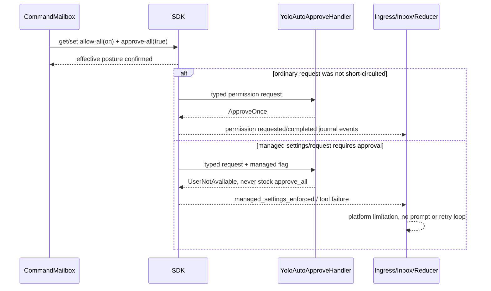
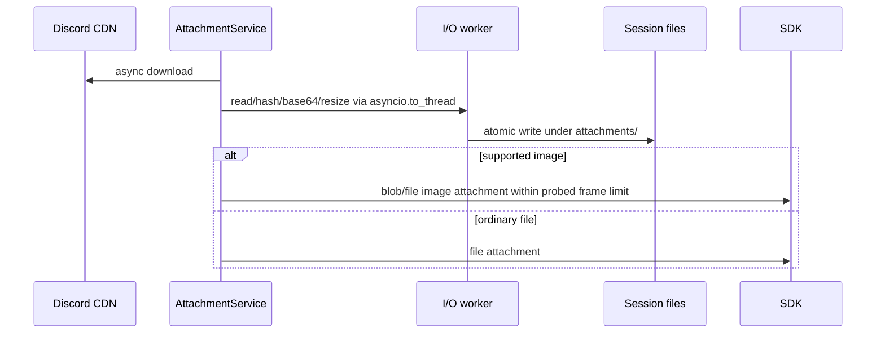
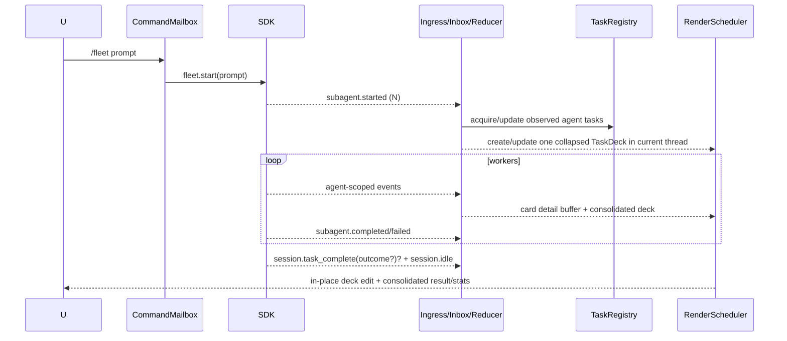

# copilotD 详细设计与实施计划

> 当前阶段：详细设计 v2.5 已批准，durable/capability foundation、Discord core、
> interaction router 与 background-task reconciliation 已实现；当前继续按 capability
> gate 补齐产品能力并做真实平台验收。
>
> 本版固定前提：单用户、私有部署、Copilot runtime 全程 `--yolo`，不设计多用户共享、
> 工具确认流程、安全沙箱或租户隔离。
>
> 2026-08-05 实测 SDK 1.0.8 / runtime 1.0.73 / protocol 3，generated event 为
> **114** 个；`factory.run_updated` 与 `session.context_cleared` 仅存在于 main branch，
> 不归入 1.0.8。stdio `--yolo`、full allow-all、
> create/resume 预注册 callback、跨 idle 回调、history/eventLog、usage/context、native `/after`
> 和 1/5/10 MiB frame 可用；sidecar client transport 断开后 session retention 不成立，因此
> 当前固定 bundled-runtime topology，不宣称 detached continuation。
>
> 交付格式：仓库 `docs/` 内同时提交 Markdown 内容源和 standalone HTML。

## 目标

新建一个 `copilotD` 项目：借鉴 `HXYerror/claudeD` 的产品结构——Discord 频道可绑定
本地项目、Discord 线程对应独立 Agent 会话；频道未绑定时固定以当前 OS 用户的 `$HOME`
作为 cwd。项目不复制 claudeD 代码，也不追求 Claude 专属功能的一比一复刻；Agent 能力、
命令名称、计费展示和交互语义都按 GitHub Copilot SDK 重新设计。

## 调研结论

结论：**可行，且核心能力覆盖度高，但不是替换一个依赖就能完成。**

GitHub 已提供官方 Python SDK：

- 包名：`github-copilot-sdk`
- Python：3.11+
- 状态：GitHub 于 2026-06-02 宣布 GA
- 许可证：MIT
- 架构：Python SDK 通过 JSON-RPC 驱动 Copilot CLI Agent Runtime
- Runtime：Python wheel 对应的 CLI runtime 可自动下载，也可连接独立 headless runtime
- 鉴权：本地已登录的 Copilot CLI 用户即可；GitHub token/OAuth、GitHub App 或 BYOK 是
  SDK 可选路径。本产品仅把显式 GitHub token 用于启用 managed-settings session options。
- 主要能力：流式输出、工具调用、文件编辑、持久会话、权限回调、MCP、Hooks、
  自定义 Agent、Skills、Plugins、图片输入、模型切换、上下文压缩、用量指标

需要注意：官方整体已 GA，但 PyPI 元数据仍保留 `Development Status :: 3 - Alpha`，
部分低层 RPC（例如 usage metrics、fork/compact 等）仍应视为需要版本固定和契约测试的
接口。实施时必须同时固定 SDK 和 bundled runtime 的兼容版本。

### 与 claudeD 的能力映射

| claudeD 能力 | Copilot 对应方案 | 结论 |
|---|---|---|
| Discord 消息双向桥接 | `session.send()` + session event subscription | 直接支持 |
| 实时打字机输出 | `assistant.message_delta` | 直接支持 |
| Thinking 展示 | `assistant.reasoning(_delta)` | 支持，是否产生取决于模型 |
| 工具状态、结果、Diff | `tool.execution_start/progress/complete`，读取 structured result | 直接支持，Renderer 要重写 |
| 线程对应会话 | 自定义 `session_id` + `create_session`/`resume_session` | 直接支持 |
| 重启后恢复 | persisted session + `resume_session()`；ephemeral idle/delta 不做 durable restart replay | transcript 可恢复；in-flight 默认 unknown |
| 中断当前任务 | `session.abort()` | 直接支持 |
| 切换模型/推理强度 | `set_model(model, reasoning_effort=..., reasoning_summary=..., context_tier=...)` | 高层 API 直接支持；按 model capability 校验参数 |
| 自动/手动 compact | infinite sessions + `session.rpc.history.compact()` | 支持，手动 RPC 需原型验证 |
| Fork 会话 | `client.rpc.sessions.fork(...)` | 可实现，低层 RPC 需原型验证 |
| 无确认工具执行 | runtime `--yolo` + per-session allow-all/approve-all 校验 + typed permission fallback | 直接支持；组织托管策略仍可能拒绝 |
| 交互式提问 | `on_user_input_request` / `user_input.requested` | 直接支持，可映射 Discord 按钮和菜单 |
| 图片附件 | file/blob image attachments | 直接支持 |
| 代码、文档附件 | 异步落盘，再使用 SDK file attachment | 应用层生命周期管理 |
| MCP server | `mcp_servers`，支持 stdio 和 HTTP | 直接支持 |
| Custom Agents/Subagents | `custom_agents` + subagent/task events | 直接支持；原 thread 内折叠 TaskDeck，不为 worker 新建 thread |
| Skills | `skill_directories` / `disabled_skills` | 直接支持 |
| Plugins | `plugin_directories` 或 runtime `--plugin-dir` | 直接支持 |
| Hooks | Copilot session hooks | 支持；Hook 名称和 payload 需适配 |
| Context 展示 | `session.usage_info` / context-info RPC | 直接支持 |
| 用量 | `/usage`、AI Credits、premium request multiplier、account quota | 只读展示 Copilot 原生语义，不提供 limits 配置 |
| worktree | 应用层调用 Git 创建并绑定新工作目录 | copilotD durable extension |
| Autopilot/Plan/Fleet/Tasks | mode get/set、per-message agentMode、Fleet/task RPC | mode/Plan compatibility-supported；Fleet/tasks 需 gate |
| Quick side question | `session.rpc.ui.ephemeral_query()` | Native-Gated；no-tools/no-history fixture 后提供 `/ask` |
| Code/security review/research | generated `session.rpc.commands.list/invoke` 可发现并调用 builtin | 严格 Native-Gated；不得用 app prompt wrapper 冒充 |
| Cross-model critique | builtin `/rubber-duck` invocation | 严格 Native-Gated；由 runtime 选 critic model |
| Scheduler | builtin `/after`/`/every` command invocation 与 app durable `/schedule` 分离 | 两套 registry，不互相映射；不依赖 private schedule-add RPC |

### 不应照搬的 Claude 语义

- 不保留 `ClaudeBridge`、Claude message block 和 Claude tool name；改为
  `CopilotBridge` + 统一内部事件模型。
- `/cost`、`/budget`、`/limits` 和 fallback-model 直接删除；只保留只读 `/usage`，
  model 使用 `Auto` 或显式选择。
- `/review`、`/security-review`、`/research` 只有在 pinned runtime 的
  `commands.list(include_builtins=true)` 返回对应 builtin，且 disposable-session
  `commands.invoke()` fixture 通过时才注册；不得自行拼 prompt 模拟。PR/Delegate 不进入产品面；
  durable scheduler/project-worktree 明确标为 copilotD extension。
- 不创建 `/workflow`、`/max-turns`、`/goal`、`/bare` 等无 Copilot 原生对象的命令。
- Claude 的可切换运行模式和审批 UI 不迁移；copilotD 固定使用 `--yolo`，每次 create/resume
  验证 session allow-all，typed permission handler 只作自动批准兜底和遥测。
- 不依赖宿主机中“碰巧存在”的插件、工具或个人配置；生产配置必须显式、可复现。

### SDK 契约二次审计快照

本版按官方 `github/copilot-sdk` commit
`e7876395f12a6dcc375a84b11ac73ea86667e3ec` 的 Python handwritten API、generated RPC、
generated session events、文档和 E2E 测试交叉审计。实现时仍以最终 pin 的 SDK/runtime
重新生成同一份矩阵，不能把这里的源码快照当永久兼容保证。

| 契约面 | 当前可确认事实 | 设计约束 |
|---|---|---|
| create/resume registration | local create 与 resume 都在 RPC 前注册 session handlers 和 `on_event`；cloud server-ID create 在 reader 收到 response 时 inline 注册 | app 必须把唯一 ingress 直接传入 create/resume，不得 return 后补订阅 |
| post-create options patch | create/resume server RPC 成功后，SDK 还可能调用 `session.options.update`；patch 失败会移除 local registration、best-effort disconnect 后抛错 | 从发起 create/resume 起，除非错误明确证明 server side effect 未发生，否则都按 attachment unknown 对账；create 只 reconcile 预分配 ID，禁止第二次 create |
| Event envelope | native 字段是 `id/timestamp/type/agent_id/ephemeral/parent_id/raw_type`；没有 `persisted`；SDK 1.0.8 generated enum 共 114 个值（含 `unknown`），main branch 另有 `factory.run_updated`、`session.context_cleared` | `ephemeral is True` 才归 ephemeral，否则归 durable；unknown type 保留 raw_type/raw payload；升级必须全量 diff enum，不能把 main-only 事件计入 1.0.8 |
| `parentId` | 文档定义为“前一个 event”的 linked-list predecessor | 用于链完整性与 replay order；语义关联使用 explicit IDs |
| `send()` | 返回 server `messageId`，官方说明可用于 event correlation；generated `QueuePendingItems` 有 stable opaque `id`，但 `UserMessageData` 没有 messageId，只有 envelope event UUID | acceptance/native-queue/user-event ID 分列持久化；fixture 固定三者关系，未证明时仅严格单候选 fallback；crash gap/歧义进入 submitted unknown |
| queue delivery | `mode` 省略时默认 `enqueue`；immediate 若错过 current turn 会移入普通 queue | app FIFO 是唯一 durable queue，但每次只 dispatch 一项，并 query native pending snapshot |
| agent loop | 每个 `assistant.turn_start/end` 恰好一次 LLM API call；一个 user message 可有多 turn | turn、submission 和 semantic task completion 必须分层 |
| idle/task complete | `session.idle` always emitted、ephemeral、表示 loop/queue drained；`task_complete` 是 optional durable evaluation，带 optional `objectiveId`，outcome 为 `completed|continue|blocked`，Autopilot 会在缺失/continue 时注入 nudge | 先按 `objectiveId` 关联 active objective/submission；只有 correlated completed（兼容 outcome 缺失且 `success=true`）+ final idle 才是 Autopilot semantic completion |
| model config | high-level `set_model()` 已接受 reasoning effort/summary/context tier，但返回 `None`；generated `model.get_current()` 可读当前 model/effort/context tier | 不再创建低层 `/model options`；按 capability 校验；set ambiguity 通过 event/get-current 对账，不假装 rollback |
| session/message mode | `SessionMode` 只有 interactive/plan/autopilot；`SendAgentMode` 另有 shell，但 `send(agent_mode=...)` 只是 queued-entry/UI 快照，当前 session mode 才约束 write gate/continuation | Plan/Autopilot 必须先 `mode.set` 并确认；shell 只可作为外部 `user.message.agentMode` 事实记录 |
| permission posture | generated `permissions.set_allow_all(mode=on)` 是 full allow-all，`set_approve_all(true)` 会 short-circuit handler；stock `PermissionHandler.approve_all` 在 `managed_settings_enabled=true` 时抛错，managed request 会返回 no-result | CLI `--yolo` 后仍按 session 验证；普通 request 才 ApproveOnce，managed request 确定性 platform-blocked；无法证明 allow-all 就禁止 dispatch |
| interactive handlers | user-input/plan-exit/auto-mode-switch 是 awaitable server-request handler；typed 参数不暴露 protocol requestId | handler 可等 Discord future，但 callback/reducer 不等；app interaction ID 与 wire request journal 分离 |
| broadcast requests | permission/tool/elicitation/MCP/command 由 SDK event dispatcher 启动 handler 并调用 specific response RPC | app 不重复响应；event requestId 只做 protocol journal，除非 high-level request明确暴露 |
| background tasks | `session.background_tasks_changed` payload 为空；task RPC 提供 refresh/list/progress/cancel/remove/message/wait，status 为 running/idle/completed/failed/cancelled | change 后 refresh/list；running/idle 非终态，消失且无 terminal 为 UNKNOWN |
| runtime activity | generated `metadata.isProcessing()` 表示 local turn/background continuation；`metadata.activity()` 给 abortable/hasActiveWork，remote session 的 isProcessing 固定 false | attach、change trigger、stall 与 mutation gate 前 coalesced query；false 只用于 readiness，不单独证明 submission success |
| event replay | handwritten `get_events()` 返回 history；experimental `eventLog.read/tail` 提供 cursor、long-poll、expired rebase，并可在 live ring 返回 ephemeral | durable backfill 用 `include_ephemeral=false`；ring 不等于 restart replay |
| builtin commands | experimental `commands.list/invoke` 已有 E2E；result union 为 text/agent-prompt/completed/select-subcommand | selected builtin 可 strict gate；command name/event 不能单独作为能力 |
| native schedule | public generated API 只有 list/stop；add/addCron/addAt/addSelfPaced 位于 private API；`manageScheduleEnabled` 只控制 agent 的 `manage_schedule` tool 暴露 | `/after`/`/every` 走 gated builtin invocation，禁止依赖 private add；必须在 tool disabled 条件下验证 create 直接完成 |

## 推荐架构

```text
Discord
  -> DiscordIngress
      -> ProjectRegistry
        channel -> explicit project；无 binding -> implicit $HOME project
      -> SessionRegistry
         thread -> SessionRuntime -> Copilot session_id
      -> SessionRuntime（每个 thread 唯一且常驻）
         -> CommandMailbox（唯一 app-initiated mutating/exclusive command lane、持久 FIFO）
         -> SdkEventIngress（create/resume 前注册的唯一非阻塞 on_event callback）
         -> ReducerInbox（raw callback receipt + fenced command/snapshot receipt 的有界 MPSC queue）
         -> EventReducerWorker（ReducerInbox 单一 consumer + journal/reducer/outbox）
         -> SnapshotReconciler（coalesced activity/tasks/queue/eventLog read RPC -> ReducerInbox）
         -> ResponseCoordinator（awaitable handlers + exactly-once response RPC）
         -> LivenessController（submission/observed-task/interaction leases）
         -> TaskRegistry（强引用 app asyncio tasks + SDK task/background observations）
      -> CopilotBridge
         create/resume/on_event/send/abort/model/mode + capability-gated RPC
      -> EventAdapter -> SessionReducer
         raw SDK events -> versioned internal events -> durable state/render intents
      -> RenderScheduler -> RenderOutbox
         Markdown block assembler、表格缓冲/PNG、流式文本、可折叠 TaskDeck、final flush
      -> InteractionGateway
         ask_user、elicitation、plan；不处理工具确认
      -> UsageService / Scheduler / RuntimeSupervisor
```

四个核心边界：

1. Python SDK 不暴露应用拥有的 `receive_response()` stream。每次 create/resume 必须把唯一
   `on_event=SdkEventIngress` 在 RPC 前注册；callback 只复制规范化事件到有界 ReducerInbox，
   不做 SQLite、Discord、文件 IO，也不等待用户交互。单一 `EventReducerWorker` 串行持久化。
2. daemon 禁止使用 `send_and_wait()`。它等待下一次 session-wide `session.idle`，不与某个
   message ID 绑定，无法安全支持并发 queue、steer、Autopilot 或长任务。
3. `session.idle` 是不进入 durable restart replay 的 SDK agent-loop/SDK-queue drained 信号，不是 disconnect、
   background-task completion 或 crash-window success 证明。SessionRuntime 只因显式 close/
   delete、terminal shutdown 或不可恢复 transport failure 释放 handle。
4. CommandMailbox 只串行 app 主动发起的 mutating/exclusive session operations；SDK awaitable handler 返回、
   SDK 内部 broadcast response RPC 和 app generated handle-pending response 走独立
   ResponseCoordinator，否则 ask-user/permission 会与等待它们的 turn 互相死锁。所有 response
   task 仍受 owner fence、request/interaction exactly-once 与 TaskRegistry 管理。

## 单用户 `--yolo` 与常驻部署基线

- 只有一个可信操作者和一个 Copilot 身份；bot 所在私有 Discord 即操作面。
- runtime 固定以 `--yolo` 启动；每次 SDK create/resume 后、首次 send 前验证 session 的
  full allow-all/approve-all 已生效。普通 typed permission request 自动批准，不生成 Discord
  审批卡，也不存在任何可切换配置。
- `setup`、service install、session create/resume 和 Discord thread creation 都接受本地
  Copilot CLI 登录态；`COPILOTD_GITHUB_TOKEN` 可选。仅当显式 token 存在时才传递
  `github_token`/`enable_managed_settings`，缺失时省略这两个 option，使用正常 runtime 登录态。
- 不实现 guild/user/role allowlist、Owner/Admin 区分、路径沙箱、URL/MCP policy、
  SecretStore、内容脱敏审计或多租户隔离。
- 宿主进程用户能访问的文件、命令、网络和凭据，Agent 都可能访问。这是明确产品前提，
  不是待补安全项。
- 每个未显式停止的 session 默认常驻；没有 idle reaper，没有“运行满 N 分钟”的硬生命周期
  上限。
- channel 有显式 binding 时使用绑定 cwd；没有 binding 时使用启动账号的 resolved
  `$HOME`。该行为固定启用，没有 fail-closed 或 fallback 开关。
- 优先验证独立 headless runtime/sidecar，使 Discord bot 重启时 runtime 和后台任务仍可
  继续；若 SDK/runtime 不支持连接重放，则把“进程重启会中断 in-flight task”明确标为
  capability 限制，不伪装为无损恢复。
- SDK、runtime 和 protocol 固定版本；启动时做 capability、event replay、frame size 和
  session resume 探测。

## macOS / Windows 默认自启动与进程保活

`copilotd setup` 是标准首次配置入口，默认完成平台 service 安装、立即启动并验证状态。
只有显式 `copilotd run --foreground` 才以前台开发模式运行。不会要求用户另外执行保活
脚本。

统一 service graph：

```text
OS service manager
  ├─ copilotd-runtime   独立 headless Copilot runtime sidecar
  ├─ copilotd-bot       Discord gateway + SessionRuntime/Ingress/Reducer
  └─ copilotd-watchdog  每 5 分钟检查 heartbeat、gateway、runtime 和 restart loop
```

如果 SDK spike 证明 headless runtime 不能独立存活，仍安装 bot + watchdog，但 capability
标记为 `bundled-runtime`；watchdog 在有 protected work 时不得强杀 bot。

### 通用 service CLI

| 命令 | 行为 |
|---|---|
| `copilotd setup` | 生成配置、安装当前 OS service、立即启动、验证 heartbeat/runtime/Discord |
| `copilotd service install` | 幂等安装或更新 service definition；总是先卸载旧内存定义再注册 |
| `copilotd service status` | 显示 OS manager 状态、PID/generation、heartbeat age、gateway、runtime、active leases、remote exposure 与 native schedules |
| `copilotd service restart` | 默认仅在无 protected work 且所有 session detach-safe 时执行；`--force` 标记 in-flight/remote/native-trigger window outcome unknown |
| `copilotd service logs` | 输出 app、boot、watchdog 和 alerts 日志位置 |
| `copilotd service uninstall` | 停止并注销 service；保留 SQLite、session state 和 logs |
| `copilotd run --foreground` | 不注册 service 的显式开发入口 |

restart 使用持久事务而不是“读一次 heartbeat 后 kill”：

1. manager 写 `requested` fence，同时记录 PID、OS process start、generation 和
   event-journal high-water mark；
2. bot 关闭全局 create/resume/send admission，停止并 await queue/task/permission/owner-renew
   producer，冻结并 await mailbox，再 drain reducer inbox；
3. `acknowledged` 通过 producer counter + journal high-water 的同一条 CAS 提交；任何 SDK
   callback 或 internal producer 在 requested/acknowledged/prepared/committed 阶段都持久计数，
   ACK 后到达则令可逆阶段 violated；
4. normal restart 只在 fenced snapshot 无 blocker 时进入 owner handoff；force 先原子提交
   `prepared`，只把真实 in-flight 结果置 unknown，并保持 local queued/cancelled/terminal；
5. `committed` 与 owner lease expiry、binding recovery_unknown 同事务；此后失败只能 fail-closed
   terminate，不能 release/reopen。新 PID/generation/process-start 在启动 attach 前完成 committed
   fence adoption，随后 queued claim 以新 generation/fence 重建 submission lease。

schema 11 将 service-control protocol 固定为 v2：旧 v1 worker 在建立 v2 fence 前必须由 OS
manager 停止并证明原 PID/process-start 已退出；新 worker 通过私有 handoff token、effective
manager PID/start 和 generation 三重证明后才能 adoption。inbox observer 安装与 reserve 共用
barrier；overflow 或非阻塞 SQLite accounting 失败写 0600 durable watermark，任何 watermark
都会阻止 ACK/commit。rollback 有 persisted pending/attempts/complete 状态并有界重试；
prepared/committed worker 自行退出，避免 fresh heartbeat 掩盖 stranded transaction。

### Heartbeat 协议

bot 每 30 秒原子写入 heartbeat JSON；不是只 touch mtime：

```json
{
  "schema_version": 1,
  "pid": 1234,
  "process_generation": 7,
  "written_at": "RFC3339",
  "gateway_state": "ready|reconnecting|down",
  "gateway_down_since": "RFC3339|null",
  "runtime_state": "ready|reconnecting|down",
  "attached_sessions": 4,
  "active_submissions": 1,
  "observed_background_tasks": 2,
  "active_or_unknown_native_schedules": 0,
  "remote_steerable_or_unknown_sessions": 0,
  "pending_interactions": 1,
  "ingress_queue_depth": 0,
  "max_reducer_lag_ms": 12,
  "last_callback_at": "RFC3339",
  "last_reducer_progress_at": "RFC3339",
  "durable_replay_capable": true
}
```

watchdog 默认每 5 分钟运行。heartbeat age > 120 秒视为 event-loop stale；系统刚从睡眠/
休眠恢复 60 秒内跳过一次，避免误杀。gateway 连续 down 600 秒才进入 restart 判断，短暂
Discord reconnect storm 不触发重启。

本节及 worktree/ops 中的 “active lease” 均指 `liveness_leases` 中属于当前
generation/fence 且 state=active 的 submission/background/interaction lease，不指每个
attached session 都必然持有的
`session_owner_leases` owner fence；owner fence 本身不是 restart blocker。watchdog 的
“protected work” = active lease、任一 active/unknown native schedule，或 remote
steerable/unknown session；后两者即使当前没有 turn，也要求保持 attached ingress。

| 场景 | 自动动作 |
|---|---|
| bot 进程退出 | OS manager 30 秒节流后重启 bot |
| runtime sidecar 进程退出 | OS manager 重启 runtime；所有 in-flight submission/native-trigger window 标 outcome unknown，owner-fenced resume + schedule reconcile |
| bot heartbeat stale、无 protected work | watchdog 只重启 bot，不重启健康 runtime |
| bot heartbeat stale、有 protected work、sidecar replay 已验证 | checkpoint 后只重启 bot，重连同一 runtime 并 replay |
| bot heartbeat stale、有 protected work、无 sidecar/replay | 不自动强杀；写 alert，保留进程、任务、remote ingress 和 native schedule，等待人工 `--force` |
| gateway down > 600 秒、无 protected work | freeze heartbeat，由 watchdog 重启 bot |
| gateway down > 600 秒、有 protected work | 继续 heartbeat，不自动杀 bot/runtime；写告警并等待 gateway 恢复或人工 force |
| 连续 3 个 5 分钟 watchdog 周期均发生重启 | 第 4 次停止主动 kick loop，写 alerts log，并发本机桌面通知；15 分钟窗口允许覆盖真实 cadence |

这比 claudeD 的固定 hard ceiling 更保守：后台工作优先，不因 watchdog 误杀 session。

### macOS：LaunchAgent

sidecar topology 默认安装三个 user-level LaunchAgent 到 `~/Library/LaunchAgents/`，无需 sudo：

| Label | 关键配置 |
|---|---|
| `com.github.copilotd.runtime` | `RunAtLoad=true`、`KeepAlive=true`、`ThrottleInterval=30` |
| `com.github.copilotd.bot` | `RunAtLoad=true`、`KeepAlive=true`、`ThrottleInterval=30`、absolute argv/cwd/HOME/PATH |
| `com.github.copilotd.watchdog` | `StartInterval=300`，执行 `copilotd service watchdog` |

若 SDK spike 将 runtime topology 固定为 `bundled-runtime`，installer 明确省略独立 runtime
label，只安装 bot + watchdog；这不是禁用默认保活，runtime 由 bot 的 KeepAlive 生命周期托管。
status/verify 使用持久化的 topology capability 决定期望 2 还是 3 个 label。

主 plist **不写 `ProcessType`**，保持 launchd 默认 `Standard`；设置
`LowPriorityBackgroundIO=false`。claudeD [#232](https://github.com/HXYerror/claudeD/issues/232)
实测 `ProcessType=Background` 会令长连接 bot 每 15–25 分钟因 “because inefficient” 被
launchd 回收，后续 `Interactive` 也未解决；当前模板最终删除该键。

安装/更新必须对 topology 期望的 2/3 个 label 依次执行 `launchctl bootout`（不存在可忽略）后再
`bootstrap + enable + kickstart`，不能只覆盖磁盘 plist。claudeD
[#168](https://github.com/HXYerror/claudeD/issues/168) 的 healthcheck 因 launchd 保留旧
内存定义而从未按 `StartInterval` 运行。安装完成后同时验证：

1. `plutil` 读取 watchdog plist 的 `StartInterval=300`；
2. `launchctl print gui/<uid>/com.github.copilotd.watchdog` 包含
   `run interval = 300`；
3. bot 与 topology 要求的独立 runtime state 为 running，heartbeat 在 45 秒内出现；
4. 运行满 60 分钟的 soak 中 launchd log 没有 `because inefficient`。

路径固定为：

```text
~/Library/Application Support/copilotd/   SQLite/session/runtime state
~/Library/Caches/copilotd/heartbeat.json
~/Library/Logs/copilotd/{copilotd.log,watchdog.log,alerts.log,boot.log}
```

app log 使用 10 MiB × 7 rotating files。watchdog 读取最近一次 `DarkWake/Wake`，60 秒内
不重启。restart loop 达阈值时使用 `osascript display notification`，同时始终写 alerts.log。

### Windows：Task Scheduler

claudeD [#289](https://github.com/HXYerror/claudeD/issues/289) 推荐 “Task Scheduler XML +
PowerShell install script”，但 merged [#290](https://github.com/HXYerror/claudeD/pull/290)
只完成跨平台运行 subtasks 1–5；当前 main 没有 Windows 自启动脚本。copilotD 首版直接
补齐该缺口，不引入 NSSM 或 pywin32 service。

`copilotd setup` 调用签入的 `install-service.ps1`，在 sidecar topology 注册三个
current-user Scheduled Task：

| Task | Trigger/Settings |
|---|---|
| `copilotD Runtime` | AtLogOn；失败每 1 分钟重启；`ExecutionTimeLimit=PT0S` |
| `copilotD Bot` | AtLogOn；失败每 1 分钟重启；`MultipleInstancesPolicy=IgnoreNew` |
| `copilotD Watchdog` | AtLogOn 后每 5 分钟重复；`StartWhenAvailable=true` |

`bundled-runtime` topology 同样省略独立 Runtime task，只注册 Bot + Watchdog，并由
status/export verifier 按已探测 topology 校验 2/3 个 task；两种 topology 都默认安装和启动。

runtime/bot task 统一设置 schema-valid `RestartCount=255`、`RestartInterval=PT1M`、`DisallowStartIfOnBatteries=false`、
`StopIfGoingOnBatteries=false`、`WakeToRun=false`，使用安装时解析出的绝对 Python/entrypoint
和 working directory。安装总是先 `Unregister-ScheduledTask` 再
`Register-ScheduledTask -Xml`，随后 `Start-ScheduledTask` 立即启动，避免磁盘 XML 已更新
但 Task Scheduler 仍使用旧定义。

安装后用 `Get-ScheduledTask` + `Export-ScheduledTask` 验证 AtLogOn、5 分钟 repetition、
restart interval/count、无 execution time limit，并在 45 秒内看到 heartbeat。路径固定为：

```text
%LOCALAPPDATA%\copilotd\state\
%LOCALAPPDATA%\copilotd\cache\heartbeat.json
%LOCALAPPDATA%\copilotd\logs\{copilotd.log,watchdog.log,alerts.log,boot.log}
```

watchdog 通过 PowerShell 查询最近的
`Microsoft-Windows-Power-Troubleshooter/Operational` resume event，60 秒内跳过。重启
风暴写 alerts.log，并尽力发送 Windows toast。TableRenderer 字体候选必须包含
`C:\Windows\Fonts\msyh.ttc`、`simsun.ttc`、`arial.ttf`，对应 #289 的中文表格 tofu 问题。

## 设计门禁

编码前必须先完成并审批本文件中的详细设计，设计内容至少覆盖：

- 产品范围、非目标、单用户 `--yolo` 执行模型；
- 组件架构、runtime 部署、SQLite 数据模型和持久化目录；
- 全部 copilotD 命令的参数、前置条件、SDK 映射、状态变化、响应和错误；
- claudeD 现有命令的保留、重命名、合并、删除或延期决策；
- 完整 SDK event -> copilotD internal event -> Discord UI 映射；
- session binding/handle、submission、model turn、mode、background observation、interaction 和
  app/runtime scheduler 状态机；
- 启动/eager resume、普通 submission、Autopilot agent loop、background evidence、
  app queue/steer、ask-user、
  attachment、abort、model switch、compact、fork、subagent、scheduler 和 runtime
  crash 时序；
- session 常驻、callback/reducer、owner fencing、timeout、retry、Discord rate limit、表格显示、quota、
  恢复和版本兼容策略；
- macOS LaunchAgent、Windows Task Scheduler、heartbeat/watchdog、默认自启动和
  active-task-safe restart；
- claudeD issues 中已验证故障的对应回归测试；
- event fixtures、契约测试、状态机测试和端到端验收标准。

设计审批后，低层 RPC 仍须通过技术原型才能从“能力候选”进入稳定命令面；不允许用近似
行为伪装 fork、compact、usage/context 或 fleet 成功。

## 详细设计

### 产品决策

1. 一个 Discord thread 对应一个 Copilot session；thread 是展示、队列和渲染边界。
2. channel cwd 解析顺序固定为：显式 `/project bind` > resolved `$HOME`。未绑定频道可直接
   创建 thread/session；session 持久化 cwd snapshot，后续 bind/unbind 不改变旧 session。
3. 所有会话共享一个可信 Copilot runtime，runtime 固定 `--yolo`。
4. 每个 thread 创建一个常驻 `SessionRuntime`。`CommandMailbox` 是唯一 app 主动
   mutating/exclusive operation lane；
   create/resume 前注册一个 `SdkEventIngress`，其事件只进入一个 `EventReducerWorker`。
5. `session.idle` 只表示当前 SDK agent loop 与 SDK 自有 queue 已 drain；它不进入 durable
   restart replay，也不证明 crash 窗口内 submission 成功。callback、reducer worker 和
   SessionRuntime 继续存活。
6. 不设置绝对 max-life。任何 raw event、task snapshot 或 background observation 变化都刷新
   activity/progress heartbeat；长任务不会仅因运行时间长被回收。
7. 忙碌时普通消息先只进入 app 持久 FIFO；operationally ready 后每次最多向默认 native
   enqueue lane dispatch 一项。显式 `/steer` 使用 SDK immediate，但只承诺 best-effort
   current-turn delivery。
8. `abort` 取消当前 SDK turn；普通 `close` 只在 detach-safe 时 final flush -> disconnect，
   force close 才 interrupt/drain/disable remote/stop native schedule；
   两者都保留 SDK history，`delete` 永久删除。
9. fork/project-worktree 创建新 Discord thread 和新的常驻 SessionRuntime；worktree 默认不继承
   history，只有 fork probe 成功才允许显式继承。
10. app 只保存一个 `sdk_session_id`。`resume_session(id)` 成功或失败是权威结果；SDK 不返回
   可供比对的第二个 actual ID。恢复失败不能静默 create 新 session 覆盖原 thread。
11. subagent、Fleet worker、background agent/shell/task 都是当前 Copilot session 的内部执行单元，
   永不创建 Discord child thread。只有显式 new/fork/worktree/new-session
   schedule 能创建 thread；后台执行统一投影为原 thread 内可折叠 TaskDeck 卡片。
12. macOS LaunchAgent 和 Windows Scheduled Tasks 在 `copilotd setup` 时默认安装并立即启动。
13. 表格不能直接按普通 Markdown delta 输出；必须完整缓冲后一次性渲染。
14. raw reasoning 默认只展示 intent/concise summary，不展示 opaque/encrypted payload。
15. 只注册 Core 和 probe 成功的 Native-Gated commands；不为 claudeD 命令制造近似替代。
16. Autopilot 是首版 Core：bare `/autopilot` 进入 mode，`enabled:false` 退出；命令不携带
   prompt。`/plan` 使用 optional `action=enter|exit|show` 而不是 Discord subcommand，因而 bare
   `/plan` 可默认 enter；optional prompt 仅是确认 Plan mode 后的便利提交。普通消息保存 mode
   snapshot。

### 产品范围与非目标

首版包括可选项目绑定、未绑定 `$HOME` 默认 cwd、thread 会话、文本/图片/文件、
create/eager-resume/send/abort/set-model/disconnect、预注册 event ingress/单 reducer、后台
observation、工具/diff/usage/subagent 渲染、表格 PNG/附件、ask-user/elicitation/
autopilot/plan 交互、SQLite 状态、render outbox、macOS/Windows 默认 service/watchdog。
命令面优先交付 Core session/model/autopilot/plan/steer 与 Projection context/usage，再按
specific RPC/invocation probe 加入 Fleet、Tasks、agents、after/every/remote 及 selected
ask/review/security-review/research/rubber-duck capabilities；queue/schedule/project-worktree/ops 明确是
copilotD extension。

明确不做：

- 不复刻 Claude Code CLI 命令或 Claude message block。
- 不执行用户提交的任意 session settings JSON。
- 不保证所有模型都有 reasoning、vision、long context 或相同工具。
- 不做多用户共享、资源 ownership、审批、沙箱或可切换权限 profile；Agent 行为只使用
  Copilot 原生 interactive/plan/autopilot mode。
- 不承诺主机重启后 in-flight task 可继续；只有 SDK/runtime 能提供 detached runtime +
  replay 时才升级为该保证。
- 不把 `session.task_complete`（包括 `outcome=completed`）、task 列表变空或第一个空 result
  单独当作会话可停止信号；semantic completion 还要 correlated final idle。

### 固定 `--yolo`

这里没有权限层：没有配置对象、审批状态机、session/project 级切换或相关命令。唯一行为
就是 runtime 启动时启用 `--yolo`，并在每个 session attach 后证明有效权限 posture 确为
full allow-all。SDK 若仍发送普通 typed permission request 则返回 owner-fenced
`ApproveOnce`。

| 项目 | 固定行为 |
|---|---|
| Runtime 启动 | 传递 `--yolo`；技术原型记录实际 CLI 参数和版本 |
| Runtime 鉴权 | 本地 Copilot CLI 登录态有效；显式 GitHub token 可选，仅存在时启用 managed settings |
| Session attach | create/resume 后调用 gated `permissions.get_allow_all()` 对账；必要时 `set_allow_all(mode=on)` + `set_approve_all(enabled=true)`，确认成功前不 dispatch |
| Permission handler | 普通 request 返回 `ApproveOnce`；`managed_settings_enabled` 或 `managedApprovalRequired` 不调用 stock `approve_all`，显式标 platform limitation 并返回 unavailable，避免抛错或无限 pending |
| Discord 确认 UI | 不存在 |
| Tool 集合 | 使用 runtime 全部可用工具；不提供 allow/deny/enable/disable 命令 |
| 平台强制限制 | 若 GitHub 组织策略仍拒绝操作，原样显示为 platform limitation |
| Ask user / plan | 仍需交互，因为它们是语义输入或执行方向 |
| 宿主能力 | bot 拥有运行 `copilotd` 的 OS 用户可用的全部能力 |

### 组件职责

| 组件 | 职责 |
|---|---|
| `DiscordIngress` | gateway、slash command、message/context-menu；慢命令立即 defer |
| `ProjectRegistry` | 显式 channel binding；无 binding 时生成 implicit `$HOME` project snapshot |
| `SessionRegistry` | thread binding、metadata、eager resume 和常驻 runtime 集合 |
| `SessionRuntime` | 聚合一个 SDK handle、CommandMailbox、SdkEventIngress、ReducerInbox、ReducerWorker、SnapshotReconciler、ResponseCoordinator、liveness/task/render 状态 |
| `CommandMailbox` | 唯一 app mutating/exclusive operation lane；以 durable `session_operations` envelope 串行 send/steer/abort/reconfigure/close/native-command invocation/exclusive ephemeral query 与持久 FIFO |
| `ModeController` | desired/runtime mode、`mode.get/set`、plan-exit confirmation 与 message mode snapshot |
| `SdkEventIngress` | create/resume RPC 前注册的唯一 `on_event` callback；无阻塞 enqueue，异常显式上报 |
| `ReducerInbox` | 单 session 有界 MPSC queue；接收 SDK receipt，以及带 owner fence/generation 的 command receipt/internal snapshot |
| `EventReducerWorker` | ReducerInbox 单一 consumer；ID/parent/agent correlation、journal、state 与 durable render intent |
| `SnapshotReconciler` | 合并 activity/task/queue/cursor change trigger，在 reducer 外执行 read RPC，再把带 generation/fence 的 snapshot event enqueue 到 ReducerInbox |
| `ResponseCoordinator` | 管理 direct handler future、SDK broadcast response 与 app-owned handle-pending RPC；不经过可能导致 turn deadlock 的 CommandMailbox |
| `LivenessController` | submission/observed-background/interaction lease 与 stall watchdog |
| `TaskRegistry` | SDK task/background evidence reducer；强引用所有 app `asyncio.Task`，done callback 回收/报错 |
| `RuntimeSupervisor` | runtime/transport 健康、sidecar capability、退避重连和版本探测 |
| `CopilotBridge` | SDK public API 与 capability-gated RPC facade |
| `CapabilityRegistry` | public API、低层 RPC 和模型 capability 探测 |
| `EventAdapter` | raw SDK event 到 versioned internal event |
| `SessionReducer` | 持久事件去重、submission/model-turn/background observation 与 durable render intent |
| `RenderScheduler` | 单 session 顺序队列、coalescing、Discord rate limit 和 final flush |
| `MarkdownAssembler` | block-aware streaming；保护 fence、blockquote 和 table |
| `TableRenderer` | 完整表格解析、code block/PNG/MD/CSV 输出和降级 |
| `RenderOutbox` | 持久化未发送/待编辑/final render，Discord 失败不重跑 Agent |
| `InteractionGateway` | ask-user、elicitation、plan、MCP OAuth |
| `AttachmentService` | 异步下载/读盘/编码、临时文件和 Discord attachment batching |
| `ExtensionRegistry` | MCP、skills、plugins、custom agents 配置 |
| `UsageService` | event 聚合、experimental RPC snapshot、quota、本地统计 |
| `Scheduler` | schedule、lease、fire、catch-up、幂等 |
| `WorktreeService` | Git worktree 创建、绑定和清理 |
| `Diagnostics` | ingress/reducer、task、stderr tail、outbox、rate limit 和 resume 诊断 |

首选部署为常驻 bot + 独立 headless runtime sidecar，但 SDK 不保证 client detach 后 active
task 继续。spike 必须验证 sidecar ownership、durable event replay 和 pending-work recovery；
失败时首版回落 bundled stdio，所有 in-flight submission 标 outcome unknown。runtime crash
使用 `1s, 2s, 5s, 10s, 30s` 抖动退避；恢复时在 owner fencing 成功后 eager resume 未显式
closed 的 binding，绝不自动重发结果未知的 prompt。

### 持久化与目录

| 表 | 关键字段 |
|---|---|
| `global_config` | key, value；包含 resolved_home、default mention、global extension config |
| `channel_settings` | channel_id, layout, mention_required, config_version；不等同 project binding |
| `projects` | id, channel_id, root_path, cwd, config_version, state(active/retired)；只存显式 binding，旧 session 引用的 retired snapshot 不删除；layout/mention 只由 channel_settings 持有 |
| `project_env` | project_id, name, value |
| `mcp_servers` | project_id, name, transport, config_json, enabled, version |
| `skill_dirs` / `plugin_dirs` | project_id, path, enabled |
| `custom_agents` | project_id, name, description, prompt, tools_json, enabled |
| `session_creation_intents` | source_kind(message/context-menu/slash/schedule), source_id, creation_token, project_source, cwd_snapshot, sdk_session_id(preallocated UUID), thread_id?, starter_message_id?, attachment_manifest_id?, state(reserved/thread_created/creating/attached/unknown/failed), created_at；`source_kind+source_id` 唯一 |
| `session_bindings` | thread_id(PK), project_id?, project_source(explicit/home), cwd_snapshot, sdk_session_id(unique), binding_intent(active/closed/deleting/delete_unknown/deleted), attachment_state, attachment_reason(user_active/scheduler_run/recovery_cleanup)?, permission_posture(unverified/verified_allow_all/platform_blocked/unknown), permission_verified_at?, desired_mode, pending_mode?, pending_mode_transition_id?, runtime_mode, desired_model_config, pending_model_config?, pending_model_transition_id?, runtime_model_config?, desired_agent(default/name), pending_agent?, pending_agent_transition_id?, runtime_agent(unknown/default/name), pending_remote_target?, pending_remote_transition_id?, runtime_remote_mode(unknown/off/export/on), remote_url?, desired_session_config_version, pending_session_config_version?, runtime_session_config_version?, runtime_processing?, runtime_has_active_work?, runtime_abortable?, activity_observed_at?, runtime_generation, owner_fence_token, event_cursor?, cursor_status?, last_inbox_seq, last_sdk_receive_seq?, last_event_at, row_version |
| `session_owner_leases` | sdk_session_id, owner_id, fence_token(monotonic integer), acquired_at, renewed_at, expires_at；60 秒 TTL/20 秒续租，跨进程唯一 create/resume/send/abort/disconnect 权限 |
| `session_operations` | operation_id, sdk_session_id, runtime_generation, owner_fence_token, kind, idempotency_key, input_hash, state(pending/started/confirmed/rejected/unknown), result_ref?, error_code?, started_at?, settled_at?；`sdk_session_id+idempotency_key` 唯一；所有 app-initiated mutating/exclusive RPC 的 durable envelope，domain row 仍是权威状态 |
| `reconciliation_state` | sdk_session_id, topic, requested_epoch, applied_epoch, status(idle/querying/stale/failed), runtime_generation, owner_fence_token, query_start_sdk_receive_seq?, query_end_sdk_receive_seq?, observed_at?；防止迟到的 negative snapshot 覆盖更新的 event evidence |
| `submissions` | submission_id, sdk_session_id, origin(app_message/app_queue/app_schedule/fleet/runtime_observed), source_operation_id?, parent_submission_id?, discord_message_id?, schedule_run_id?(unique), runtime_schedule_id?, attachment_manifest_id?, prompt_hash?, requested_mode?, requested_model_config?, requested_agent?, requested_session_config_version?, requested_delivery?, observed_delivery?, state, accepted_message_id?, native_queue_item_id?, observed_user_event_id?, observed_origin_hint?(fleet/remote/native_schedule/autopilot_continuation/unknown), correlation_basis?, autopilot_objective_id?, task_completion_outcome?, completion_basis?, created_at, idle_at |
| `model_turns` | sdk_turn_id, submission_id?, agent_id?, interaction_id?, state, started_at, ended_at；一个 turn 只代表一次 LLM call |
| `message_queue` | id, thread_id, discord_message_id?, schedule_run_id?, prompt, attachment_manifest_id?, requested_mode_snapshot, requested_model_config_snapshot, requested_agent_snapshot?, requested_session_config_version, position, state, replaces_id?；只属于 app，不镜像 SDK queue；每个 `schedule_run_id` 最多一个 nonterminal row（partial unique），resubmit 创建新 row 而不改旧 snapshot |
| `attachment_manifests` | id, source_kind, source_id, session_id?, state(preparing/ready/failed/released), total_bytes, created_at, retention_until?；creation/queue/submission/outbox 的 durable owner |
| `attachment_items` | manifest_id, item_index, discord_attachment_id?, original_name, mime_type, byte_size, sha256, local_path, sdk_attachment_kind, state；`manifest_id+item_index` 唯一 |
| `background_observations` | sdk_session_id, runtime_generation, task_id?, task_type?, agent_id?, source_event_id, observed_state, terminal_evidence?, last_progress_at；不声明超出 task RPC snapshot 的 lifecycle |
| `task_card_projections` | sdk_session_id, panel_id, card_token, card_key(task-id 或 orphan-agent-id), task_id?, agent_id?, kind(agent/shell/fleet/orphan), title, state, progress_summary, detail_artifact?, first_seen_at, terminal_at?, revision；TaskDeck 可重建 read model，不拥有 lifecycle |
| `liveness_leases` | session_id, lease_id, kind, source_id, runtime_generation, owner_fence_token, state(active/released/orphaned), acquired_at, refreshed_at, released_at?；无 duration TTL，但只对当前 generation/fence 生效 |
| `event_journal` | sdk_session_id, generation, inbox_seq, source(sdk/internal), sdk_receive_seq?, event_id?, internal_event_id?, ephemeral?, persistence_class, raw_type, parent_id?, agent_id?, message_id?, turn_id?, interaction_id?, request_id?, reducer_hash, received_at；SDK event 以 `(sdk_session_id,event_id)` 跨 generation/cursor 去重；command/snapshot receipt 以 app `internal_event_id` 幂等 |
| `render_outbox` | id, session_id, logical_seq, lane, coalesce_key, idempotency_key(unique), payload, state, attempts, next_attempt_at |
| `render_messages` | session_id, logical_key, discord_message_id, content_hash, finalized；`session_id+logical_key` 唯一 |
| `pending_interactions` | interaction_id, protocol_request_id?, sdk_session_id, runtime_generation, owner_fence_token, thread_id, kind, response_plane, expires_at, state, payload；typed handler 未暴露 requestId 时使用 app ID，旧 generation component 只返回 expired |
| `protocol_requests` | sdk_session_id, generation, request_id, requested_type, requested_event_id, completed_event_id?, state；只记录 wire requested/completed pair |
| `usage_samples` | session_id, turn_id, model, token fields, nano_aiu, premium_requests |
| `schedules` | id, project_id?, thread_id?, kind, expression, timezone, payload, target_snapshot, misfire_policy, state |
| `schedule_runs` | run_id, schedule_id, planned_key, planned_at_utc, status, lease_owner, lease_expires_at, fence_token, attempt, claimed_at, creation_intent_id?, session_create_started_at?, send_started_at?, accepted_message_id?, terminal_turn_id?, completion_basis?, result_thread_id?, result_session_id?, dispatch_key；`schedule_id+planned_key` 唯一，manual key 为 `manual:<uuid>` |
| `runtime_schedules` | sdk_session_id, runtime_schedule_id, builtin_name, invocation_input, recurrence, next_run_at, state(active/triggered/cancelled/unknown), last_event_id；只表示 `/after`/`/every` 的 runtime-owned registry；triggered 仅用于能按 explicit ID 证明已触发的 one-shot |
| `capabilities` | runtime_version, sdk_version, capability, supported, probe_detail |
| `runtime_incidents` | timestamp, runtime_generation, session_id?, kind, stderr_tail, last_inbox_seq, last_sdk_receive_seq?, detail |

SQLite 使用 WAL、foreign keys 和 migrations。EventReducerWorker 每批事件在同一短事务中更新
`event_journal`、reducer 状态和 `render_outbox`，先持久化再通知 Renderer；Discord API、
SDK 调用和文件 IO 不得发生在事务内。event journal 可按 session 压缩，但 background/
submission terminal/shutdown/recovery unknown/runtime error 永久保留。

```text
COPILOTD_DATA_DIR/
  copilotd.sqlite3
  runtime/
  sessions/<session-id>/{attachments,exports,renderer,tables}/
  worktrees/<project-id>/<session-id>/
  logs/copilotd.jsonl
  cache/event-fixtures/
```

启动时将 `Path.home().expanduser().resolve()` 保存为 `global_config.resolved_home`。每次
创建 session 都把最终 cwd 写入 `cwd_snapshot`；之后 channel binding 变化不会漂移既有
session。路径只做 resolve 以获得稳定 cwd，不做访问限制。attachment、table image 和
export 由 session manifest 跟踪；成功发送后按 retention 清理，失败项由 outbox 保留到
重试完成。输入 attachment manifest 在 creation intent、queue、submission 和相关 outbox
引用全部 terminal/released 前不得删除；Discord CDN URL 不是重启后的 durable source。

### Session、submission、model turn 与 schedule 状态

以下都是 copilotD app 状态；SDK 只提供 persisted session/history、当前
`CopilotSession` handle、RPC result、callback event 和 generated query result。

**Binding intent / SDK attachment**

```text
binding_intent: ACTIVE <-> CLOSED -> DELETING -> DELETED
                                      \-> DELETE_UNKNOWN -> DELETING | DELETED

attachment_state:
ABSENT -> CREATING/RESUMING -> ATTACHED -> DISCONNECTING -> ABSENT
                \                 \-> RECOVERY_UNKNOWN -> RESUMING | OWNER_CONFLICT | ABSENT
                 \-> OWNER_CONFLICT -> RESUMING
                 \-> ABSENT        \-> TERMINAL -> ABSENT
```

binding row 的存在与 SDK transcript persistence 是两件事：`CLOSED` 表示不 eager resume，
不表示 history 已删除；`ACTIVE + ABSENT` 表示应 attach 但当前没有可用 handle。每次
CREATING/RESUMING 前必须原子获取 DB owner lease/fence；旧 fence 的 callback 和 command
全部拒绝，避免两个进程同时操作同一 SDK session（官方对 concurrent access 不提供定义）。
`CLOSED + ATTACHED` 只允许 scheduler-run/recovery-cleanup 临时 attachment：普通 Discord
message 仍拒绝，只有用户 `/session resume` 才把 intent 改回 ACTIVE。临时 run terminal 且
detach-safe 后恢复 `CLOSED + ABSENT`；run 未决/unknown 时继续 attached 观察，不为满足旧 closed
intent 误杀工作。
`session.shutdown` 使当前 handle terminal；只有 explicit close 已在进行时才提交
`binding_intent=CLOSED`，其他 routine/error shutdown 均先进入 recovery/diagnostics，不能从
`shutdownType` 猜用户意图。

owner lease TTL 固定 60 秒、每 15 秒续租，保留 40 秒 mutation headroom 与至少 5 秒调度抖动
余量；每次 takeover 在 SQLite transaction 内分配严格
递增的 `fence_token`。所有 mutating RPC dispatch、snapshot commit 和 callback reduction 都
必须携带并重新校验当前 token，不能只在 attach 时检查一次。续租失败后立即暂停新 mutating
RPC；一旦发现 token 已被替换，旧 runtime 进入 fenced/quarantined，旧 callback 只计 incident，
且不得主动 disconnect/abort 可能已由新 owner 接管的 server session。只有仍持有当前 fence 的
owner 才能 teardown handle。该 token 不是 runtime/server-side fence，不能撤回 takeover 前已
发出的 RPC：每个 mutating call 前必须 durable 写 started intent 并确保 lease remaining >= 40
秒；takeover 将旧 generation 所有 started-but-unsettled call 标 unknown，新 owner 完成
event-log/native queue/activity 对账前不得 dispatch 下一项。

`session_operations` 为上述 started intent 提供统一 crash envelope；submission、mode/model、
close、task/schedule 等 domain row 仍保存业务状态。operation 的 pending/started/settled receipt
也必须经 ReducerInbox 提交，CommandMailbox 不可绕过 reducer 直接写 DB。明确 protocol reject
才可记 rejected；RPC 已开始后的 timeout、transport loss 或 fence takeover 一律记 unknown，
再按该 operation kind 的 event/snapshot 规则对账，不能把异常统一解释为“未执行”。
ResponseCoordinator 的 protocol/interaction response 不进入该 mailbox 表，而由
`protocol_requests`/`pending_interactions` 的 exactly-once 状态覆盖。

系统 sleep/wake 可能让 60 秒 lease 在进程未退出时自然过期。任何 RPC 前检查发现 expiry 都先
冻结 mailbox/snapshot commit；只有 DB 中 last fence 仍等于本地 token（证明没有 intervening
takeover）时，同一 owner 才可事务性分配新 token、重标当前 ingress generation 并完整 reconcile。
期间以旧 token 入队的 receipt 拒绝或 backfill；ephemeral gap 标 unknown。若 DB fence 已变化，
当前 handle 直接 quarantine，绝不 self-renew、disconnect 或继续写。

generation/fence takeover 时，同一事务把旧 generation 未释放的 liveness lease 标
`orphaned`，并把对应 submission/background/interaction domain state 转 unknown/expired；
这只表示旧 app owner 不再能证明 liveness，不表示 runtime task 已结束。新 generation 必须在
resume/backfill/snapshot 重新观察到 active evidence 后获取新 lease，避免 crash 遗留 lease 永久
阻止 watchdog、close 或 worktree cleanup。

generated `sessions.check_in_use()` 只作为 secondary runtime-lock probe：DB fence 获取后、resume
前若它明确报告 session 被另一 process 持有，则 attachment 进入 owner-conflict 并等待旧 owner
释放/过期，不能并发 resume。probe 不可用时仍只依赖 app fence，不能宣称 server-side fencing；
新 owner 禁止调用 `release_lock()` 释放不属于自己的 runtime lock。

**Submission / model turn**

```text
LOCAL_QUEUED -> SUBMITTING -> SUBMITTED | REJECTED
                         \-> SUBMITTED_UNKNOWN
SUBMITTED -> OBSERVED_ACTIVE -> LOOP_IDLE | OBSERVED_ABORTED | OUTCOME_UNKNOWN
runtime-only user.message -> RUNTIME_OBSERVED -> OBSERVED_ACTIVE
LOOP_IDLE -> SEMANTIC_COMPLETE | CONTINUATION_EXPECTED | SEMANTIC_BLOCKED | OUTCOME_UNKNOWN
CONTINUATION_EXPECTED -> OBSERVED_ACTIVE | OUTCOME_UNKNOWN
sdk model turn: OBSERVED_START -> RETRYING -> OBSERVED_END
```

一个 user submission 可触发多个 `assistant.turn_*`；一个 SDK turn 只代表一次 LLM call。
`session.idle(aborted?)` 是当前 agent loop 与 SDK queue drain 的 ephemeral signal；它可把
当前串行 dispatch 标为 `LOOP_IDLE`，但不等于目标语义完成，也不等于 detached background
task 完成。completion policy 按 submission snapshot 决定：interactive/plan 且无 linked
background task 时，correlated final idle 可标 `SEMANTIC_COMPLETE(basis=loop_idle)`，这里只
表示本次 protocol processing 结束，不宣称业务目标正确；Autopilot 必须先有 correlated
`task_complete(outcome=completed)`（或 outcome 缺失且 legacy `success=true`）再等 final idle；
linked background task 则要求 submission 已有 correlated idle、全部 task 显式 completed，
且 terminal 后 fresh task/queue/activity snapshot 均 quiet，完成 basis 为
`tasks_terminal_quiet`。若随后已观察 Autopilot/agent continuation，则重新进入 active 并等该
segment 的 final idle；activity capability 不可用时不能仅凭 task list empty 推断 quiet。
Reducer 缓存
`session.task_complete` evaluation：`continue` 标 `CONTINUATION_EXPECTED` 并等待后续
active/continuation，`blocked` + idle 标 `SEMANTIC_BLOCKED` 并显示 intervention，不能算
success。outcome 缺失且 `success!=true` 只形成 evidence。evaluation 优先以 `objectiveId` 对应
`session.autopilot_objective_changed.id` 关联 submission；objectiveId 缺失时，只有“本
generation 恰有一个已 observed、未结算 Autopilot submission，且 evaluation 位于该
user.message 之后、final idle 之前”才允许 fallback correlation，否则记 orphan evidence。
后续 `is_autopilot_continuation` 可从 `LOOP_IDLE`/
`CONTINUATION_EXPECTED` 重开。断线窗口缺 idle 时必须 `OUTCOME_UNKNOWN`，不能从 transcript
猜成功。

correlated objective `status=cap_reached|paused` + final idle 即使没有 task_complete，也结算为
`SEMANTIC_BLOCKED` 并显示 runtime/account intervention；`status=completed` 仍只是 completed
佐证，不能替代 correlated task_complete + final idle 的 success policy。objective delete 只清
projection，不推断完成。

每次 `/steer` 也建立 submission row 并保存 `send()` 返回的 message ID。后续
`user.message.delivery` 明确为 `steering|queued|idle`：steering 归入当前 run；queued/idle
拥有自己的 run segment。SDK 会一直处理 native queue 到空才发一个 session idle，因此该 idle
可关闭本 generation 中已观察 user.message 且尚未闭合的 run segments；任何 accepted ID 未见
对应 user event 时保持 unknown，不能按事件数量配对。fixture 若证明 accepted ID 等于/映射到
user event envelope ID，则使用 exact basis；否则只有本 generation 恰有一个 accepted-unobserved
submission，且 event 位于该 send receipt 后、下一 app dispatch 前，并且 content/mode/
attachment facts 无冲突时才允许 `single_candidate` fallback。重复 prompt、external
continuation 或任何多候选都标 correlation unknown。

没有 app accepted candidate 的 root `user.message` 也不是可丢弃 orphan：remote steer、
runtime native schedule 和其他 runtime continuation 都可能直接产生它。Reducer 以该 event ID
创建 `origin=runtime_observed` submission 并获取 liveness；只有 explicit continuation marker、
schedule/task/interaction ID 或通过 fixture 的 origin 字段才填具体 `observed_origin_hint`，否则
保持 unknown，不按 prompt 文本猜 remote/native。带
`is_autopilot_continuation=true` 且能关联 active objective/submission 的 event 作为该 submission
新 segment；关联歧义时建立独立 runtime-observed row，而不是污染某个 app submission。后续
turn/message/idle 仍按明确 IDs 归属和结算，使 `/remote` 与 `/after|every` 的晚到输出在原 thread
可见。
若经过 fixture 的 origin 字段携带 exact `runtime_schedule_id`，one-shot `/after` 在该 root
message 被 durable 接收时单调转 `triggered`，并把执行交给对应 runtime-observed submission；
recurring `/every` 仍保持 active/rearmed。没有 exact ID 时，不能仅按到期时间或 prompt 文本把
消失的 schedule 推断为 triggered。

**Mode**

```text
desired_mode: interactive | plan | autopilot
runtime_mode: unknown | interactive | plan | autopilot
requested_message_mode: interactive | plan | autopilot（每条 app submission 的 immutable snapshot）
observed_message_mode: interactive | plan | autopilot | shell（来自 `user.message.agentMode`）
```

`send(agent_mode=...)` 只给 queued entry 和 timeline 打 mode 快照，不是持久 mode transition，
也不保证约束实际 turn；当前 session mode 才控制 write gate、Plan 和 Autopilot continuation。
进入/退出 Plan/Autopilot 使用 typed generated `session.rpc.mode.set()`，并以
`session.mode_changed` 或 `mode.get()` 确认。`shell` 只可能作为外部
`user.message.agentMode` 被记录；它不是 `SessionMode`，Discord 不提供 shell-mode command。

**Model config**

```text
desired_model_config: model + effort? + reasoning_summary? + context_tier?
pending_model_config: target + transition_id | null
runtime_model_config: per-field known/unknown current model/options snapshot
```

`set_model()` 返回 `None`，不能仅按 await success 推导完整 post-state。ModelController 先
durable 写 pending，再调用 high-level `set_model()`；明确 server reject 清 pending 并保留旧
desired/runtime，成功 response 后仍以唯一关联的 `session.model_change` 或 gated
`session.rpc.model.get_current()` 提交 desired/runtime。get-current 只覆盖 model/effort/context
tier；reasoning summary 必须由 matching durable `session.model_change`/backfill 确认，缺失时该
字段仍 unknown；runtime snapshot 的各字段独立标 known/unknown，不能把 partial snapshot 当
完整成功。desired/queued config 同时保存 `confirmation_mask`：只有 command 实际控制的字段
才要求相等；省略的 optional field 不会因为 runtime 无 readback 而永久阻断 queue。
`reasoning-summary` option 只有在 pinned runtime fixture 证明 matching durable event 可回读该
字段时才进入 Discord command manifest，否则不接受该 option；model、effort、context-tier
仍可由 get-current 确认。timeout/transport ambiguity 时保留
pending、runtime 设 unknown 并暂停新 submission；重启先 event backfill + get-current 对账，
不自动重发 set_model。外部 model change 只更新 runtime 并标 drift，不在 active work 中自动
改回 desired。

**Selected agent**

```text
desired_agent: default | agent name
pending_agent: target + transition_id | null
runtime_agent: unknown | default | agent name
```

`/agent select|deselect` 与 mode/model 一样只在 operationally quiet 时启动：先 durable pending，
再调用 generated `agent.select()`/`deselect()`，以 typed result、唯一关联的
`subagent.selected|deselected` 或 `agent.get_current()` 确认。明确 reject 保留旧 desired/runtime；
transport ambiguity 保持 pending/runtime unknown 并暂停 SDK dispatch，重启只 reconcile、不自动
重发 select。外部 agent change 只更新 runtime 并标 drift。这里的 selected root agent 与
envelope `agentId` 标识的 worker/subagent execution 是两层概念，不能互相覆盖。

**Remote exposure**

```text
runtime_remote_mode: unknown | off | export | on
```

remote 是 runtime-owned per-session exposure，不是 app mode，也没有 desired-state 自动修复。
`/remote set` 先写 pending target/fenced operation，再以 typed result、
`session.remote_steerable_changed` 和 fresh `metadata.snapshot` 对账；transport ambiguity 保留
pending、runtime 设 unknown，禁止自动重放 enable/disable。`set on|export` 只允许从 confirmed
non-steerable state 启动；从 `on` 切 `export` 必须先显式 `off`，避免把两个有歧义的 mutation
包装成一个操作。
`on` 表示外部可随时注入 steer，`unknown` 也不能证明安全，因此二者都属于 protected work，
并阻止 detach/normal close。`export` 只在 fixture 证明不可 steer 时允许 detach；否则同样保守
视为 unknown。外部 root `user.message` 仍按 runtime-observed submission 进入原 thread。

**Background observation**

```text
NONE | OBSERVED(activity/task/snapshot/notification/agent evidence) | UNKNOWN
```

SDK 没有通用的 `DISCOVERED -> RUNNING -> CONTINUATION_EXPECTED -> CLOSED` 保证。
`session.background_tasks_changed`、typed `system.notification`、task RPC snapshot、
metadata activity、envelope `agentId`、explicit task/tool IDs 和
`user.message.is_autopilot_continuation` 只形成可撤销的观察；未关联事件进 orphan
diagnostics。`parentId` 仅校验 event predecessor chain。`session.task_complete` 是可选语义
evaluation，且可能要求 continue 或报告 blocked，不是通用强制 terminal。activity 是
aggregate：true 可阻止 quiet 并刷新 liveness，
但不能凭空创建 task ID；false 也不能关闭已观察且缺 terminal 的 task。

**App schedule definition / run**

```text
definition: enabled <-> disabled -> deleted

planned -> claimed(lease, fence) -> dispatching -> queued_local -> accepted -> waiting_terminal
                                             \-> cancelled                    -> succeeded | failed | cancelled
                                              \                               \-> outcome_unknown
                                               -> target_unknown -> dispatching | failed
                                               -> retry_wait -> claimed | failed
                                               -> dispatch_unknown | failed
```

同一 `(schedule_id, planned_key)`（自动 run 使用规范化 UTC instant，manual run 使用
`manual:<uuid>`）先原子插入再 dispatch。向 app FIFO 写入时以
`schedule_run_id` nonterminal partial unique 约束进入 `queued_local`，crash/reclaim 只接管原
row，绝不自动再次 enqueue；只有显式 `/queue resubmit` 可在取消 blocked-mode-drift 旧 row 的
同一事务创建 replacement。
claim lease 同样固定 60 秒 TTL/20 秒续租，每次 reclaim 分配该 run 单调 fence；只覆盖
target-create 到 durable queued/accepted 前的 dispatcher ownership。进入 queued_local 后由
queue unique row 接管，进入 accepted/waiting_terminal 后由 submission/reducer 接管，不能因
claim lease 到期重发。
Mailbox 取该项时先发送 internal receipt，由 Reducer 在同一事务写 queue `SUBMITTING` + run
`send_started_at` 并 durable ack，随后才调用 SDK。
只重试确定发生在 SDK accept
之前且 `send()` 尚未调用、也尚未 durable queued 的 transient failure（例如 runtime attach
前明确 unavailable）；
初始 dispatch 记 `attempt=1`，随后按 `5s, 30s, 2m, 10m, 30m` 最多重试五次
（attempt 2..6），第 6 次仍失败才标 `failed`。claim lease 过期可由新 owner 用新 fence
接管同一 run，但必须从 durable state 判断是否曾开始 `send()`；`send()` 已开始但 acceptance
未持久化时进入 `dispatch_unknown`，绝不自动重发。确定的输入/capability错误直接 `failed`。
保证是“单 durable claim + uncertainty 后 at-most-once 自动 dispatch”，不是 exactly-once。
`run-now` 使用独立 `manual:<uuid>` planned key。

`succeeded` 只表示已接受的 submission 达到可验证 completion basis，不保证业务目标正确：
interactive 且无关联 background task 时为 correlated loop idle；Autopilot 为
`task_complete(outcome=completed) + final idle`；有关联 task 时为 correlated loop idle +
所有 task 显式 `completed` + terminal 后 fresh task/queue/activity quiet；若已观察 continuation，
再等 continuation final idle。`task_complete(outcome=blocked)`、objective
`paused|cap_reached` + idle、task `failed/cancelled` 或 correlated session error 进入 `failed`；
若 abort/task-cancel operation 能 exact 关联为用户主动
取消该 run，则进入 `cancelled` 而非 failed。`outcome=continue` 继续等待下一 segment，不能结算。
已 accept 后发生 runtime crash、缺失 idle、task 未见 terminal 就消失或 correlation 不明确时
进入 `outcome_unknown`。
`dispatch_unknown` 专指 `send()` acceptance 是否发生都不确定，二者不得混用。
`target_unknown` 专指 new-session run 的 Discord thread 或 SDK session create side effect
不确定；reconciler 只能按既有 creation intent/token/preallocated ID 恢复到 dispatching，不能
新建第二套 target。

Cron 先按 IANA timezone 解析为 UTC instant：spring-forward 不存在的 local instant 跳过；
fall-back 两个实际 UTC instant 各执行一次；重启 catch-up 只执行最新遗漏 instant。new-session
schedule 在创建时保存 project/cwd/config snapshot；message schedule 固定引用已有 session
snapshot，后续 bind/unbind 不改变 target。
new-session run 在任何 Discord/SDK side effect 前先持久化 `creation_token` 和预分配的
`result_session_id`；Discord `result_thread_id` 只能在 create response 成功或按
starter/source/token 对账后写入，不能客户端预生成。确认 thread 后任何 retry 复用同一 thread，
create RPC 进入 uncertainty 时只 reconcile 该预分配 session ID，绝不再建第二个
thread/session。`session_create_started_at` 已写但无法确认 create
结果时进入 `target_unknown`，不能把“尚未 send prompt”误当作可安全重建 session，也不能
误标为 send acceptance unknown。

关键不变量：

1. 每个 attached generation 只有一个预注册 `SdkEventIngress`、一个 `ReducerInbox` 和一个
   `EventReducerWorker`；SDK 内部拥有 transport reader。
2. callback 只 enqueue，handler exception 必须显式日志/metric；不能依赖 SDK 吞掉异常。
3. 所有 event ID 跨 generation/cursor durable 去重；ephemeral event 不假装可在进程重启后
   replay。
4. timestamps 只做显示；`parentId` 是 event-log predecessor 链，不单独证明语义父子关系。
   业务 correlation 优先使用 message/turn/tool/task/request/agent/interaction ID。
5. 没有 idle reaper。`liveness_leases` 只用于状态、graceful shutdown 与 watchdog；
   跨进程写权限只由独立 `session_owner_leases` fence 决定，两者不能混用。
6. raw event、task snapshot 变化、callback enqueue 和 reducer progress 刷新 heartbeat。
7. owner lease 每 15 秒续租且 fence token 单调递增；任一 RPC/commit 前失配即冻结旧 owner，
   旧 owner 不通过 disconnect 破坏新 owner。

CommandMailbox 同时最多向 runtime dispatch 一个 app submission。SDK 的默认 delivery 就是
`enqueue`，所以 app FIFO 不能假装绕过 native queue：只有 handle/fence 有效、没有
app-owned unsettled dispatch、transport 非 recovery-unknown、reducer caught-up、
`queue.pending_items()` 为空，且 fresh activity snapshot 没有 processing/active work 时，才从
durable FIFO 取一项。该项 attachment manifest 必须 READY、item hash/size 复验通过；
PREPARING 留在 `preparing_attachments`，FAILED 确定性终止该 queue item 并显示错误，不能降级成
无附件 prompt。该项的 `requested_mode_snapshot` 还必须等于 confirmed runtime mode；
若外部/auto mode change 造成 drift，则标 `blocked_mode_drift` 并留在 FIFO，不通过
`agent_mode` stamp 假装原 mode，也不自动反向 set mode；`requested_model_config_snapshot`
同样必须与 confirmation mask 内已确认的 runtime model config 相等，否则标
`blocked_model_drift`；
selected-agent 与 session-config-version snapshots 也必须匹配，否则进入对应 config drift。全部
gate 满足后才显式调用
`send(..., mode="enqueue", agent_mode=requested_mode_snapshot)`。activity RPC gate 失败或 snapshot
过期时不猜 ready；若该 generated capability整体不可用，才退回“fresh create 或当前 generation
已观察 idle 且无 active event”的 compatibility policy。readiness race 最多让这一项成为
native queued item；在看到该 item/active run/idle 前不得 dispatch 第二项。
`pending_messages.modified` 只有空 payload，收到后必须 query
`queue.pending_items()` 对账；禁止把整批 app FIFO 预装进 SDK queue，也不能把 SDK queue 当
durable source。每个 queued message 保存 immutable mode/model/selected-agent/session-config
snapshots。用户消息恰逢 app mode/model/agent/config transition 时，snapshot 取 pending target
（否则取 desired），先以
`blocked_config_unknown` durable 保存；transition 对账后相等则回 local_queued，不相等则进入
对应 drift，绝不丢消息或带未知 config dispatch。
用户消息恰逢 remote transition 时仍保存当前 confirmed execution config snapshot，但以
`blocked_remote_transition` 入队；remote 明确结算后回 local_queued，结果 unknown 时继续阻断，
不把普通消息作为 enable/disable 成功探针。
`/steer` 的 immediate 只标 best-effort：turn 若先结束，SDK 可把它移到普通 queue 前端，
必须从 `user.message.delivery`、queue snapshot 与后续 turn 事件对账。

所有 send/steer/native command dispatch 另要求当前 attachment generation 的
`permission_posture=verified_allow_all`。attach 或 permission state change 后旧 verification
立即失效并重新对账；`platform_blocked|unknown` 只能执行诊断、close/delete 和 posture reconcile，
不能退回逐次 Discord 审批。
同样要求无 pending model/mode/agent/remote/config transition，且 runtime mode/model/agent/session
config 已确认；unknown/drift
时允许 durable queue intake、对应 reconcile 或显式 queue cleanup/resubmit，但不带着 stale
desired config 调 SDK。

凡是必须与 SDK callback 排序的 command transition 都不由 CommandMailbox 直接改 reducer
state：mailbox 将 `SubmissionSubmitting(send_started_at)`、`SubmissionSendAccepted(message_id)`
、`SubmissionSendRejected`（明确 server rejection）或 `SubmissionAcceptanceUnknown`
（transport/timeout/失租）作为 fenced internal receipt 入 ReducerInbox，并等待 ReducerWorker
事务提交的 ack；事务内不调用 SDK。SDK `user.message` 可早于 send response 到达，Reducer 先
保存 unbound candidate，待 accepted receipt 后按 exact/single-candidate 规则关联。response
已返回但 accepted receipt 尚未 durable 就 crash 时仍是 SUBMITTED_UNKNOWN；恢复后若 durable
user event 能唯一证明该 submission 已被接受，可转 OBSERVED_ACTIVE，否则不自动重发。
若随后收到明确 rejection，不能把早到 candidate 强绑到 rejected submission；candidate 按
runtime-observed/ambiguous 规则独立保留。

**Operationally quiet** 是 app 派生判定，不是 SDK enum：handle ATTACHED 且 owner fence
有效；无 submitting/submitted-unsettled submission；app FIFO 为空；SDK pending items 与
steering messages 都为空；无 pending direct handler interaction；task snapshot 无
`running|idle` 且没有 UNKNOWN observation；当 activity capability 可用时，fresh
`isProcessing=false` 且 `hasActiveWork=false`；ingress queue 已被 reducer 追平；无
close/config/remote transition；runtime remote mode 已 confirmed non-steerable。
activity/task/queue/remote 各 topic 还必须是 latest requested epoch 已 applied，
且 reducer 已追平 query end watermark；stale/failed reconciliation 不算 quiet。任一
event/snapshot 表示 active 时 active 优先，activity=false 不能单独关闭 submission 或证明成功。
只有需要重配、compact、fork 或升级的操作使用 quiet 作为基础门禁（fork/reattach/升级还需
detach-safe）；普通会话在 `session.idle` 后仍保持 ATTACHED。

`/remote set off` 是唯一可从 steerable state 启动的例外：它要求上述条件除 remote
non-steerable 外全部成立（`runtime-drained`），先冻结 app dispatch，再发单次 fenced disable。
disable 窗口若仍收到外部 root message，按 runtime-observed submission 接管并等待其结算；
disable response/event/snapshot 有歧义则保持 pending/unknown，不能继续其他 exclusive operation。

**Detach-safe** = operationally quiet + fresh native schedule/remote snapshot 已成功，且
`runtime_schedules` 无 `active|unknown` entry、runtime remote mode 已确认不可 steer。只使用
in-place RPC 的 model set/compact 可仅要求 quiet；fork 即使不替换 source handle，也因 persisted
history/schedule copy 语义未稳定而要求 detach-safe。close、MCP/skills/plugins/custom-agent
reattach、SDK/runtime upgrade 等会 disconnect/replace handle 的操作同样必须 detach-safe。enabled
app schedule 不阻止 detach，因为 fire 时由 app owner 显式 resume。

### 通用命令契约

所有 slash command 进入 callback 后第一步 `defer()`，目标 500ms、硬上限 2.5 秒；之后
解析 thread/project、做参数/capability 校验、向 CommandMailbox 提交 idempotent
operation、持久化并返回结果。Discord `10062 Unknown interaction` 记 warning 并改走
thread follow-up；不能让 ACK 失败中止已经运行的 SDK task。

| 错误码 | 含义 |
|---|---|
| `CD-SCOPE-001` | 不在要求的 channel/thread scope |
| `CD-PROJECT-001` | 显式 project binding 损坏/禁用；普通对话无 binding 时不会触发此错误 |
| `CD-PATH-001` | 路径不存在或当前 OS 用户无法访问 |
| `CD-SESSION-001` | session 不存在 |
| `CD-SESSION-002` | 当前状态不允许操作 |
| `CD-CONFLICT-001` | operation 重复或配置版本冲突 |
| `CD-CAP-001` | SDK/runtime/model 不支持 |
| `CD-RUNTIME-001` | runtime unavailable/degraded |
| `CD-INPUT-001` | user input/plan 超时或取消 |
| `CD-QUOTA-001` | account quota/rate limit |
| `CD-DISCORD-001` | Discord API 最终失败，session 结果仍保留 |
| `CD-RESUME-001` | SDK resume 失败、owner fence 冲突或 pending-work policy 不兼容 |
| `CD-LIVE-001` | event ingress/reducer/transport stalled 或执行结果未知 |

### 命令设计原则

不再以 claudeD 命令表为模板。一个 Discord 命令只有同时满足以下条件才存在：

1. 是当前官方 Copilot CLI/SDK 的明确概念，或者是 copilotD 必需的 daemon/Discord 能力；
2. 在 Discord 中需要独立、确定的操作语义，不能用普通自然语言消息同样清楚地完成；
3. 有可验证的 SDK/CLI 映射；generated/experimental RPC 必须经过当前 pinned runtime probe；
4. 名称使用 Copilot 当前术语，不为了“命令数量对齐”发明别名。

命令直接使用顶层 `/session`、`/model`、`/plan` 等名称，不增加 `/copilot` 前缀。
经 SDK compatibility 二次审计后，最多注册 18 个 Copilot-backed top-level command；
`/project`、`/queue`、`/schedule`、`/ops` 是 4 个明确的 copilotD extension groups，总计
22 个，低于 Discord application command 上限。Native-Gated probe 失败时实际数量会更少。
标记含义：

| 标记 | 注册规则 |
|---|---|
| **Core** | 官方 handwritten API 或 compatibility 明确支持的 typed protocol；首版固定注册，缺失视为 pinned runtime 不兼容 |
| **Projection** | 基于官方 event/RPC 的只读 app 视图；数据缺失时显示 stale/unknown，不伪装 CLI TUI |
| **Native-Gated** | 有明确 generated/experimental RPC；具体 method probe 成功才注册 |
| **Extension** | copilotD 持久化/Discord/运维能力；名称不冒充 Copilot 原生命令 |

普通 thread 消息就是主对话入口。generated experimental
`session.rpc.commands.list/invoke` 已提供 builtin dispatch，但 command name 或
`command.*` event 本身仍不是稳定契约。Native builtin 必须同时满足：list 返回
`kind=builtin`、invoke result union fixture 通过、结果语义可在 Discord 无歧义承接；否则不
注册。

### Copilot 原生命令

#### Core：稳定或 compatibility-supported SDK 面

| 命令与参数 | Scope/前置 | SDK 映射与行为 |
|---|---|---|
| `/session new prompt?` | channel/thread | `create_session()`；总是创建新 Discord thread，保存 explicit/home cwd snapshot |
| `/session list` | 任意 | `list_sessions()` + app binding；显示 active/closed、cwd、model、last event |
| `/session info` | thread | 显示 `sdk_session_id`、binding/handle、owner fence、desired/pending/runtime mode/model/selected-agent/session-config、runtime remote exposure、permission posture、ingress/inbox/reducer、activity、submission、observed tasks、queue、context、usage；gated snapshots 只用于 point-in-time 对账 |
| `/session resume session-id?` | thread 或 channel | thread 内省略 ID 固定读取该 thread 原 `sdk_session_id`；channel 调用必须提供 ID，只 unarchive/resume 原绑定 thread 并返回链接，绝不创建第二个 thread；resume 失败不静默 create |
| `/session rename name` | thread | 更新 app metadata 和 Discord thread name；`session.rpc.name.set` 仅 probe 后 best-effort，不影响命令成功 |
| `/session abort clear-local-queue=true` | current turn observed 或 fresh activity `abortable=true` | 先以 typed cancel/decline 结算该 submission 的 pending interaction，再 `session.abort()`；等待 `abort` + `session.idle(aborted=true)`；参数只清尚未 submit 的 app FIFO，不谎称清除 native race item/background task；只有 background task 时应使用 gated `/tasks cancel`；ingress/handle 继续 |
| `/session close force=false` | thread | 默认要求 detach-safe，再 final flush -> 持久化 closed intent -> `disconnect()`；有 submission/background/interaction liveness、queue、observed task、native schedule 或 remote steerable/unknown exposure 时不做任何动作；force 才取消 local queue、以 typed cancel/decline 结算 pending interaction、abort、逐项 cancel addressable task、stop native schedule、disable remote，并把无法证明终止的结果标 unknown；保留 SDK history |
| `/session delete session-id?` | binding closed 或 runtime-drained，且无 non-deleted app schedule 引用；remote exposure 与 active native schedule 必须先对账并 disable/stop，或随明确 delete 销毁 | thread 内省略 ID 使用原 session；active 时冻结 dispatch 并执行 disable remote/stop native schedule 的 destructive teardown；全部确认后 normal close，disable/stop/trigger race 不确定则把相关结果标 unknown、force disconnect，再 `delete_session()` 永久删除；response loss 进入 DELETE_UNKNOWN 并按同一 ID 查 metadata/list/not-found，不提前删 app mapping |
| `/model list` | 任意 | `list_models()`；显示 model capabilities、multiplier、reasoning/context support |
| `/model set model effort? reasoning-summary? context-tier?` | operationally quiet、无 pending model transition | 高层 `set_model()` 直接传 typed options；按 `list_models()` capability 校验；reasoning-summary 还要求 durable event readback fixture；以 `session.model_change` + gated `model.get_current()` 确认受控字段，明确 reject 保留旧 config，transport ambiguity 设 runtime unknown 并暂停 dispatch |
| `/autopilot enabled?` | operationally quiet、无 pending mode | `enabled` 省略时为 true；调用 typed `session.rpc.mode.set(autopilot/interactive)`，以 mode event/get 确认；不携带 prompt |
| `/plan action? prompt?` | operationally quiet、无 pending mode；action 默认 `enter` | `enter` 先 `session.rpc.mode.set(plan)` 并确认，prompt 省略时只进入 mode，有 prompt 才再 `send(..., agent_mode="plan")`；`exit` 调 `mode.set(interactive)`，不 abort/发 prompt；`show` 仅在 gated `plan.read()` 可用时进入 manifest |
| `/steer text` | observed active | `send(text, mode="immediate")`；best-effort steering，若 turn 先结束可退化为普通 queued delivery |

`close` 是唯一非 Copilot 原生但不可省略的 session 子命令：它停止常驻 daemon 资源而不删除
SDK history。`abort`、`close`、`delete` 三者不再使用含糊的 `stop/clear` 别名。

`/session resume` 是 thread-first：无参数时不能打开 picker、不能选择“最近 session”，只能恢复
当前 thread 持久化的 `sdk_session_id` 和 cwd snapshot。若 handle 已 ATTACHED 则幂等返回当前
状态；thread 内显式 ID 与原 ID 不同时返回 `CD-CONFLICT-001`，不能重绑到另一 session。
channel 内显式 ID 也必须先解析到 copilotD 已知的 closed/active binding snapshot，只
unarchive/复用其原 Discord thread；原 thread 已删除时返回可行动错误，不新建 replacement。
首版不提供任意外部 SDK session import/adopt。resume 失败时保留原 mapping，不静默创建新 session。
成功 resume 会把 `binding_intent` 从 closed 改回 active；若已 active + attached 则幂等。

`/autopilot` 是进入 mode，不是“start + prompt”：

- `/autopilot` 等价 `/autopilot enabled:true`；只切 desired/runtime mode，下一条普通消息才是
  task。`/autopilot enabled:false` 切回 interactive。
- bare `/plan` 等价 `action=enter`，只切到 plan；`action=enter prompt:<text>` 是“先确认 plan
  mode，再提交 optional prompt”，不能只给 `send()` 打 `agent_mode=plan` 标签。
  `action=exit` 显式回 interactive；`action=show` 只有 plan-read gate 通过才暴露。
- 这里不能把 enter 的 root option 与 `/plan exit|show` Discord subcommand 混用；Discord
  application-command schema 禁止同一 root 同时包含 subcommand 和普通 option。
- `send(agent_mode=...)` 是 per-message mode snapshot，不负责持久切换，也不覆盖 session mode
  对 turn 的真实约束；ModeController 通过 `mode.set/get` 和 `session.mode_changed` 确认，
  不能只因 `send()` 返回就标 mode 成功。
- ModeController 先写 `pending_mode` 与 transition ID，不提前覆盖 `desired_mode`。明确成功后
  才原子提交 desired/runtime mode；明确失败清 pending 并保留旧 desired。timeout/transport
  ambiguity 时保留 pending、设 runtime mode unknown 并暂停新 submission，直到 `mode.get()`
  对账；重启也先 reconcile，绝不在未知状态反复 set。
- 与 app pending transition 或已批准的 exit-plan/auto-mode-switch interaction 可唯一关联的
  `session.mode_changed` 会同时提交 desired/runtime；无法关联的外部 mode event 只更新 runtime
  并标 drift，不擅自覆盖用户 desired，也不在 active work 中自动反向 set。
- 退出 mode 不隐式中止当前 agent loop；中止仍使用 `/session abort`。
- plan accept 只向 `on_exit_plan_mode_request` 返回一次 validated `selectedAction`；不能额外
  发送 Autopilot prompt，也不能假设 `autopilot_fleet` 一定存在。
- 固定 `--yolo` 已授予工具权限，不显示 permission picker。copilotD 不暴露
  `max-autopilot-continues` 或本地 Autopilot limit；Python SDK 未提供稳定 session option，
  实际终止由 runtime/account policy 或 `/session abort` 决定。

#### Projection：官方事件的只读 app 视图

| 命令 | 数据源与降级 |
|---|---|
| `/context` | 最新 `session.usage_info`/checkpoint；若 `metadata.context_info` probe 成功，以当前 model 和 `list_models()` limits 构造 required prompt/output limits（未知按 RPC 契约传 0/omit）刷新 point-in-time snapshot，否则明确显示 last-seen/stale |
| `/usage` | public usage events/checkpoints；tokens、AI Credits、premium requests、account quota；无 USD、无本地 limit 设置 |

#### Native-Gated：有明确 typed RPC 的 Copilot 能力

| 命令与参数 | 官方概念 | 注册与实现门禁 |
|---|---|---|
| `/ask question` | CLI quick side question | operationally quiet 时经 CommandMailbox 独占调用 `session.rpc.ui.ephemeral_query()`；只在 no-tools/no-history fixture 通过时注册，结果不写 conversation transcript |
| `/session compact focus?` | CLI `/compact`；operationally quiet | `session.rpc.history.compact(custom_instructions=focus)` 为 generated RPC；probe 后注册 |
| `/session fork name?` | CLI experimental `/fork`；source detach-safe | fork RPC 成功并返回新 session ID 后注册；新建 thread；target remote exposure 必须不可 steer、native schedule list 必须为空，否则 quarantine/cleanup，不能复制执行入口 |
| `/plan action=show` | persisted plan | `session.rpc.plan.read()` probe 后才把 `show` choice 加入 `/plan` manifest；不存在时不从 transcript 猜 plan |
| `/fleet prompt` | Copilot Fleet；operationally quiet | `session.rpc.fleet.start()` 明确 experimental；在当前 thread 的可折叠 TaskDeck 渲染 parent/subagent/todo dependency，不为 worker 新建 thread |
| `/tasks action id? message?` | generated task RPC；list/show 为 active-safe read，message/promote/cancel 为 fenced priority operation，remove 只允许 terminal task | action=`list|show|message|promote|cancel|remove`；root 以 `list()` 为门禁，其余 action 分别 probe `get_progress()`、`send_message()`、`get_current_promotable()`/`promote_to_background()`、`cancel()`、`remove()` 后动态注册；id 除 list/current-promotable lookup 外必填，`cancel id=all` 先 snapshot 后逐 task cancel，不把 agent-only bulk cancel 冒充 shell cancel；list/show 更新或聚焦同一 TaskDeck，不创建 thread |
| `/agent action name?` | generated agent RPC；select/deselect operationally quiet | action=`list|current|select|deselect`；name 只对 select 必填；分别 probe `list/get_current/select/deselect`，显示 builtin/custom/inferable 来源 |
| `/after create delay prompt`、`list`、`cancel id` | CLI experimental `/after`；create quiet，list read-only，cancel 为 fenced priority stop | create 用 strict builtin `commands.list/invoke` fixture；list/cancel 用 public generated schedule list/stop；写独立 `runtime_schedules`，不调用 private schedule add RPC |
| `/every create interval prompt`、`list`、`cancel id` | CLI experimental `/every`；create quiet，list read-only，cancel 为 fenced priority stop | create 同上；list 只筛 recurring，cancel 先校验 kind；无 app lease/exactly-once 保证 |
| `/remote action mode?` | CLI `/remote`；status read-only；set `on|export` 要求 operationally quiet，set `off` 使用专用 runtime-drained gate | action=`status|set`，mode=`off|export|on`；set 映射 per-session `session.rpc.remote.enable(mode)`/`disable()` + auth/repo gate，以 typed result、remote event 和 fresh metadata snapshot 对账；从 `on` 到 `export` 必须先 off；status 显示 URL/steerability/stale；`on|unknown` 属于 protected work 并阻止 detach，`export` 只有 no-steer fixture 通过才视为 detach-safe；global remote-control singleton 只进 diagnostics，不与 per-session mode 混写 |
| `/review instructions?` | builtin `/review` | strict builtin discovery + disposable-session invoke fixture；只审当前 local workspace，不提供 PR 子命令，不自行拼 review prompt |
| `/security-review instructions?` | builtin `/security-review` | 同上；只有 invocation 能在 non-TUI host 完整执行或返回可提交的 `agent-prompt` 才注册 |
| `/research topic` | builtin `/research` | 同上；按 runtime 返回的 `text/agent-prompt/completed/select-subcommand` 承接，不伪造 web/GitHub 能力 |
| `/rubber-duck question?` | builtin cross-model critic | strict builtin discovery + invoke fixture + model availability gate；只承接 runtime 返回的 critic flow，不自行选择第二模型或拼 critic prompt |

`/after`、`/every` 与 app `/schedule` 是两套 ownership：前者是 runtime per-session registry，
只观察 `session.schedule_created/cancelled/rearmed`；后者由 SQLite、lease、thread 和 outbox
驱动。public generated schedule API 当前只有 `list()`/`stop()`；`add/addCron/addAt/addSelfPaced`
只存在 private API，产品代码禁止依赖。copilotD create/resume 默认
`manage_schedule_enabled=false`；该字段只隐藏 agent 的 `manage_schedule` tool，不等价于
禁止 host 调 builtin。显式 `/after`/`/every` 只能走已探测的 builtin invocation，且注册门禁
必须证明在 tool disabled 条件下 invoke 返回 `completed`、schedule list/event 出现对应 entry；
若只返回依赖该 tool 的 `agent-prompt`，则不注册 native schedule 命令。

native schedule 依赖 attached ingress 承接到期后的 live output：普通 `/session close` 在
`runtime_schedules` 仍有 active/unknown entry 时 fail closed，并提示先用 `/after|every cancel`；
force close 才逐项 `schedule.stop()`，stop/race 无法确认的 entry 标 unknown，可能已触发的
submission 标 outcome unknown。app schedule 不受此限制，因为 fire 时由 app 显式 resume。
`delete_session()` 是销毁 transcript/schedule 的明确意图，但 delete 前仍做 stop snapshot，
以便把与删除并发的已触发执行正确记为 unknown。

attach/resume、detach-safe 判定和 list/cancel 命令都要求 fresh public `schedule.list()`
snapshot：成功时 upsert 当前 entry；先前 active entry 无 cancelled event/successful stop
却从列表消失时标 unknown，因为 one-shot 已触发也可能表现为 absence，不能伪装 cancelled；
唯一例外是已由 exact `runtime_schedule_id` 的 root user event 单调确认 one-shot
`triggered`，迟到 empty snapshot 只保持该 terminal evidence。
one-shot 的 triggered evidence 也高于并发 stop/cancel 的“未来不再触发”证据：cancel event
仍记 journal，但不能抹掉已经发生的 execution；recurring schedule 的 successful cancel 则正常
转 cancelled。
RPC/transport 失败时先前 active entry 同样转 unknown，绝不能按空列表放行 close/reattach。
live created/cancelled/rearmed event 仍即时更新 registry，但不能替代 restart reconciliation。

`commands.invoke()` 返回 union，Bridge 必须完整解释：`text` 直接渲染；`agent-prompt` 作为
runtime 生成的 prompt 经 CommandMailbox 提交并记录 provenance；`completed` 记录已完成副作用；
`select-subcommand` 只展示 runtime 返回的选项并在用户选择后重新 invoke。未知 variant
fail closed 为 `CD-CAP-001`，不能把 command input 直接当普通 prompt。manifest 同时持久化
`allowDuringAgentExecution/experimental/schedulable/input`；默认只在 operationally quiet 时
invoke，只有 fixture 证明 active-safe 且结果不启动新 agent turn 的命令才尊重
`allowDuringAgentExecution=true`。

### copilotD 扩展命令

#### `/project`

| 命令与参数 | 行为 |
|---|---|
| `/project bind path layout? mention-required?` | resolve path；原 active project retired；未来 session 使用 explicit cwd |
| `/project info` | 显示 source 为 `explicit` 或 `implicit-home`、最终 cwd、配置版本和常驻 session；thread 另显示 immutable snapshot |
| `/project unbind` | active project retired；未来 session 回落 `$HOME`；已有 SessionRuntime 不停止、不迁移 |
| `/project layout value` | value 为 `text` 或 `forum`；只控制后续 Discord thread 组织，不叫 Copilot mode |
| `/project mention required` | 更新 channel trigger；默认 false |
| `/project variable set name value` | 保存 future-session reference value；显式 project only；只解析到 typed MCP/environment reference，不批量注入 runtime process environment |
| `/project variable list reveal=false` | 项目 reference value 视图 |
| `/project variable remove name` | 删除项目 reference value；被 MCP/environment binding 引用时 fail closed；已有 session snapshot 不热变更 |
| `/project mcp action` | explicit project only；管理 future-session `mcp_servers` config；不是 CLI `/mcp` runtime UI |
| `/project skill action` | explicit project only；管理 future-session skill directories；不是 CLI `/skills` dispatch |
| `/project plugin action` | explicit project only；管理 future-session plugin directories；不是 CLI `/plugins` marketplace UI |
| `/project agent action` | explicit project only；管理 future-session custom-agent config；不自动改 active runtime，未来若提供 apply 必须 detach-safe reattach |
| `/project worktree create name base? history?` | 建 Git worktree + 新 thread/session；history fork 仅真实 fork RPC 可用时开放 |
| `/project worktree list` | 显示 branch/path/session/submission/lease/schedule references |
| `/project worktree close name` | 所有绑定 session 必须已 `CLOSED+ABSENT`，且无 active lease、remote steerable/unknown exposure、active/unknown native schedule 或 non-deleted app schedule 指向该 worktree；移除 worktree 但不删除 branch |

嵌套 config action 使用固定 typed manifest，不接受任意 session settings：MCP 为
`list|add|toggle|remove`（add: name、transport=`stdio|http`、command/url、schema-validated
args/headers、project-env references）；skill/plugin 为 `list|add|toggle|remove`（resolved
directory path）；custom agent 为 `list|add|toggle|remove`（name、description、prompt 或 prompt
attachment、typed tool-name list）。字段不符合对应 SDK config schema 时返回 `CD-INPUT-001`，
不把原始 JSON 透传 runtime。

不提供 project system-prompt/add-dir 命令。仓库指令使用 Copilot 原生
`.github/copilot-instructions.md`、`.github/instructions/**/*.instructions.md` 和 `AGENTS.md`；
SDK 没有 CLI `/init`、`/instructions` 的等价 dispatch API。

`ProjectRegistry.resolve(channel_id)` 固定返回 explicit binding 或 synthetic
`implicit-home` snapshot；`unbind` 只改变未来 resolve，不能停止或迁移已有 session，也不重置
独立的 channel layout/mention settings。

#### `/queue` 与 `/schedule`

`/queue` 是 app durable FIFO，不镜像 SDK enqueue queue。`/schedule` 是 app durable scheduler，
不伪装成 CLI `/after`、`/every`。Schedule 只接受 `at:<RFC3339>` 或 `cron:<5-field>` +
IANA timezone。

| 命令 | 行为 |
|---|---|
| `/queue add text` | thread-only；只写 app FIFO 与 immutable mode/model/selected-agent/session-config snapshot；SDK ready 后 mailbox 用普通 `send()` 提交一项 |
| `/queue list` | 显示 preparing-attachments/local-queued/blocked-config-unknown/blocked-remote-transition/blocked-mode-drift/blocked-model-drift/blocked-agent-drift/blocked-session-config-drift/submitting/submitted-unknown；不把 SDK pending snapshot 当 durable truth |
| `/queue remove id` | 只取消指定的尚未 submit 项；schedule-origin item 在同一事务把对应 run 标 cancelled |
| `/queue resubmit id` | 仅处理 blocked mode/model/agent/session-config drift；原项保持 immutable 并标 cancelled，prompt/attachment manifest 复制引用为使用当前 confirmed execution config 的新 tail item；schedule-origin item 在同一事务转移该 run 的唯一 nonterminal slot，run 仍是 queued_local |
| `/queue clear` | 只清尚未 submit 的 app 项；schedule-origin run 同步标 cancelled；不撤销 current turn 或 runtime-native schedule |
| `/schedule message when text timezone` | thread-only；到期向当前 immutable session target enqueue；closed 时用 scheduler_run 临时 attach，不改变用户 closed intent |
| `/schedule new-session when text timezone` | channel/thread；创建 schedule 时冻结 explicit/home project、cwd 和 config snapshot；到期新建 interactive thread/session，不隐式继承调用者 mode |
| `/schedule list`、`show id`、`toggle id enabled`、`delete id`、`run-now id` | 全部使用 Discord subcommand，不与 root options 混用；toggle 只影响未来 claim，既有 run 继续；delete 在有 nonterminal run 时返回 conflict，终态后只做 soft-delete/tombstone；显示 claim/fence/target_unknown/dispatch_unknown/outcome_unknown/completion_basis；run-now 使用 manual UUID key |

Catch-up 最多执行最近一次遗漏。SDK acceptance 不确定时不重发。App worktree 默认
`history=none`，不能在 fork 不可用时伪装继承上下文，也不占用官方 top-level `/worktree` 名称。

#### `/ops` 与 context menu

| 命令 | 行为 |
|---|---|
| `/ops health` | uptime、gateway、runtime、event ingress/reducer、owner leases、tasks、queues、outbox、DB、两类 scheduler、OS services |
| `/ops diagnostics session-id?` | capability manifest、stderr tail、last event、generation、stalled reason |
| `/ops restart-runtime force=false` | active liveness lease、remote steerable/unknown exposure 或 active/unknown native schedule 时拒绝；force 把 in-flight/remote/native-trigger window 标 outcome unknown，重启后 fresh remote/schedule reconciliation |
| `/ops debug level duration` | level 为 `info`、`debug` 或 `trace`，最长 30 分钟 |
| `/ops log-dump correlation-id?` | 有界日志和 event timeline 附件 |
| Context menu `Ask Copilot` | 从消息创建 thread/session；无 binding 使用 `$HOME`；保留 provenance/attachments |
| Context menu `Pin message` | Discord 原生 pin，不经过 Copilot |

### 明确删除，不做机械映射

| 删除项 | 决策 |
|---|---|
| `/workflow` | Copilot 无此原生命令。并行执行用 `/fleet`，运行中工作用 `/tasks`，规划用 `/plan`；不存在通用替代别名 |
| `/max-turns` | 直接删除。Copilot 拥有 agent loop，不提供近似替代 |
| fallback model 命令 | 直接删除。使用 model `Auto` 或显式 `/model set`；generated routing event 不构成公共配置 |
| `/mode`、`/bare` | 直接删除。`/autopilot`、`/plan`、`/fleet` 是具体行为；不暴露通用 mode 字符串开关 |
| `/goal` | 直接删除。使用普通 prompt、`/plan` 或 tasks |
| `/tools` 的 `allow`、`deny`、`reset` | 直接删除。runtime 固定 `--yolo`，不再做另一套工具配置命令 |
| `/cost`、`/budget`、`/limits` | 直接删除。只保留只读 `/usage`，不显示 USD，也不设置额度 |
| `/pr` 全组、`/delegate` | 直接删除。copilotD 不提供 PR 创建、修复、自动合并或 cloud-agent delegation |
| `/init`、`/chronicle` | 当前不进入首版；即使 list 中出现，也要先有独立产品价值与 non-TUI invocation fixture，不能靠名字注册 |
| CLI-only `/env`、`/instructions`、`/mcp`、`/skills`、`/plugins` | 不伪装 TUI/runtime command；只保留 `/ops` 诊断和 `/project ...` future-session config |
| CLI `/worktree`、`/move` | 当前无等价 SDK command API；app worktree 改为 `/project worktree`，避免名称碰撞 |
| `/shell` mode command | `user.message` 可观察 per-message `agentMode=shell`，但 `SessionMode` 不含 shell，Discord 也不是交互 shell；只保留 message fact，不注册命令 |
| CLI `/keep-alive`、`/caffeinate` | 它们控制终端进程的 machine-sleep assertion，不等同 daemon/service 保活；首版允许系统睡眠并做 wake grace，不制造无 SDK 契约的 Discord command |
| `/btw` | 不迁移；纠正当前执行使用官方 SDK steering `/steer` |
| `/diff` | 不迁移 terminal UI；diff 自动进入 tool/review renderer |
| session export/tag/open/history/diff/notifications | 不进入首版；list/resume/Discord thread 已覆盖实际需求 |
| project system-prompt/add-dir | 不进入；使用 Copilot instructions 和固定 cwd |
| terminal UI/process 命令 | `/copy`、`/theme`、`/voice`、`/cwd`、`/cd`、`/ide`、`/lsp`、`/exit`、`/login`、`/update`、`/feedback`、`/help`、`/share` 等不映射到 Discord |

`factory.run_updated` 只是在 generated event enum 中标为 experimental 的 ephemeral
invalidation signal，不是 Factory 产品 API，也不是命令。首版仅记录 raw type/run id/revision
到 diagnostics，不获取 liveness lease、不渲染面板。

### 事件适配

内部 envelope：

```text
InternalEvent {
  schema_version, event_id, raw_type, session_id, thread_id,
  runtime_generation, inbox_seq, sdk_receive_seq?, ephemeral?, persistence_class, source,
  parent_id?, message_id?, turn_id?, interaction_id?, task_id?, agent_id?, tool_call_id?, request_id?,
  received_at, sdk_timestamp?, correlation_id, payload
}
```

- SDK class 只允许出现在 `adapters/copilot/`。
- `SdkEventIngress` 在 callback 点分配 `(runtime_generation, sdk_receive_seq)`；ReducerInbox 对
  SDK receipt 与 internal snapshot 统一分配单调 `inbox_seq`。Reducer 只按 inbox_seq 串行处理，
  不按 timestamp 重排，也不把任一 sequence 当跨 agent 的因果序。
- SDK `parentId` 指向 event-log 中前一个 event，适合校验链完整性与恢复顺序，但不是通用
  semantic parent。text/tool/request correlation 优先使用 payload 的
  message/turn/tool/task/request/interaction ID 与 envelope `agentId`；不得仅按相邻位置或
  `parentId` 猜归属。`include_ephemeral=false`、cursor rebase 或 retention 造成的 predecessor
  gap 记 diagnostics，不把 filtered backfill 误判为 durable corruption。
- SDK 原生字段是 `ephemeral`，没有 `persisted`。adapter 以 `ephemeral is True` 派生
  `persistence_class=ephemeral`，false/omitted 派生 durable；所有 callback `SessionEvent`
  都要求 UUID `id`，并以 `(sdk_session_id,event_id)` durable 去重。ephemeral 通常不 replay，
  但 experimental
  `eventLog.read(include_ephemeral=true)` 可能在当前 runtime ring/cursor 窗口再次返回同一 ID。
  缺失/非法 ID 是 decode/transport incident，不能合成一个看似正常的 durable event。
- generated model 对未知 event type 提供 `UNKNOWN/RawSessionEventData`；已知 payload 的任意未知
  字段不会自动保留。若 SDK callback 无原始 wire JSON，文档不承诺 `extra` round-trip。
- callback 不能同步落库或等待 ACK；ReducerWorker 先写 journal/state/outbox 再暴露 render。
  ingress queue 满时 callback 只原子置 overflow flag、记录首个丢失的 receive sequence 并唤醒
  Supervisor（保留独立 emergency slot），不能阻塞等待空间或静默 drop。该 generation 立即冻结
  新 dispatch，durable event 用 backfill 对账；任何依赖可能丢失 ephemeral terminal 的 in-flight
  submission 转 outcome unknown、interaction 转 expired/unknown，完成 generation replacement 前
  不得恢复 READY。
- SnapshotReconciler 的每次结果带 `snapshot_id/runtime_generation/owner_fence/observed_at`，
  source=`internal`；每个 topic 的 change trigger 先递增 durable `requested_epoch`，query 再记录
  start/end SDK receive watermark。它没有 SDK parentId/ephemeral 语义，旧 fence 或重复
  snapshot_id 在 reducer 前幂等丢弃。若 query 期间 requested epoch 前进，迟到 snapshot 的
  active/positive evidence 仅在同 entity 没有 query-start 后的 terminal evidence 时保守合并；
  terminal 状态单调且不被旧 running snapshot 回退。empty/false/absence 不得关闭现有 evidence，
  必须立即再跑最新 epoch；只有 `applied_epoch=requested_epoch` 且 reducer 已追平 end watermark 时，
  negative snapshot 才可参与 quiet/terminal 判定。internal observation 以 app durable journal
  记录，但不得反推成 SDK persisted event。
- CommandMailbox receipt 同样使用 durable `internal_event_id`、generation/fence 与 reducer ack；
  它可与 SDK callback 在一个 inbox 中排序，但没有 SDK event ID/parentId/ephemeral 语义。
- subagent 归属取 envelope `agentId` + explicit task/tool/turn mapping；`parentId` 只辅助链遍历，
  不依赖 deprecated `parentToolCallId`。
- `reasoningOpaque`、`encryptedContent` 不进入 Discord；其他 payload 在单用户 debug 模式下
  可以进入本地 event fixture，但普通 UI 只展示摘要。
- create/resume 必须传入 `on_event=SdkEventIngress`；禁止 post-return 才订阅，也禁止
  `send_and_wait()` 临时注册 session-wide idle handler。

内部稳定事件族：

- Session：`SessionStarted/Resumed/SdkLoopIdle/Terminal/Warning/Failed/ContextUpdated/
  ConfigUpdated/CompactionStarted/CompactionFinished/SemanticTaskEvaluated/QueueUpdated`
- Submission/Turn：`SubmissionQueued/Submitting/Observed/OutcomeUnknown`、
  `SubmissionSendAccepted/SubmissionSendRejected/SubmissionAcceptanceUnknown`、
  `ModelTurnStarted/Retrying/IntentUpdated/Ended/Aborted`
- Content：`AssistantTextStarted/Delta/Completed/ReasoningStatus/ReasoningCompleted`
- Tool：`ToolRequested/Started/Progress/Output/Completed`
- Liveness：`IngressAttached/CallbackReceived/ReducerProgress/Stalled/Reattached`、
  `RuntimeActivitySnapshotObserved/BackgroundEvidenceObserved/TaskSnapshotRefreshed/BackgroundEvidenceChanged/
  BackgroundEvidenceUnknown/LivenessLeaseChanged`
- Interaction：`PermissionAutoApproved/PermissionPlatformBlocked`、`UserInputRequested/Resolved`、
  `ElicitationRequested/Resolved`、`PlanApprovalRequested/Resolved`、
  `McpAuthRequested/Resolved`
- Usage：`UsageSampled/ContextUsageUpdated/QuotaUpdated`
- Agent/Plan：`AgentSelected/Deselected/SubagentStarted/SubagentFinished/SkillInvoked/
  PlanUpdated/TaskSetUpdated/AgentHandoff`
- Capability/Artifact：`CapabilitiesUpdated/ExtensionsUpdated/ArtifactAvailable/WorkspaceChanged`
- Fallback：`UnknownSdkEvent`

#### 完整 raw event 处置

下表逐项覆盖 SDK 1.0.8 Python generated `SessionEventType` 的 **114** 个 enum value（含
`unknown`）；main branch 额外的 `factory.run_updated` 与 `session.context_cleared`
单独跟踪，不计入 pinned SDK。只有官方 streaming 文档事件作为首版
稳定渲染契约；generated-only 事件需 fixture 后再提升。“UI 无”仍会更新状态或审计。

| Raw event(s) | Internal/处理 | Discord UI |
|---|---|---|
| `session.start`, `session.resume` | SessionStarted/Resumed；on_event 已在 RPC 前注册；persisted history 可对账 | 恢复状态行 |
| `session.error` | SessionFailed；分类和 correlation | 可行动错误卡；stack 隐藏 |
| `session.idle` | ephemeral `SdkLoopIdle(aborted)`；SDK agent loop 与 native queue 已 drain；将当前串行 submission 标 LOOP_IDLE，并触发 activity/task/queue reconcile；不等于 semantic/background completion，不能 replay 或证明 crash-window success | final 同 message/turn 输出；aborted 明示 |
| `session.shutdown` | terminal，读取 `shutdownType=routine/error` 与 final metrics；durable finalize 后 retire handle/ingress，不猜发起者 | routine 可简化；error 显示恢复卡 |
| `session.title_changed` | title state | 仅 auto-name thread 自动改名 |
| `session.context_changed` | SessionContextUpdated | branch/cwd 状态 |
| `session.usage_info`, `session.usage_checkpoint` | ContextUsageUpdated/usage aggregate | footer 与 `/usage` |
| `session.session_limits_changed` | 官方 documented state；记录 nullable limits/maxAiCredits，但产品不保存为可编辑配置 | UI 无设置入口 |
| `session.compaction_start`, `session.compaction_complete` | compaction lifecycle | rolling compact card |
| `session.task_complete` | optional semantic evaluation；先按 `objectiveId` 关联 objective/submission，缺失 ID 仅在严格单候选窗口 fallback；优先读 `outcome=completed|continue|blocked`，仅 outcome 缺失时允许 `success=true` 兼容为 completed；continue 等后续 segment，blocked 标 intervention；歧义进 orphan evidence，不释放全部 liveness | correlated completed/continue/blocked 摘要；不驱动 disconnect |
| `session.info`, `session.warning` | state/warning reducer | warning 可见；info 合并 |
| `session.model_change`, `session.mode_changed`, `session.permissions_changed` | SessionConfigUpdated；mode_changed 只接受 SessionMode 的 interactive/plan/autopilot；shell 仅可能出现在 user.message mode；permissions_changed 立即把 posture 设 unverified 并触发 get-allow-all reconcile，确认前暂停 dispatch | footer/info；permission drift/platform block 可见 |
| `session.context_cleared`, `session.truncation`, `session.snapshot_rewind` | history mutation audit | 明确警告 |
| `session.plan_changed`, `session.todos_changed` | PlanUpdated/TaskSetUpdated | plan/todo panel |
| `session.workspace_file_changed` | WorkspaceChanged | diff/files badge |
| `session.handoff` | AgentHandoff | handoff card |
| `session.remote_steerable_changed` | runtime remote exposure state；刷新 metadata snapshot；active/unknown steerability 持有 protected-work evidence，外部消息按 runtime-observed submission 处理 | steer enable/disable 与 stale 状态 |
| `session.autopilot_objective_changed` | 以 objective `id` + `operation=create|update|delete` + `status=active|paused|cap_reached|completed` 维护 objective projection，并为 task_complete correlation 提供键；completed 是佐证，paused/cap_reached + final idle 是 semantic blocked，delete 不推断完成 | autopilot header/status/intervention |
| `session.schedule_created`, `session.schedule_cancelled`, `session.schedule_rearmed` | generated-only runtime schedule registry；rearmed 仅 self-paced nextRunAt；one-shot triggered 只能由带 exact schedule ID 的 root user event 证明 | `/after`/`/every` 状态；app scheduler 不消费 |
| `pending_messages.modified` | 空 payload change trigger；发 reconciliation intent，由 SnapshotReconciler 调 `queue.pending_items()` + activity 取得 item stable opaque IDs/agentMode/displayText 与 steering strings，再送回 reducer；ID 与 accepted/user-event 的关系由 fixture 固定，不作为 app FIFO durable truth | queue diagnostics；业务 FIFO 以 app DB 为准 |
| `user.message` | 保存 envelope event ID、interactionId、delivery、agentMode、`is_autopilot_continuation`、`parent_agent_task_id`；payload 没有 messageId，`send()` accepted ID 与 envelope ID 的关系由 fixture 固定，失败时优先 explicit interactionId，再用严格单候选 fallback；无 app candidate 时创建 runtime-observed submission | 不重复渲染用户消息；remote/native activity 标来源或 unknown |
| `assistant.turn_start`, `assistant.turn_end` | 一次 LLM call 的 ModelTurnStarted/Ended；start 的 optional interactionId 参与显式关联，不等于整个 user task terminal | status/LLM turn counter |
| `assistant.turn_retry` | TurnRetrying | 节流重试状态 |
| `assistant.intent` | TurnIntentUpdated | rolling status |
| `assistant.reasoning_delta` | ReasoningStatus | 默认只显示 thinking，不流出 raw CoT |
| `assistant.reasoning` | ReasoningCompleted | 仅 configured concise summary |
| `assistant.message_start`, `assistant.message_delta`, `assistant.message` | start/delta 只保证 messageId；按 `(messageId, agentId)` 组装，final 可再带 optional turnId/interactionId；final 只 canonicalize 自己的 delta，一个 submission 可有多个完整 message | block-aware stream；同 message final 校正 |
| `assistant.streaming_delta` | transport metric | UI 无；stall 诊断 |
| `assistant.tool_call_delta` | argument buffer | UI 无；等完整 start |
| `assistant.server_tool_progress` | ToolProgress | rolling tool panel |
| `assistant.idle` | generated-only hint | UI 无；session.idle 权威 |
| `assistant.usage` | UsageSampled | tokens/credits footer，无 USD |
| `model.call_start`, `model.call_failure` | metrics/error precursor | start 无；孤立 failure 可见 |
| `abort` | abort observed；后续 `session.idle(aborted=true)` 才关闭可关联 submission | 已中止，清 controls |
| `tool.user_requested` | ToolRequested | 标注 user-requested |
| `tool.execution_start` | ToolStarted | rolling row；args redacted |
| `tool.execution_partial_result` | ToolOutput | detail buffer，不逐 chunk 发消息 |
| `tool.execution_progress` | ToolProgress | rolling row |
| `tool.execution_complete` | ToolCompleted | success/failure、diff/detail |
| `tool_search.activated` | capability/telemetry | verbose 可选 |
| `skill.invoked` | SkillInvoked | 显示名称，不显示完整 content |
| `subagent.selected`, `subagent.deselected` | AgentSelected/Deselected；仅 root-scoped、可唯一关联 pending select 的 event 更新 runtime selected-agent，agent-scoped event 只更新 worker projection | agent badge |
| `subagent.started`, `subagent.completed`, `subagent.failed` | subagent lifecycle；更新 task card projection，不分配 Discord thread | 原 thread 的 collapsed TaskDeck 与统计 |
| `hook.start`, `hook.progress`, `hook.end` | audit/debug | normal 无；verbose 摘要 |
| `system.message` | prompt provenance | UI 无，只存 hash/source |
| `system.notification` | 按 generated discriminated subtype 形成 background evidence；未关联 notification 进 orphan diagnostics，不假设 terminal/continuation | 原 thread TaskDeck evidence；未知进 orphan card/diagnostics |
| `session.binary_asset` | ArtifactAvailable（experimental） | MIME/size 校验后附件 |
| `permission.requested`, `permission.completed` | approve-all 正常会 short-circuit handler；若仍收到普通 typed request（shell/write/read/MCP/URL/memory/custom-tool）则按 requestId auto approve + latency；managed request 显式 platform-blocked | 普通 UI 无；managed limitation 显示错误 |
| `user_input.requested`, `user_input.completed` | wire request journal；实际响应走 SDK awaitable `on_user_input_request`，typed handler 不暴露 requestId | handler 创建 buttons/select/modal；event 不重复建 UI |
| `elicitation.requested`, `elicitation.completed` | wire request journal；SDK 从 broadcast event 调 handler 并代发 handle-pending RPC，handler 不暴露 requestId | 支持的 JSON Schema 表单；event 不重复建 UI |
| `exit_plan_mode.requested`, `exit_plan_mode.completed` | wire request journal；实际响应走 SDK awaitable handler，typed handler 不暴露 requestId；mode event/get 再确认 | 摘要、附件、runtime-provided actions |
| `session_limits_exhausted.requested`, `session_limits_exhausted.completed` | SDK session limit request 固定响应 Cancel；不误归类 account quota，不生成配置 | 显示本次 agent loop 停止，无设置按钮 |
| `sampling.requested`, `sampling.completed` | MCP sampling lifecycle | usage/audit；normal 无 |
| `mcp.oauth_required`, `mcp.oauth_completed` | McpAuth request/resolved | OAuth 交互 |
| `mcp.headers_refresh_required`, `mcp.headers_refresh_completed` | header provider refresh | 成功无；失败 warning |
| `external_tool.requested`, `external_tool.completed` | wire request journal；SDK broadcast dispatcher 调 registered tool handler 并响应 | 普通 tool panel；超时失败 |
| `command.queued`, `command.execute`, `command.completed` | runtime command observation；dispatch 能力以 `commands.list/invoke` probe 为准，不以 event 存在为准 | 只显示已 gated builtin/client command |
| `auto_mode_switch.requested`, `auto_mode_switch.completed`, `session.auto_mode_resolved` | wire journal + SDK awaitable handler；typed handler 不暴露 requestId | Gated confirm card |
| `session.managed_settings_resolved`, `session.managed_settings_enforced` | platform limitation state | warning；说明 `--yolo` 不能覆盖组织策略 |
| `commands.changed`, `capabilities.changed` | CapabilitiesUpdated | 刷新 autocomplete/availability |
| `session.tools_updated`, `session.skills_loaded`, `session.custom_agents_updated` | ExtensionsUpdated；custom-agent change 触发 agent list/get-current reconcile，确认前 selected-agent runtime unknown | tools/skill/agent 状态 |
| `session.mcp_servers_loaded`, `session.mcp_server_status_changed` | MCP state | health/failure warning |
| `mcp.tools.list_changed`, `mcp.resources.list_changed`, `mcp.prompts.list_changed` | MCP capability state | inspect；normal 无 |
| `session.background_tasks_changed` | 空 payload change trigger；SnapshotReconciler 先 `tasks.refresh()` 更新 detached shell metadata，再并行取 `tasks.list()` + activity snapshot 送回 reducer；`running|idle` 非终态，`completed|failed|cancelled` 终态 | tasks panel；变化时 trailing flush |
| `factory.run_updated` | experimental raw diagnostics only；不驱动 liveness/state | UI 无 |
| `session.extensions_loaded`, `session.extensions.attachments_pushed` | extension state/artifacts | summary 或附件 |
| `session.custom_notification` | subtype reducer；只能形成 evidence，未知 subtype 不驱动 terminal | 已知 subtype 渲染；未知进 diagnostics |
| `session.canvas.opened`, `session.canvas.registry_changed`, `session.canvas.closed`, `session.canvas.unavailable`, `session.canvas.recorded`, `session.canvas.removed` | experimental telemetry | Discord v1 不支持；只审计 |
| `mcp_app.tool_call_complete` | MCP app completion | 关联 tool panel，否则审计 |
| `unknown` 或未来 type | UnknownSdkEvent | 不打断；计数/hash/diagnostics |

所有带 requestId 的 requested/completed event 都写入 `protocol_requests` 并按 requestId
幂等配对，但响应平面必须区分：

1. `userInput.request`、`exitPlanMode.request`、`autoModeSwitch.request` 是 server-request；
   SDK await app async handler 的返回值。handler 可以等待 `InteractionGateway` future，
   `on_event`/ReducerWorker 不得等待。当前 typed handler 参数不含 protocol requestId，因此 UI
   使用独立 app `interaction_id`，wire event 只做 journal，不能声称二者总能一一映射。
2. permission、external tool、elicitation、MCP OAuth 和 client command 是 broadcast event；
   SDK 自己调 registered handler，再用 requestId 发 specific handle-pending RPC。app 不重复
   调 RPC；只有 MCP auth 的高层 request 当前显式带 requestId。
3. session-limits、sampling、MCP headers 等没有产品级 high-level handler 的 flow，只有在
   specific generated response RPC probe 通过后由 app 按 event requestId 响应；本产品对
   session limits 固定 `cancel`，不生成 limits 配置。

completed 只是 wire confirmation；UI 以 handler future/response RPC 的一次性状态失效。等待
Discord 输入不会阻塞 SDK notification callback 或 ReducerWorker；timeout/cancel、重复点击和
晚到 completed 都必须幂等。

#### Hooks 与事件边界

| Hook | copilotD 用途 |
|---|---|
| `onPreToolUse` | 不增加 app 阻断或修改参数；记录 tool id/turn/task 关联，权限仍由已确认的 allow-all posture 处理 |
| `onPostToolUse` | 提取 diff/artifact metadata；不篡改业务结果 |
| `onPostToolUseFailure` | 失败分类/retry guidance；非幂等操作不自动重试 |
| `onUserPromptSubmitted` | Discord provenance、mention 清理；不改变用户意图 |
| `onUserPromptTransformed` | 记录 turn 关联 |
| `onSessionStart` | 注入 typed project/session context |
| `onSessionEnd` | 任一 terminal end 都做 usage/outbox flush；只有已持久化 explicit close/delete intent 才提交用户关闭语义，不能因 AgentStop 释放 runtime |
| `onErrorOccurred` | 统一错误分类和 correlation ID |
| `onAgentStop` | 更新 observed agent-loop 状态；不 unsubscribe ingress，不假定 background 工作结束 |

所有 app-level `asyncio.create_task()` 必须经 `TaskRegistry.spawn()` 创建。Registry 保存
强引用、task name/source/session/generation，done callback 记录异常并释放引用；任何 heartbeat
loop 异常都进入 Supervisor，不能静默停止。

### Discord Renderer

Discord 不原生渲染 GFM 表格，且 2000 字符限制、message edit rate limit、附件上限会破坏
普通 Markdown 流。因此 Renderer 必须先生成逻辑 block，再决定 Discord 载体。

#### Render pipeline

```text
InternalEvent
  -> SessionReducer
  -> RenderIntent(logical_seq, lane, coalesce_key)
  -> MarkdownAssembler(block state machine)
  -> RenderPlan[text segments | table assets | files | TaskDeck]
  -> durable RenderOutbox
  -> Discord API
  -> render_messages checkpoint
```

- `assistant.message_delta` 只追加到 `(messageId, agentId)` 对应 block assembler；delta payload
  不保证带 turnId，final `assistant.message` 的 optional turnId 只用于补充关联；
  最终 `assistant.message` 只 canonicalize 同 messageId 的 delta。一个 submission 的多个
  complete message 不能互相覆盖。
- 每条文本目标 1850 字符，预留 fence、continuation marker 和 footer 空间。
- splitter 按 Markdown block AST 切分：paragraph、list、blockquote、fenced code、table、
  thematic break。不得在 code fence、blockquote 或 table 内跨消息。
- 单个 block 超过限制时不截断：code/text 输出 `.md`/`.txt` 附件，正文只放摘要和文件名。
- text lane 最快 1 秒一次 edit；TaskDeck lane 最快 4 秒一次 edit。计时从 Discord edit
  完成时开始，而不是 request 发起时。
- task/subagent/background evidence 使用原 session thread 中的一张 rolling `TaskDeck`，默认
  collapsed；绝不为 subagent/task/Fleet worker 创建 child thread，也不为每个 ToolUse 单独
  发消息。主回答只接收已按 agent/message/parent ID 归属到 main submission 的文本；agent-scoped
  内容只进入对应 task card，orphan agent 内容只进入专用 orphan card。
- Discord 没有原生 collapsible embed，TaskDeck 用“编辑同一 durable message”实现折叠：
  compact view 显示每项 `state/title/type/elapsed/progress`；select menu 选择 card，
  `Expand/Collapse` 在同一 message 原位切换 bounded detail；`Prev/Next` 分页。单页最多 8 张
  embed card、select 最多 25 项；超过后分页，不创建额外 thread。
- expanded detail 只显示最近进度、最终摘要、错误、tool/artifact links 和依赖；raw reasoning
  不显示。详情超过 embed/message 限制时写 `.md`/`.txt` artifact，卡片只保留摘要与下载按钮。
  下载按钮返回 ephemeral attachment follow-up，不替换 TaskDeck message 的 attachment set，也不
  创建 thread。terminal card 默认在 final flush 后重新折叠，但用户可再次展开；`remove` 成功才
  从 deck 删除。
- card action 只在对应 typed RPC/state gate 成立时出现：running/idle 可 `Cancel`，sync +
  `canPromoteToBackground=true` 可 `Promote`，agent task 可 `Message`（modal），terminal 可
  `Remove`；它们与 `/tasks` 共用同一个 idempotent operation handler，不实现第二套 lifecycle。
- component `custom_id` 只带 DB 生成的短 `panel_id/card_token/revision/action`，总长硬限制
  < 100 chars；真实 session/task ID 由 DB lookup，不直接塞入 component。stale revision 只
  refresh 当前 TaskDeck，不重复执行 cancel/promote/message。折叠状态是 UI projection，
  runtime 重启后可默认 collapsed，不影响 task lifecycle 或 completion evidence。
- bot 启动时注册 timeout=None 的 persistent/dynamic component router，不为历史 message
  逐条常驻 View；interaction 按短 token 查 DB 并验证 guild/channel/thread/message/panel/revision。
  DB row 已清理或 message 不匹配时只返回 ephemeral expired/refresh，不执行 task RPC。
- message final、correlated idle/abort、observed task terminal、session shutdown 和 ingress
  retire 前都执行 trailing/final flush，绕过普通 throttle 但仍服从 Discord retry-after。
- 每次 late send/edit 前先 fetch thread state；已自动 archived 且未 locked 时原位 unarchive 后
  重试，不创建 replacement thread。locked/deleted/权限错误只把 RenderOutbox 标 blocked 并在
  原 channel 发有界诊断（若可用），SessionRuntime/后台任务继续存活。
- Discord 429 使用准确 `retry_after`；5xx 最多 3 次。最终失败保留在 RenderOutbox，
  后续重渲染，绝不重跑 Agent。

#### 表格显示协议

表格是独立 block 类型，不能沿用文本 splitter。

1. `MarkdownAssembler` 看到“header 行 + delimiter 行”后进入 `TABLE_CANDIDATE`。
2. 候选期间所有 table 行只进入 buffer，不发送 typewriter delta。遇到空行、其他 block
   开始或 canonical final 时封闭；解析失败则按原 Markdown 文本释放。
   table detection/hold 在每次 generic soft-limit split 之前执行；splitter 永远看不到半张表。
3. parser 保留 header、alignment、原始 cell 文本和 source range。正文、表格、后续正文
   使用同一 `logical_seq` 排序，保证 `text -> table -> text` 不错位、不重复。
4. 选择显示载体：

| 条件 | Discord 输出 | 可复制原文 |
|---|---|---|
| <= 4 列、<= 12 行、等宽估算 <= 88 字符 | 对齐后的 fenced code block | 消息本身 |
| <= 8 列、<= 50 行、预估图片 <= 4096x4096 | 2x PNG 预览 | 同发 `.md` |
| > 8 列、> 50 行、超宽 cell 或多页 | 首 20 行 PNG 预览 | 完整 `.md`；纯标量表另附 `.csv` |
| PNG 生成失败/字体缺失/附件超限 | fenced code；仍超限则 `.md` | `.md` |

5. PNG 完全本地生成，不调用远程网页。首版使用 Pillow + font resolver；必须覆盖
   CJK、ASCII、emoji fallback、inline code、换行和 column alignment。固定浅色高对比
   主题、2x scale、重复表头、zebra rows、最小 12px cell padding。
6. 高度超限时按行分页并重复 header；最多发送 10 个附件。超过 10 页只发送首页预览 +
   完整 `.md/.csv`，避免刷屏。
7. 图片是预览，不是唯一数据源；完整表格始终可复制。生成 PNG、读字体和编码都放到
   `asyncio.to_thread()`，不得阻塞 gateway/SDK callback/ReducerWorker。
8. table asset 以 source hash 缓存；canonical final 与 streamed candidate hash 相同则复用，
   防止 final 阶段重复发图。

#### 其他内容

- reasoning 只显示 intent/concise summary；opaque/encrypted reasoning 不显示。
- partial tool output 每 tool 内存上限 64 KiB，溢出写文件；complete display payload 优先取
  `result.detailedContent`，其次规范化 structured `result.contents`，最后才是可能为模型截断的
  `result.content`。实际收到的 display payload >= 8000 chars 或任何 spill 必须生成 `.txt`
  attachment + char/line count，不能只留 success icon；只有收到 detailed/structured 完整数据时
  才标 verbatim，fallback content 附件显式注明 runtime 可能截断；error 仍使用有界 inline 摘要。
- diff 优先使用 SDK structured result，否则本地 `git diff`；超长 patch 附件化。
- interaction 卡记录 app interaction ID/expiry；只有 high-level request 明确暴露时才附 protocol
  request ID；完成/超时后禁用组件。
- correlated `session.idle` 后发送 model、tokens、AI Credits、context 和 duration；若仍有
  active background evidence，footer 标记“观察到后台工作，状态可能变化”，不能宣称 SDK
  保证仍在运行或已经完成。

### claudeD issues 避雷矩阵

以下是截至 2026-08-05 对 `HXYerror/claudeD` 公开 issues/PR 的核查。Claude SDK 细节不能
直接当作 Copilot SDK 事实；表中的 Discord、async stream、liveness 和渲染失败模式作为
copilotD 设计输入，具体 Copilot event 必须由 spike/fixture 验证。

| 来源 | claudeD 已验证现象 | copilotD 设计约束 | 回归测试 |
|---|---|---|---|
| [#324](https://github.com/HXYerror/claudeD/issues/324) open + [#325](https://github.com/HXYerror/claudeD/pull/325) merged | turn Result 后数分钟仍会收到 background completion 和自动 continuation；turn reader 停止会丢事件 | Copilot 不承诺同样顺序；on_event callback/ReducerWorker 常驻，晚到 evidence 按 ID 处理 | idle 后延迟注入 typed task evidence + Autopilot continuation，必须完整显示 |
| [#352](https://github.com/HXYerror/claudeD/pull/352) merged | 最后 task 清除后 continuation 刚开始，quiet gap 导致 reader 被杀 | task list empty 只改变 observation；后续 continuation 由 `is_autopilot_continuation`/IDs 重新关联 | task snapshot 变空与 continuation user.message 交叉到达 |
| [#353](https://github.com/HXYerror/claudeD/pull/353) merged | 固定 3600 秒 max-life 杀死 81 分钟 workflow，后续结果卡在 transport backpressure | 禁止绝对生命周期；只做 progress/inactivity watchdog | 模拟 90 分钟 callback/reducer activity，handle 不 disconnect |
| [#323](https://github.com/HXYerror/claudeD/issues/323) closed + [#339](https://github.com/HXYerror/claudeD/pull/339) merged | idle reaper/watchdog 未把后台流量算 activity，误杀工作 | 无 idle reaper；gateway 重连不重启 runtime；每帧刷新 heartbeat | background active 时触发 reaper/restart 请求必须拒绝 |
| [#139](https://github.com/HXYerror/claudeD/issues/139) closed | 单靠 `KeepAlive` 只能发现进程退出，发现不了 Discord gateway/event loop 活着但 wedged | bot 30 秒写结构化 heartbeat；独立 5 分钟 watchdog；stale、recent wake、restart storm 分开处理 | 冻结 event loop 但保留 PID，watchdog 能诊断；protected work 下遵循 sidecar/replay gate |
| [#335](https://github.com/HXYerror/claudeD/pull/335) merged | Discord gateway 可连续断开 10 分钟而 asyncio heartbeat 仍正常；仅看 event loop 会让 off-gateway bot 永不重启 | heartbeat 单独记录 gateway state/down_since；连续 down 600 秒且无 protected work 时停止刷新，让既有 watchdog 重启；短 blip/首次登录不触发 | event loop 持续 tick 但 gateway down 超 budget：无 protected work 时 heartbeat stale，有时继续写且不杀 runtime |
| [#168](https://github.com/HXYerror/claudeD/issues/168) | healthcheck plist 磁盘上有 `StartInterval=300`，但 launchd 内存仍是旧定义，watchdog 从未运行 | service update 必须 bootout + bootstrap；同时验证磁盘 plist 与 `launchctl print` 的 `run interval` | 从无 interval 的已加载 plist 升级，确认 watchdog 45 秒内首跑且后续 300 秒执行 |
| [#232](https://github.com/HXYerror/claudeD/issues/232) | `ProcessType=Background` 使 launchd 每 15–25 分钟以 `because inefficient` 回收长连接 bot，thread 上下文中断 | 主 LaunchAgent 省略 `ProcessType`，保持 Standard；`LowPriorityBackgroundIO=false` | macOS 60 分钟 service soak + 跨 25 分钟 turn，launchd log 零 `because inefficient` |
| [#289](https://github.com/HXYerror/claudeD/issues/289) + [#290](https://github.com/HXYerror/claudeD/pull/290) merged | Windows 兼容 PR 只完成 subtasks 1–5；Task Scheduler/PowerShell 自启动仍未实现，字体和路径也有平台差异 | copilotD 交付原生 Scheduled Task installer/uninstaller/status/watchdog、`%LOCALAPPDATA%` 路径和 Windows CJK 字体 | Windows fresh-user setup 后 AtLogOn 自动启动；5 分钟 watchdog、restart、中文 PNG 和 tzdata smoke 全通过 |
| [#327](https://github.com/HXYerror/claudeD/pull/327) merged | `/compact`、turn、stop 并发消费/断开同一 stream，文本交错或崩溃 | CommandMailbox 串行 SDK calls；唯一 ingress + inbox + ReducerWorker；disconnect 前不 unsubscribe | send/compact/close race，断言单 reducer 和 final flush |
| [#328](https://github.com/HXYerror/claudeD/pull/328) merged | 无强引用 fire-and-forget task 被回收；heartbeat 异常后静默停止；缺终态 task 永久 running | TaskRegistry 强引用/done callback；loop 异常上报；task GC/unknown 终态 | 强制 GC、heartbeat throw、缺 terminal event |
| [#333](https://github.com/HXYerror/claudeD/pull/333) merged | 慢 slash command 错过 3 秒 ACK，报 Discord 10062 | command 第一行 defer；10062 不取消 SDK task | 注入 4 秒磁盘/SDK 延迟仍先 ACK |
| [#337](https://github.com/HXYerror/claudeD/pull/337) merged | 无 parent ToolUseBlock 的 background subagent 文本泄到主频道 | main/task/subagent/continuation 明确 render target；未知 agent 只进原 thread 的 collapsed orphan card；任何 subagent/task 都不新建 thread | orphan agent event 不进入 main text，且 Discord thread count 不变 |
| [#340](https://github.com/HXYerror/claudeD/pull/340) + [#341](https://github.com/HXYerror/claudeD/pull/341) merged | 1.2 秒 task-card edit 产生 29 个 429；被 throttle 的最后状态未落屏 | 4 秒 panel cadence、从 edit 完成计时、trailing/final flush | burst 100 updates + 429，最终状态必须一致 |
| [#346](https://github.com/HXYerror/claudeD/pull/346) + [#350](https://github.com/HXYerror/claudeD/pull/350) merged | continuation 每 ToolUse 发一条消息导致刷屏，最终回退为 text + footer | 工具进度聚合到单 panel，阶段变化/最终结果才发消息 | 100 个 tool events 消息数保持有界 |
| [#274](https://github.com/HXYerror/claudeD/issues/274) closed + [#276](https://github.com/HXYerror/claudeD/pull/276) merged + [#308](https://github.com/HXYerror/claudeD/issues/308) closed | 2000 字符 smart split 破坏 code fence/blockquote/table；即使 splitter block-aware，typewriter 若在 table extraction 前发走 buffer，长表仍退化成 code block | block-aware splitter；table candidate/extraction 必须先于任何 typewriter split；单块超限附件化 | >2000 字符 text-table-text 与 fence/quote snapshot；table 只产一个 PNG/MD asset，不先泄漏 code block |
| [#314](https://github.com/HXYerror/claudeD/pull/314) merged | typewriter 先流出 table，final PNG 阶段重复或无法渲染 | table candidate 全程 hold，final 单次提交 | streamed table + canonical final 只产生一个 asset |
| [#181](https://github.com/HXYerror/claudeD/issues/181) closed + [#238](https://github.com/HXYerror/claudeD/pull/238) merged | tool result >= 8000 chars 落入 bare success 分支，用户只见 `✅ Tool`、完整内容消失 | xlong/spilled tool output 始终 `.txt` 附件化，rolling panel 显示 char/line count；error 保留有界 inline | 7999/8000 边界、12000-char verbatim round-trip、xlong error 不误发 success attachment |
| [#222](https://github.com/HXYerror/claudeD/issues/222) closed | 本地 Markdown image path 不会自动在 Discord 显示；附件每消息最多 10 个 | 抽取本地 image、与文本按序发送、10 个分批、失败保留路径文本 | 12 张图、缺失图和混合 text-image-text |
| [#331](https://github.com/HXYerror/claudeD/issues/331) closed + [#332](https://github.com/HXYerror/claudeD/pull/332) merged | 1.23 MB NDJSON 超 SDK 默认 1 MB buffer，bridge teardown | probe/configure frame limit；超限事件失败不销毁 session | 1/5/10 MB tool/image frame 压测 |
| [#318](https://github.com/HXYerror/claudeD/pull/318) merged | Claude resume 失败时静默创建新 session | Copilot SDK 不返回第二个 actual ID；resume error 保留原 mapping，禁止 fallback create | fake resume error，断言 mapping/sdk_session_id 不变 |
| [#342](https://github.com/HXYerror/claudeD/pull/342) merged | 启动/resume 失败只显示占位 ProcessError，真实 stderr 未捕获 | runtime 启动即注册有界 stderr tail | 失败卡包含 exit code、tail、generation |
| [#320](https://github.com/HXYerror/claudeD/issues/320) closed + [#343](https://github.com/HXYerror/claudeD/pull/343) merged | Windows 缺 IANA tzdata，scheduler 把依赖问题报成 invalid timezone | 启动 smoke check 时区数据库和 scheduler | 无 tzdata 环境返回 dependency error |
| [#316](https://github.com/HXYerror/claudeD/issues/316) closed | workflow 第一个 result 为空，但真实文本仍在 trailing transcript/continuation | 空 message 不等于 submission terminal；ingress 继续按后续 messageId/turnId 处理 | empty message 后注入新 complete message，必须显示 |

### 关键事件流程

#### 启动

```mermaid
sequenceDiagram
    participant OS
    participant Bot
    participant DB
    participant Runtime
    participant SDK
    participant Discord
    OS->>Bot: default auto-start/restart
    Bot->>DB: migrate + integrity check
    Bot->>DB: resolve and persist startup account HOME
    Bot->>Runtime: connect/start pinned --yolo runtime (sidecar or bundled)
    Runtime-->>Bot: version/protocol + stderr stream
    Bot->>SDK: models + capability/background/replay/frame/allow-all probes
    Bot->>DB: expire stale owner generations; orphan old liveness; inventory unknown operations
    Bot->>SDK: reconcile SDK side of creating/unknown intents and DELETE_UNKNOWN by existing IDs
    loop every binding_intent=active
      Bot->>DB: acquire owner lease + fence
      Bot->>Bot: create SdkEventIngress + ReducerWorker + handlers
      Bot->>SDK: resume_session(id, on_event=ingress, continue_pending_work=policy)
      SDK-->>Bot: attached handle or explicit error
      Bot->>SDK: verify/set session allow-all + approve-all
      Bot->>SDK: reconcile durable history/cursor if supported
      Bot->>SDK: mode/model/selected-agent/config + activity/task/queue/remote/native-schedule snapshots
      Bot->>DB: ATTACHED + generation + ingress checkpoint
    end
    Bot->>DB: kind-specific reconcile of unsettled operations + reclaim expired schedule-run leases
    Bot->>Discord: connect REST/gateway; reconcile thread creation tokens; sync commands
    Bot->>Discord: flush durable RenderOutbox
    Bot-->>Discord: ready/degraded + recovery-unknown/stalled notices
```

`copilotd setup` 安装并启动 service 后才进入上述流程；watchdog 独立于 bot。每个 ingress
必须在 resume RPC 前构造并传入，ReducerWorker 在 Discord gateway 前启动，使早到事件先进入
journal/render outbox。`get_events()` 只用于 durable history baseline；若 experimental
eventLog cursor gate 通过，backfill 使用 `include_ephemeral=false` 并处理 expired/rebase。
idle/delta 等 ephemeral crash gap 必须标 recovery unknown。关键 migration 失败时不启动
command handling。启动恢复按 domain kind 处理所有 `creating|unknown|started` 行：creation 只查
预分配 ID/token，delete 只查同一 ID，send/fork/config 绝不自动重发，schedule 只 reclaim 原 run/
queue row。完成该 inventory 前 scheduler 和 Discord mutating command 保持 paused；只读
diagnostics 可先上线。

#### 新 thread/session 与普通 turn

```mermaid
sequenceDiagram
    participant U as User
    participant D as Discord
    participant B as Bot
    participant PR as ProjectRegistry
    participant DB
    participant SR as SessionRuntime
    participant I as SdkEventIngress
    participant Q as ReducerInbox
    participant P as EventReducerWorker
    participant S as SDK
    U->>D: @copilotD prompt + attachments
    D->>B: MESSAGE_CREATE
    B->>PR: resolve(channel_id)
    alt explicit binding exists
      PR-->>B: source=explicit, cwd=bound resolved path
    else no binding
      PR-->>B: source=implicit-home, cwd=resolved HOME
    end
    B->>DB: reserve unique creation intent + preallocate sdk_session_id
    B->>D: create thread
    B->>DB: persist thread_id + binding + project_source + cwd_snapshot
    B->>SR: create SessionRuntime(config snapshot)
    SR->>DB: acquire owner lease + fence for preallocated sdk_session_id
    SR->>SR: create ingress/inbox/reducer + all request handlers
    SR->>S: create_session(preallocated session_id, on_event=I, typed handlers/options)
    S-->>SR: attached handle (SDK validates session id)
    SR->>S: verify/set session allow-all + approve-all
    S-->>SR: effective full allow-all or platform limitation
    SR->>DB: persist sdk_session_id/binding/generation/fence
    SR->>S: send(prompt, attachments)
    S-->>I: callback events
    I-->>Q: nonblocking receipt
    Q-->>P: single-consumer dequeue
    P-->>D: reducer -> outbox -> rendered response
```



重复 gateway dispatch 用 `source_kind+source_id` intent 去重，intent 必须在任何 Discord/SDK
side effect 前提交。message/context-menu 从既有消息开 thread 时使用可对账的 starter/source
ID；slash/new-session schedule 先发布带短 `creation_token` 的 bot starter，再创建 thread。
Discord response ambiguity 时先按 source/token 对账，找不到才将 intent 标 unknown，不能直接
再建。SDK create 使用 intent 预分配 UUID；从调用 `create_session()` 起，timeout、transport
failure、post-create options patch failure 或其他不能证明 server 未创建的异常，都只用
`list_sessions()/resume_session(preallocated_id)` 对账，不调用第二次 create。只有 protocol
明确证明 create 在 side effect 前被拒绝，intent 才可标 failed；thread 保留 Retry，仍复用同一
intent/session ID。对账使用 `1s, 2s, 5s, 10s, 30s` 有界退避；耗尽后保持 unknown，后续
Retry 仍只操作该 intent/ID。任何 prompt 都必须在
handle ATTACHED、
owner fence、ReducerWorker ready 且 attachment manifest READY/hash verified 后发送；
`on_event` 已在 create RPC 前注册，避免最早的
session/request event 丢失。`/project bind|unbind` 只改变
未来 session 的 resolve；已有 thread 永远继续使用自己的 `cwd_snapshot`，除非显式新建
session。

```mermaid
sequenceDiagram
    participant U as User
    participant B as Bot
    participant M as CommandMailbox
    participant I as Ingress/Inbox/Reducer
    participant Q as SnapshotReconciler
    participant DB
    participant S as SDK
    U->>B: normal message
    B->>Q: ensure fresh readiness snapshot
    Q->>S: metadata.isProcessing/activity + queue.pendingItems
    Q-->>I: fenced Activity/QueueSnapshotObserved
    alt runtime inactive, queue snapshot empty, reducer caught-up
      M->>I: fenced SubmissionSubmitting receipt
      I->>DB: LOCAL_QUEUED -> SUBMITTING + send_started_at; durable ack
      M->>S: send(message, mode=enqueue)
      S-->>M: accepted message id
      M->>I: fenced SubmissionSendAccepted receipt
      I->>DB: SUBMITTED + accepted id; durable ack
    else observed active or state unknown
      M->>I: fenced SubmissionQueued receipt
      I->>DB: enqueue durable FIFO; durable ack
      M-->>U: queued #N + observed state
    end
    U->>B: /steer correction
    B->>M: priority steer
    M->>S: send(correction, immediate)
    S-->>I: user.message delivery + turns/messages
    Note over M,I: immediate may fall back to regular queue if turn ends first
    S-->>I: pending_messages.modified (empty)
    I->>Q: queue reconciliation intent
    Q->>S: queue.pending_items()
    S-->>Q: items + steering_messages snapshot
    Q-->>I: fenced QueueSnapshotObserved
    S-->>I: session.idle(aborted?)
    I->>DB: close only correlated submission
    alt runtime inactive, queue snapshot empty, reducer caught-up
      M->>DB: dequeue first
      M->>S: send(next, mode=enqueue)
    else active/unknown
      M-->>U: keep queued; update evidence panel
    end
```

所有 SDK event 都进入预注册 ingress 与单一 reducer；CommandMailbox 不调用
`send_and_wait()`，也不创建临时 idle handler。若进程在 `send()` 与 accepted-message-id
持久化之间崩溃，该 submission 进入 `SUBMITTED_UNKNOWN`，不自动重发。

#### `--yolo`、session permission posture 与 typed request



该流程没有 Discord 按钮、timeout 或可选 permission profile。`--yolo`/allow-all 无法确认时
session 保持 degraded 并拒绝 dispatch；不能偷偷退回逐次审批。`--yolo` 不等于能绕过 GitHub
组织托管策略；runtime 报告的 managed policy/request 无论是否配置显式 token，都返回
`UserNotAvailable`，只显示真实 platform limitation 并确定性失败，不无限 pending。

#### 后台 task 与 Autopilot continuation evidence

```mermaid
sequenceDiagram
    participant U as User
    participant M as CommandMailbox
    participant S as SDK/runtime
    participant I as Ingress/Inbox/Reducer
    participant Q as SnapshotReconciler
    participant L as LivenessController
    participant R as Renderer
    U->>M: prompt starts background work
    M->>S: send(prompt)
    opt generated background evidence exists
      S-->>I: background_tasks_changed (empty change notification)
      I->>Q: task reconciliation intent
      Q->>S: tasks.refresh() then tasks.list()
      S-->>Q: typed task snapshot
      Q-->>I: fenced TaskSnapshotObserved
      I->>L: acquire or refresh observed-background lease
      I->>R: evidence panel
    end
    S-->>I: session.idle (ephemeral SDK loop drained)
    I->>R: finalize correlated messages; background remains evidence only
    opt runtime later emits more durable/live evidence
      S-->>I: change notification / notification / agent events
      I->>Q: coalesced reconcile when task RPC is gated
      Q->>S: refresh/list
      Q-->>I: fenced snapshot
      I->>L: update observation; completed/failed/cancelled terminal, running/idle nonterminal
      I->>L: previously seen task absent without terminal -> UNKNOWN
    end
    opt Autopilot injects a continuation
      S-->>I: user.message(is_autopilot_continuation, parent/task IDs)
      S-->>I: assistant.turn/message events by IDs
      S-->>I: session.task_complete(outcome?)? + session.idle
      I->>R: correlated output + final flush
    end
    R-->>U: completion visible without new user message
```

SDK 不保证“foreground idle -> terminal task notification -> continuation”顺序，也不存在通用
continuation started/finished event。`session.background_tasks_changed` 本身没有 snapshot；
Reducer 只能组合 query 得到的 task snapshot、typed notification、`agentId`、explicit task/tool
IDs 与 `is_autopilot_continuation`。task list 变空且无 terminal 时转 UNKNOWN；
第一个空 message 不代表后续事件不存在。callback 长期注册但没有 reader timeout。后台状态卡
最多 4 秒更新一次；明确 terminal/idle/shutdown 执行 trailing/final flush。

#### Ask-user、elicitation 与 plan

- `user_input.requested`：choices <= 5 用 buttons，<= 25 用 select；freeform 用 modal；
  超出 Discord 限制时分页或只保留 freeform。
- `elicitation.requested`：只支持 JSON Schema object 下 string/number/boolean/enum 和有限
  array；未知或深层嵌套 schema 返回 decline，不能猜字段。
- `exit_plan_mode.requested`：摘要进 embed，完整 plan 附件化；actions 只用 SDK 提供值；
  返回 `{approved, selectedAction?, feedback?}` 一次；不假设 action vocabulary，不额外 send。
- `session_limits_exhausted.requested`：固定响应 Cancel，并显示本次 SDK loop 停止；
  不生成额度设置组件。
- direct async handler 创建 app `interaction_id` 并使 UI 在 handler return/timeout 时失效；
  completed event 按 wire requestId 更新 protocol journal。若 typed handler 未提供 requestId，
  不通过 payload 相似度强行绑定两者。晚到点击返回已完成/过期，不能二次响应。
- 每个 handler invocation 持有独立 interaction liveness lease；ResponseCoordinator 调
  InteractionGateway 等待 Discord 输入，`on_event` callback 与 ReducerWorker 不等待该
  future。broadcast/response RPC flow 才按 requestId exactly-once；direct handler 按 app
  interaction ID exactly-once。
- bare `/plan` 通过 ModeController 先提交并确认 `SessionMode.PLAN`，不发送 prompt；
  `action=enter prompt:<text>` 仅在相同 transition 成功后提交 prompt。
  `send(agent_mode="plan")` 只是 stamped message metadata，不能替代 session mode。
  `action=exit` 通过 mode RPC 回 interactive；
  runtime 发起的 exit-plan request 则只返回其 action，最终 mode 仍以 mode event/get 对账。

#### Autopilot

```mermaid
sequenceDiagram
    participant U as Discord user
    participant M as CommandMailbox
    participant A as ModeController
    participant DB
    participant S as Copilot session
    participant I as Ingress/Inbox/Reducer
    U->>M: /autopilot
    M->>A: request mode=autopilot
    A->>DB: pending_mode=autopilot + transition_id
    A->>S: rpc.mode.set(AUTOPILOT)
    S-->>I: session.mode_changed
    I->>DB: commit desired/runtime=autopilot; clear pending
    I-->>U: mode enabled
    U->>M: next ordinary prompt
    M->>DB: submission requested_mode=autopilot
    M->>S: send(prompt, agent_mode="autopilot")
    loop runtime autonomous continuations
      S-->>I: ID-correlated turn/tool/task/objective events
    end
    S-->>I: task_complete(completed|continue|blocked)? + session.idle
    I->>DB: submission idle; runtime mode remains observed autopilot
```

`/autopilot` 不带 prompt；`enabled` 省略即 true，false 通过 mode RPC 回到 interactive。
ModeController 分离 desired/runtime/message mode，并在 resume 后先 `mode.get()` 对账。普通
message 始终保存 immutable mode snapshot。Autopilot 自主 continuation 是 runtime agent-loop
行为，不是 app 自造 queue；crash 后 normal resume 只恢复 session/transcript，未决 submission
默认 outcome unknown。mode.set 明确失败保持原 desired；结果未知时 pending mode 可见且暂停
发送，不能把用户请求伪装成已生效。

#### 附件



默认输入每文件 25 MiB、每消息 100 MiB；最终上限取 Discord、SDK probed frame/buffer 和
runtime 配置的最小值。图片在超过 frame threshold 时先本地压缩/降采样；不能安全缩减的
大文件改为落盘路径提示，不把超大 base64 塞进 JSON-RPC。所有同步读盘、hash、图片和
base64 工作移出 event loop。

Agent 输出中的本地 Markdown image path 由 Renderer 抽取、从正文移除一次并作为 Discord
attachment 发送；最多 10 个/消息，超过分批。缺失文件保留可读路径和 warning，不让整个
turn 失败。

#### Abort、close、resume、delete

- abort：CommandMailbox priority -> 可清 app FIFO -> ResponseCoordinator typed-cancel 当前
  submission 的 pending interaction -> `session.abort()` -> 等 abort/idle；
  ingress/reducer 始终继续；正常完成证据是 `abort` 后的 `session.idle(aborted=true)`。
  `clear-local-queue` 只把尚未 submit 的 app FIFO 项和对应 schedule-origin run 在同一事务标
  cancelled；observed background evidence 和可能已进入 native queue 的 race item 单独保留，
  不能假装全部取消；abort 不修改 runtime mode。
- close：普通 close 先验证 detach-safe；若有 active submission、app/native queue、
  interaction、`running|idle|UNKNOWN` task、remote steerable/unknown exposure 或
  active/unknown native runtime schedule，则不改变状态并返回 conflict。通过后拒绝新 send ->
  final pre-flush -> 在同一事务写
  `binding_intent=CLOSED, attachment_state=DISCONNECTING` -> 调 `session.disconnect()`。
  final pre-flush 的完成条件是 canonical render intent 已 durable enqueue；Discord delivery
  失败由 outbox 继续重试，不阻塞 SDK detach，也绝不重跑 Agent。
  成功后只把 attachment 改为 ABSENT；RPC 失败则改为 RECOVERY_UNKNOWN，closed intent 保持。
  force close 先把 local FIFO 和其 schedule-origin run 标 cancelled，通过 ResponseCoordinator
  对 pending direct interaction 返回各协议的 typed cancel/decline，再调用 abort、用 gated
  queue snapshot/remove best-effort 清 addressable native item，按 fresh task snapshot 逐项调用
  generated `tasks.cancel()`，逐项调用 public generated `schedule.stop()`，并调用 remote
  disable，等待最多 15 秒；某项 cancel capability 缺失不是 silent success，而是直接把该
  observation 标 unknown 后继续 destructive teardown。已开始 send 或无法证明终止的
  submission/task/native item/schedule run/remote trigger window 标
  `outcome_unknown` 后仍
  执行上述 disconnect。SDK `disconnect()` 会在 RPC 返回或
  失败后自行清除 handle callbacks，app 不提前 unsubscribe。不能要求 `session.shutdown` 必达；
  失败后旧 handle 同样不可再用，closed intent 禁止 eager resume，只由显式 resume 或 ops
  cleanup 处理可能仍存活的 runtime session。enabled app schedule 不因 close 自动关闭，未来
  fire 使用不改变 closed intent 的 scheduler-run 临时 attachment；native runtime schedule 则
  不能跨 normal close 留存。
  delete 必须先删除/解除全部 app schedule 引用；仅 disabled 仍算引用，因为之后可重新启用。
  与 native schedule 并发的 trigger 先标 unknown。
- resume：获取 owner fence，先构造 ingress/reducer/handlers，再调用
  `resume_session(sdk_session_id, on_event=..., continue_pending_work=policy)`；不重发
  submitted-unknown prompt。resume RPC 或其 post-create options patch 发生 uncertainty 时保持
  原 mapping，attachment 进入 RECOVERY_UNKNOWN，并按同一 ID 对账。
- delete：normal close 或上述 explicit-delete destructive teardown 后，先 durable 写 DELETING
  operation，再调用 SDK delete；明确 success 或权威
  metadata/list + resume-not-found 对账后才提交 DELETED，再删 app attachment/worktree metadata。
  RPC timeout/transport loss 保持 DELETE_UNKNOWN、不自动创建/复用该 ID，也不提前清 mapping；
  显式 Retry 仍操作同一 ID，server not-found 视为已删除。文件删除失败标 cleanup pending。
- `recovery_kind` 固定为 `normal | continue_pending_work | unknown`。只有经过原型验证的 suspended
  permission/tool workflow 才用 `continue_pending_work=True`；它不是通用 background/Autopilot
  crash recovery。
- bot graceful shutdown 不假设 client detach 后 task 存活。sidecar 仅在 probe 明确支持时保留；
  SDK-owned runtime 的 client stop/disconnect 语义按官方实现执行，未结束 submission 标 unknown。

#### Model 与 session config generation

```mermaid
sequenceDiagram
    participant U
    participant M as CommandMailbox
    participant I as Ingress/Inbox/Reducer
    participant DB
    participant S as SDK
    U->>M: typed config change while operationally quiet
    M->>I: fenced pending-config receipt
    I->>DB: persist pending config/transition; durable ack
    alt high-level model/options change
      M->>S: set_model(model, reasoning_effort, reasoning_summary, context_tier)
      M->>S: model.get_current() reconcile
    else selected-agent change
      M->>S: agent.select(name) or deselect()
      M->>S: agent.get_current() reconcile
    else reattach required
      M->>I: drain reducer checkpoint; keep ingress through disconnect
      M->>S: disconnect
      M->>M: create new ingress/reducer generation under same owner fence
      M->>S: resume_session(sdk_session_id, on_event=new ingress, config)
    end
    S-->>I: model/config events
    alt confirmed
      I->>DB: commit desired/runtime version or new generation
      M-->>U: success
    else explicit reject before mutation
      I->>DB: clear pending; preserve old desired/runtime
      M-->>U: explicit failure
    else transport/post-mutation ambiguity
      I->>DB: retain pending; runtime config/attachment unknown; pause dispatch
      M-->>U: recovery required
    end
```

有 active submission/background observation/interaction lease、remote steerable/unknown
exposure 或 active/unknown native runtime schedule 时拒绝 reload，不做“边跑边重建”；
reattach 必须满足 detach-safe。
old/new generation 在任意时刻只能有一个 accepted owner fence 和 ingress；model 用
高层 `set_model()` 同时设置 effort/context-tier/reasoning-summary，并按 model capabilities
预校验，随后以 model event/get-current 对账。只有 MCP/skills/plugins/custom-agent 等
create/resume config 才走 reattach。model 明确 reject 保留旧 config；model transport ambiguity
保持 pending、runtime model unknown，但不销毁仍可诊断的 handle。reattach 在 disconnect 前
明确失败可清 pending；disconnect 后任一 failure/ambiguity 都令 attachment/config
RECOVERY_UNKNOWN，只按同一 owner fence/session ID 对账，不并行恢复 old/new handle，也不声称
已经 rollback。

#### Compact、fork、worktree

- compact 仅 operationally quiet；先 durable 写 operation intent/context snapshot，再调用 RPC，
  以 correlated start/complete event、RPC result 和 history/context snapshot 对账。明确
  pre-mutation reject 保持原 history；transport ambiguity 标 `compaction_unknown`、暂停新
  submission 并做 durable backfill，禁止自动重试或声称原 session 未变化；确认后按
  cursor-expired/rebase 协议刷新 baseline，既有 app journal 不因 SDK history 压缩而重放渲染。
- fork 要求 source detach-safe；成功调用真正的 sessions.fork 并取得新 ID 后，为新 thread 预注册 ingress
  并 attach 新 handle。target ID 在 fork result 前未知，因此不能谎称 fork RPC 前已注册 target
  ingress；attach 后必须 backfill durable history，result-to-attach 间的 ephemeral gap 明确标
  recovery unknown，并 fresh reconcile target remote/native schedules。任何被复制/重建的
  remote steerable exposure 或 active schedule 都使 target quarantine，逐项 disable/stop/标
  unknown 后才能 READY；fork capability fixture 必须验证默认 target remote off 且 schedule
  registry 为空。
  `sessions.fork` 不接受 client-provided target ID/idempotency key；RPC 开始后的
  timeout/transport loss 因而记 `fork_unknown`，禁止自动 retry。只有 before/after inventory
  fixture 能按 operation token/name/event boundary 唯一识别一个 target 时才可继续 attach，否则
  仅在 `/session list`/diagnostics 显示可能的 unmanaged orphan，等待显式清理。
  若 Discord thread 创建失败，fork 保留为 orphan metadata，可 attach 或删除。
- app worktree 先验证 repo/branch/目标唯一，参数化 Git 创建。默认新建无 history session；
  `history=fork` 仅在 fork probe 成功时可选。按 saga 补偿新建资源，不删除用户已有 branch。
- worktree close 不把 “idle/无 liveness lease” 当成 session 已关闭；必须先逐个显式 close，
  确认 binding `CLOSED+ABSENT`、remote 不可 steer，并清除所有 non-deleted app schedule 与
  native schedule 引用，才可执行 Git worktree remove。

#### Subagent/fleet 与 scheduler



事件按 envelope `agent_id` 分流；父文本只消费 `agent_id is None`，subagent 文本进入 worker
card detail。没有 parent mapping 的 agent event 不进入 main text，只更新 orphan card。
`fleet.start()` 前先建立 origin=fleet submission/operation；RPC 不返回 `send()` message ID 时，
只按 Fleet result、explicit task/agent IDs 或严格单 operation window 关联首个 user/turn event，
歧义则保留 runtime-observed row，不按 prompt 文本强绑。
整个过程复用当前 session thread 和一条 durable TaskDeck message；不调用 Discord create-thread
API。用户通过 select + Expand/Collapse 在同一卡片原位查看 worker，terminal 时 final flush。

App Scheduler 先为 `(schedule_id, planned_key)` 原子 claim lease/fence，再进入 dispatching。
message kind 先验证 immutable target session；`ACTIVE + attachment ABSENT` 先 normal resume，
`CLOSED + ABSENT` 则以
`attachment_reason=scheduler_run` 临时 resume 且不改 binding intent。临时 attachment 在 run
terminal、final render intent durable enqueue 且 detach-safe 后自动 disconnect 回
`CLOSED + ABSENT`；run
unknown 或新 active evidence 出现时继续 attached 观察，不能为了恢复 closed 状态而中断。handle
ATTACHED 后 reconcile confirmed runtime mode/model/selected-agent/session-config，把它们作为 queue
item immutable snapshots，再以 `schedule_run_id` 写 app FIFO 进入 queued_local（由
nonterminal partial unique 防重）。
new-session 使用 schedule 创建时冻结的 project/cwd/config snapshot，attach 后同样以该 run ID
建立唯一 queue item。Mailbox 等 Reducer 原子提交 `SUBMITTING/send_started_at` receipt 后才
调用 send；`send()` 返回
并持久化 accepted message ID 后才进入 waiting_terminal；Reducer 以 exact 或严格单候选规则
关联 observed user event，再关联其 turn/idle。interactive 且无 linked task 时以 correlated
idle 为 completion basis；
Autopilot 需要 `task_complete(outcome=completed)` 后的 final idle；`continue` 保持 waiting，
`blocked` 进入 failed/intervention；linked task 必须已有 correlated idle、全部显式 completed，
并在 terminal 后取得 fresh task/queue/activity quiet；若 continuation 已开始则再等其 final
idle。task
failed/cancelled 进入 failed；accepted 后 crash、idle 缺失或 task disappearance 进入
outcome_unknown。target create 未对账是 `target_unknown`，acceptance 本身不确定才是
`dispatch_unknown`；三种 unknown 都不自动创建新 target 或重发 prompt。`succeeded` 只代表
该 protocol completion policy 满足且 final render intent 已 durable enqueue，不断言 prompt 的
业务目标正确，也不等待 Discord API delivery；RenderOutbox 失败独立重试，绝不重跑 schedule。

Native `/after`、`/every` 的 create 只调用 current-session builtin invocation，list/cancel
只调用 public schedule list/stop；它们只同步 `runtime_schedules` 和
created/cancelled/rearmed event，不获得 app schedule lease，也不创建 Discord thread。

#### Runtime crash

```mermaid
sequenceDiagram
    participant R as Runtime
    participant S as Supervisor
    participant SR as SessionRuntimes
    participant DB
    participant D as Discord
    alt Discord gateway disconnect only
      D--xS: gateway lost
      S->>D: reconnect in place
      Note over R,SR: runtime handles/ingress remain attached
    else SDK transport lost but runtime alive
      R--xSR: transport error / callback silence
      SR->>DB: checkpoint last inbox/sdk receive seq
      S->>DB: fence submissions/native trigger window as outcome_unknown
      S->>R: reconnect transport
    else runtime process exited
      R--xS: exit
      S->>SR: RECOVERY_UNKNOWN; in-flight/remote/native triggers -> outcome_unknown
      SR->>DB: persist observations/submissions/outbox/stderr tail
      S->>R: restart with backoff
      R-->>S: healthy + capabilities
      S->>DB: acquire new owner fences
      S->>SR: create ingress first; resume sdk_session_ids
      SR->>R: reconcile durable history/cursor if supported
      SR->>D: explicit incomplete/recovered/unknown status
    end
```

不自动重发可能已被 SDK 接受的 prompt。Retry 是新的明确用户操作。normal resume 恢复
session/transcript/config，不证明旧 execution 继续；ephemeral idle/delta 不做 durable restart
replay。Runtime
stderr 从进程启动时保存有界 tail。恢复后先对账 mode/model/selected-agent/session-config/remote
runtime snapshots，再按各 desired state 决定是否在 operationally quiet 时显式 reconcile；不能因
desired=autopilot 自动重跑旧 prompt，也不能在 unknown 时自动重复 config mutation。

### 超时、重试与错误分类

| 场景 | 策略 |
|---|---|
| Session handle/ingress 生命周期 | 无 idle timeout、无绝对 max-life；只由 explicit close、terminal shutdown 或 confirmed failure 结束 |
| Background observation | app 不设运行时长上限；event/snapshot 变化刷新 evidence，缺 terminal 转 UNKNOWN |
| Autopilot submission | 无 app duration/continuation cap；runtime terminal/problem、`/session abort` 或 account policy 结束当前 loop |
| Active execution lease silence | 10 分钟无 callback/reducer/snapshot progress 才进入 SUSPECT 并做 non-destructive transport ping；单纯 attached、remote exposure 或等待未来 native schedule 不触发，不 abort/disconnect |
| Missing terminal task | fresh runtime snapshot 已无该 task 且无 terminal 时立即标 UNKNOWN；24 小时只升级告警/diagnostics，不改成 success、不停 session |
| Discord interaction ack | callback 第一行 defer，目标 500ms、硬上限 2.5 秒 |
| Input/plan | 默认 15 分钟；超时 cancel；SDK callback/ReducerWorker 继续 |
| Runtime start | 单次 30 秒；Supervisor 有界退避 |
| Model API rate limit | 遵循 retry-after；不切换 app fallback model；选择 `Auto` 时由 Copilot 自己路由 |
| Tool failure | 交回 Agent；不重试非幂等 tool |
| MCP disconnect | 结果未知不重试；下次 call 前 reconnect |
| Discord 429 | retry-after + renderer coalescing |
| Discord 5xx | 最多 3 次；失败持久化 render，不重跑 turn |
| DB busy | busy timeout + 短事务；事务内不等待 Discord/SDK |
| Compact/fork/fleet | 不通用自动重试；先做 version/capability 判断 |
| Quota exhausted | 显示真实 account quota/rate error；不提供本地 limits 设置 |
| Explicit close | 普通 close 只接受 detach-safe；force abort/drain/stop native schedule/disable remote 最多 15 秒，超时将未决结果标 unknown 后 teardown |
| Graceful process shutdown | 默认 30 秒 checkpoint/outbox flush；未决 submission 标 unknown，除非 probed sidecar contract 明确支持继续 |

错误至少分类为 managed-policy/content-policy、rate limit、account quota、
provider unavailable、invalid model、runtime transport、resume failure/owner conflict、event-ingress stall、
frame-too-large、MCP、tool、Discord、storage 和 internal bug。rate limit 只按 retry-after
重试；provider unavailable/invalid model 直接显示可行动错误，不自动切换模型。

### 会话存活保证与边界

**copilotD 必须保证：**

- 正常进程存活期间，mapped session 不因 `session.idle`、AgentStop、task list empty、
  Discord quiet gap 或运行时长而 disconnect。
- 每个 attached generation 只有一个预注册 ingress、一个 ReducerInbox 和一个 ReducerWorker；所有 callback event
  与 internal snapshot 先按 inbox sequence 进入同一 journal/reducer/outbox；SDK callback 另保留
  receive sequence，再按 IDs 建立语义关系。
- Discord gateway 重连不影响 runtime；RenderOutbox 可在 Discord 恢复后补发。
- app 不主动重启持有 submission/interaction/observed-background lease、remote
  steerable/unknown exposure 或 active/unknown native schedule 的 runtime；升级或
  reattach-style 配置 reload 必须 detach-safe，force 则先 disable remote、stop native schedule，
  并把所有不确定执行标 unknown。
- explicit close 前 staged drain/final flush；disconnect RPC 完成前不 unregister ingress。
- 每个 sdk_session_id 同时只有一个跨进程 owner fence；旧进程 callback/command 不得写状态。

**无法伪造的边界：**

- 主机断电、OS kill、runtime crash 或外部 tool 进程消失时，SDK transcript 可恢复不代表
  in-flight execution 可继续。
- 没有 runtime event replay 时，断线窗口内的事件可能不可恢复；只能标 `outcome_unknown`，
  不能从 transcript 猜测 exactly-once。
- durable history/backfill 不包含已经离开 live ring 的 idle/delta 等 ephemeral event，不能
  重建 crash-window terminal。
- `continue_pending_work=True` 只适用于明确 suspended permission/tool recovery，不是通用
  background/Autopilot continuation。
- 已产生外部副作用但未收到 terminal event 的 tool 不自动重试。
- `--yolo` 明确让 Agent 拥有当前 OS 用户的宿主能力；本设计不包含任何多用户或安全保护。

### 版本兼容

- 同时 pin `github-copilot-sdk` 和 runtime，记录 SDK/runtime/protocol/schema hash。
- Handwritten API：create/resume（两者都传 `on_event`）、send/abort/disconnect/set_model/
  list_models/list_sessions/delete_session；daemon 禁用 `send_and_wait()`。
- Handwritten `get_events()` 读取 session history；experimental `eventLog.read/tail` 才提供 opaque
  cursor、long-poll、expired rebase 和 agent/type filter。恢复 backfill 固定
  `include_ephemeral=false`；live ring 可短暂返回 ephemeral，但不能作为进程重启 replay 保证。
- Compatibility-supported typed protocol：mode get/set、request handlers；仍同时 pin
  SDK/runtime 并做 fixture，不把 generated 等同 private。
- Gated RPC：name.set、plan.read、history.compact、sessions.fork/check_in_use、metadata.snapshot/contextInfo/
  isProcessing/activity、model.getCurrent、usage/account、UI ephemeral query、fleet、tasks、agents、
  queue snapshot、eventLog cursor、public schedule list/stop、remote、permissions
  get/set allow-all 与 set-approve-all。permission RPC 缺失时，只有 CLI `--yolo` 的 disposable
  write/shell/MCP fixture 能证明 effective posture 才允许 READY；两者都不能证明则启动失败。
- Gated runtime capability：独立 headless sidecar ownership、client detach 后 task 是否继续、
  event replay/ring retention、frame/buffer size、task snapshot、`continue_pending_work`。
- builtin `/review`、`/security-review`、`/research`、`/rubber-duck`、`/after`、`/every` 只以
  `commands.list(kind=builtin)` + disposable `commands.invoke` fixture 注册；compatibility 文档若
  仍称 CLI-only，以当前 pinned generated API 与实测结果为准并记录冲突。`/init`、`/chronicle`、
  `/mcp` 等不因 manifest/event 存在而自动注册。
- 每个 Gated capability 都有 probe、fixture、契约测试；失败则不注册对应 Discord command；
  stale interaction 才返回 `CD-CAP-001`。
- 依赖升级时 diff 完整 generated event enum；每个新增事件必须明确
  render/state/liveness/ignore。
- 不直接解析 runtime 私有磁盘 JSONL 实现稳定功能。
- runtime/SDK 升级只在全部 SessionRuntime detach-safe 时执行；流程为 lock update -> event
  inventory diff -> fixtures -> 90-minute liveness soak -> temp-repo e2e -> capability matrix
  diff -> 发布。活动 session 不做强制滚动升级。

### 测试契约

单元/属性测试覆盖：

- create/resume 前 `on_event` 注册、唯一 ingress + ReducerInbox + ReducerWorker、callback nonblocking、
  handler exception、queue overflow emergency flag/frozen dispatch/backfill/ephemeral unknown、
  generation/inbox/sdk-receive sequence、native `ephemeral` 字段和 event ID 跨
  generation/cursor 去重。
- message/turn/tool/task/agent/request/interaction correlation；`parentId` 只作 predecessor chain；
  无 app candidate 的 remote/native root user.message 建 runtime-observed submission、ephemeral
  idle 不做 restart replay、shutdown terminal、
  unknown event type 与已知 payload unknown-field 不保留边界。
- Liveness lease 的 acquire/refresh/release/generation-takeover orphan，task snapshot disappearance、orphan notification、
  activity snapshot freshness/active-wins、remote isProcessing=false 限制、empty message、缺
  terminal、stalled/unknown 状态；activity/task/queue reconciliation epoch 与 start/end receive
  watermark，change event 先到但旧 empty snapshot 后到时不得误判 quiet，terminal 后迟到
  running snapshot 不得状态回退。
- CommandMailbox app FIFO/单项 SDK enqueue/queue snapshot/steer fallback/abort/close/reconfigure、
  fresh create 首条消息不依赖预先 idle、resume unknown 最多 tentatively dispatch 一项、禁止
  批量预装 native queue、submitted-unknown 不重发、owner fence takeover、remote steerability/
  native schedule 阻止 normal close，force close typed-cancel pending interaction 与
  per-task cancel/disable/stop/trigger race unknown；owner 20 秒 renew、60 秒 expiry、
  monotonic token、每类 mutating RPC 的 session-operation started/settled envelope、失租后
  unsettled operation 转 unknown、零新 mutating RPC 且旧 owner 不 disconnect 新 owner；sleep
  后无 intervening fence 的 self-reacquire 与已有 takeover 的 quarantine 分支；delete response
  loss 保持 DELETE_UNKNOWN，mapping 只在权威 not-found 后清理；runtime check-in-use conflict
  阻止 concurrent resume，且新 owner 不调用 foreign release-lock。
- send response 与 `user.message` callback 两种乱序、SubmissionSubmitting/Accepted durable ack、
  accepted receipt 前 crash、早到 unbound candidate 后 exact/single-candidate resolve。
- remote off/export/on 的 result/event/snapshot reconciliation、unknown protected-work gate、
  `on -> export` 必须先 off、runtime-drained disable race、pending transition queue block 与
  external root-message observation；native schedule attach/close fresh list
  reconciliation、离线 create/cancel、list RPC failure
  或 active-without-terminal disappearance 转 unknown 并阻止 detach；只有 cancelled event/
  successful stop 才提交 cancelled；带 exact schedule ID 的 one-shot root event 单调转
  triggered，迟到 active/empty snapshot 不得回退/覆盖；fork source remote-off/schedule-free gate 与 target
  remote-off/registry-empty fixture，以及 fork response-loss 后零自动 retry/unmanaged-orphan
  diagnostics。
- ModeController 的 bare `/autopilot`、`enabled:false`、bare `/plan`、plan action
  `enter|exit|show` 与 optional prompt、desired/runtime/message mode 分离、mode RPC confirmation、
  shell message-observed-only、plan-exit callback exactly-once、queued mode drift 阻断且不自动
  set/dispatch、pending transition 中入站消息 durable block 后按结果分流。
- ModelController 的 desired/pending/runtime config、high-level set + get-current/event
  confirmation、explicit reject、response/event 乱序、transport ambiguity 与 restart reconcile；
  per-field confirmation mask、reasoning-summary 无 event readback 时 option 不注册；transition
  中入站消息 blocked-config-unknown、确认后 local/drift 分流、unknown/drift 时零 SDK submission。
- AgentController 的 select/deselect result/event/get-current 对账、root selection 与 worker
  agentId 隔离、transport ambiguity、queue selected-agent snapshot/drift。
- Yolo posture 的 create/resume pre-send verification、permissions_changed invalidation、
  set/get allow-all 与 approve-all short-circuit；ordinary request ApproveOnce、managed settings/
  managedApprovalRequired 不调用 stock approve_all、platform-blocked 时零 dispatch/零 Discord
  approval UI。
- TaskRegistry 对 app task 的强引用、done callback、异常上报和 heartbeat loop 自恢复。
- ProjectRegistry 的 explicit > implicit-home 解析、resolved HOME、session cwd snapshot，
  以及 bind/unbind 与已存在 session 的隔离。
- SessionCreationSaga 的 source unique intent、preallocated UUID、Discord token/thread
  reconciliation、SDK create response/post-create-patch ambiguity、list-resume 对账和
  crash-point idempotency。
- RenderOutbox 幂等、Discord message hash、429 retry-after、trailing/final flush。
- quiet gap 后 Discord thread auto-archive 的 late background render 会原位 unarchive；locked/
  deleted thread 阻塞 outbox 但不停止 SessionRuntime，且 thread count 不增加。
- TaskDeck 的 task/agent correlation、single-message projection、8-card/25-option pagination、
  collapsed/expanded revision、stale component refresh、orphan isolation、terminal refold 和
  oversized detail attachment、bot restart 后 dynamic component routing 与 wrong-message token
  rejection；所有 background worker case 断言 create-thread 调用为零。
- Markdown block assembler 的 paragraph/list/fence/blockquote/table 边界；TableRenderer 的
  CJK/emoji/wrap/alignment/pagination/PNG fallback/MD/CSV snapshot；tool output 7999/8000
  boundary、spill 与 `.txt` verbatim attachment。
- busy message attachment manifest 的 preparing/ready/restart/resubmit 引用、source message
  refetch、send 前完整性 hash，以及 queue/submission/outbox 全部释放前禁止 cleanup。
- direct handler 的 app interaction ID、wire request/completed ID、response-plane 分离、
  timeout/double-click/late completion、abort/force-close typed cancellation；Scheduler
  DST/claim/fence/target_unknown/dispatch_unknown/
  outcome_unknown/completion_basis/manual-run key、session-create/send-started crash gap、
  new-session thread reuse、closed binding 的 scheduler-run 临时 attachment/terminal re-detach 与
  60/20 秒 claim renew/reclaim、五段 pre-send retry。
- macOS plist/Windows Task XML snapshot、installer 幂等、磁盘定义与 OS manager effective
  definition 比对、heartbeat stale/recent-wake/restart-storm 决策。

SDK fixtures 至少包括 plain text、multi-turn tool loop、reasoning、write diff、tool failure、
`--yolo` effective allow-all/approve-all + typed permission fallback + managed-policy block、ask-user、elicitation、plan exit action、bare Autopilot
mode set/get、bare Plan/optional prompt/exit、session-mode vs stamped message-mode、
Autopilot multi-turn、ephemeral query no-history、image/file、abort + idle(aborted)、normal resume、
continue_pending_work fixture、`set_model` typed options、compact、session-limit auto-cancel、
quota error、subagent success/failure、background change -> refresh/list snapshot、queue change ->
pending-items/activity snapshot、fresh/resumed processing state、Autopilot continuation marker、
task promote/message/cancel/remove、TaskDeck fold/unfold/pagination/no-child-thread、
commands list/invoke union、
review/security-review/research/rubber-duck builtin、native schedule create under
`manage_schedule_enabled=false`、empty message + later message、MCP OAuth、runtime crash、
large frame、durable backfill/cursor expiry 和 unknown event。每个 fixture 断言 IDs、response
plane、generation/inbox/sdk-receive sequence、状态迁移、lease、outbox 和 render；另以重复
prompt/steer/continuation fixture 明确 `send()` accepted messageId、native queue item ID 与
`user.message` envelope event ID 的映射，不能从字段名推断。

claudeD issue 回归门禁：

1. **#324/#325**：idle 后等待至少 5 分钟再发 typed task evidence 与带
   `is_autopilot_continuation` 的 user.message；callback/reducer 不丢后续结果。
2. **#352**：task snapshot 先变空，continuation marker 后到；状态先 UNKNOWN，再按 IDs 关联。
3. **#353**：90 分钟持续 callback/reducer activity soak；没有 max-life cancellation。
4. **#323/#339**：observed background lease 时 gateway watchdog/restart 请求不杀 runtime。
5. **#327**：send/compact/close/reconfigure 并发压力下始终一个 ReducerWorker、一个 writer mailbox。
6. **#328**：强制 GC 不回收 registered task；heartbeat 抛异常可观测；缺终态不伪装完成。
7. **#333**：command body 阻塞 4 秒仍先 defer，不产生不可见副作用。
8. **#340/#341**：100 个 task updates + 模拟 429，最终 panel 状态必须落屏。
9. **#274/#276/#308/#314**：table extraction 先于任何 typewriter split；表格跨 2000 字符
   边界、streamed + final 只出现一次，fence/quote 不损坏。
10. **#331/#332**：1/5/10 MiB event frame 行为可预测；超限不 teardown 其他 session。
11. **#318/#342**：resume failure 不 fallback create、不覆盖 sdk_session_id；诊断包含 stderr tail。
12. **#316**：空 message 后另一 messageId 的 trailing text 可见。
13. **#139**：保留 bot PID 但冻结 callback/reducer heartbeat；watchdog 诊断 stale，且 active
    lease 下不会在无 recovery capability 时强杀。
14. **#168**：从旧 loaded definition 更新 plist；installer 必须 bootout/bootstrap，并断言
    effective `run interval = 300`，不能只检查磁盘文件。
15. **#232**：macOS service 连续 60 分钟 + 跨 25 分钟 turn，launchd log 不出现
    `because inefficient`。
16. **#289/#290**：Windows clean account 执行 setup 后，AtLogOn bot/runtime 与 5 分钟
    watchdog 都注册、立即启动、失败可重启；中文表格 PNG 无 tofu。
17. **#335**：asyncio loop/heartbeat 仍运行但 gateway 连续 down 超 600 秒；无 protected work
    时 heartbeat 冻结并触发 watchdog，有 active lease、remote steerable/unknown exposure 或
    native schedule 时继续写且 runtime 不被误杀。
18. **#181/#238**：7999/8000 字符边界与 12000-char tool result；xlong 内容逐字节通过
    `.txt` attachment 可取回，优先验证 detailedContent/structured contents，只有 fallback
    content 时显示 truncation caveat；error path 不误发 success file。

端到端验收：

1. 全新未绑定 channel 发送消息，直接以启动账号 resolved `$HOME` 创建 thread/session 和
   pre-registered ingress/reducer；`/project info` 显示 `source=implicit-home`；在 intent reserve、
   thread response、SDK create response、post-create options patch 四个 crash point 重放都不
   产生第二个 thread/session。
2. bind temp repo 后新 session 使用 explicit cwd；unbind 后未来新 session 回落 `$HOME`，
   两个旧 session 的 `cwd_snapshot`、handle 和 ingress 都不变。
3. `session.idle` 后 30 分钟 handle/ingress 仍 ATTACHED，可直接继续对话；idle 无 durable
   restart replay 的
   crash fixture 进入 outcome unknown。
4. `background_tasks_changed` 触发 refresh/list；task snapshot、typed notification、agent event
   和 metadata activity 按 IDs/状态形成 evidence；activity=false 不单独标成功，无 terminal 时
   UNKNOWN，不把 task disappearance 伪装成功。
   Fleet/subagent/background shell 全程只更新原 thread 的一张 collapsed TaskDeck；展开/折叠为
   同一 message 原位 edit，orphan agent 不泄到 main text，Discord thread count 不变。
5. macOS fresh account 的 `copilotd setup` 按 topology 安装 sidecar 的
   runtime/bot/watchdog 或 bundled 的 bot/watchdog LaunchAgent 并立即启动；
   重启、登录、sleep/wake 后均恢复，effective interval 与磁盘 plist 一致。
6. Windows fresh account 的 `copilotd setup` 按 topology 注册 3 个 sidecar task 或 2 个
   bundled task 并立即启动；重新登录、
   进程 crash、sleep/resume 后均恢复，exported XML 与预期一致。
7. sidecar detach/recovery 只在 probe 支持时宣称继续；否则重启把未决 submission 标 unknown。
8. thread 内 `/session resume` 无参数使用原 `sdk_session_id`；resume failure 保留 mapping，
   不静默 create；channel 显式 ID 只复用原 thread，Discord thread count 不增加。
9. 两个进程竞争同 session 时只有最新 owner fence 可 send/reduce；旧 callback 被拒绝。
10. busy 消息先只进 app FIFO；mailbox 每次最多 dispatch 一项为 SDK enqueue，并通过
    fresh metadata activity + pending-items snapshot 对账；steer 的 immediate/fallback delivery
    可见，FIFO 不乱、不重发 submitted-unknown。
11. create/resume 后先证明 full allow-all；shell/write/MCP typed permission request 不出现审批卡
    并自动执行；permissions_changed 会暂停新 dispatch 并重新对账；managed policy 拒绝时如实
    显示且没有 handler exception/infinite pending。
12. small table 为 code block，medium table 为 PNG + MD，large table 为 preview + MD/CSV；
   text-table-text 顺序正确。
13. code fence/blockquote/超长 block 分片不损坏；超限附件化。
14. 图片/文件异步处理，12 个 output image 正确分批，大 frame 不杀 session。
15. abort 后观察 `idle(aborted=true)`；remote steerable/unknown exposure 和 active/unknown
   native schedule 阻止 normal close，force close 的 disable/stop/trigger race 标 unknown；
   close 在 disconnect 完成后才 unsubscribe；
   normal/continue_pending_work resume 与 delete 语义准确。
16. model、effort、reasoning-summary、context-tier 都走 high-level `set_model()` 并按 model
    capability 校验；reasoning-summary 只有 event readback fixture 通过才暴露；明确 reject 保留
    旧 config，transport ambiguity 保持 pending/runtime unknown 并由 get-current/event 对账，
    不伪装 rollback，也不产生双 ingress；selected agent
    同样以 select/deselect + get-current/event 确认，worker agentId 不覆盖 root selection。
17. bare `/autopilot` 只切 mode、不发 prompt；`enabled:false` 回 interactive、不 abort；
    bare `/plan` 同样不发 prompt，`action=enter` 的 optional prompt 只在 mode 确认后发送，
    `action=exit` 不 abort，gated `action=show` 只读 plan；plan callback 只返回
    runtime-provided action 一次。
18. runtime crash 不自动双执行，stderr/recovery unknown 可见；durable backfill 不伪造 idle。
19. usage 无美元、account quota 只读准确，context 显示 last-seen/stale，且没有 limits 配置入口。
20. Gated method 缺失时对应 command 不注册；`/ask` 只有 ephemeral-query fixture 通过才注册；
    review/security-review/research/rubber-duck 仅在 builtin list + invoke fixture 通过时注册，
    init/MCP 等绝不因 command event 存在而注册；remote `off|export|on` 的 result/event/snapshot
    对账一致，steerable/unknown 时阻止 normal close 和无损 restart。
21. `/after`、`/every` 只经 builtin invocation 操作 runtime schedule registry，不调用 private
    add RPC；app `/schedule` 的 claim/fence、DST、snapshot、catch-up、target_unknown/dispatch_unknown、
    outcome_unknown、completion basis 和 manual key 准确，两类状态不互写。
22. 事件突发与 Discord 429 下不刷屏；request/completed pair、shutdown 和 final 不丢。
23. `/workflow`、`/max-turns`、fallback model、`/mode`、`/goal`、`/bare`、`/tools`、
   `/cost`、`/budget`、`/limits`、`/pr`、`/delegate` 均不在 Discord command manifest。
24. 没有 registered command 以 `/copilot` 开头；manifest 最多为 18 个 Copilot-backed roots +
    `/project`、`/queue`、`/schedule`、`/ops`，Native-Gated 失败时自动缩减。
25. session shutdown 的 routine/error terminal、event ID 跨代/cursor dedupe、ephemeral event
    不作为 restart replay、message/turn/tool/task/agent/request/interaction correlation 全部准确。
26. `factory.run_updated` 不创建 panel、不获取 liveness lease、不改变 task/background observation。

### 已固定的关键默认

- 单用户私有部署，runtime 固定 `--yolo`；没有审批 UI 或权限 profile。Agent mode 只保留
  Copilot 原生 interactive/plan/autopilot 语义。
- 每个 create/resume attachment 首次 dispatch 前必须证明 effective full allow-all；permission
  drift 会暂停 dispatch 并重验，managed policy block 不回退到逐次审批。
- 不实现角色、ownership、allowlist、沙箱或多租户。
- channel 未绑定时固定使用启动账号 resolved `$HOME`；没有开关。
- `project_source` 和 `cwd_snapshot` 在 session 创建时持久化；bind/unbind 不改变旧 session。
- `copilotd setup` 默认安装并立即启动 macOS LaunchAgent 或 Windows Scheduled Tasks；
  `--foreground` 是显式开发模式。
- 每个 mapped session 常驻，没有 idle reaper、没有绝对 max-life。
- 一个 attached generation 一个预注册 SdkEventIngress + 一个 ReducerInbox + 一个 ReducerWorker；
  SDK 内部拥有 reader。
- 启动时先获取 owner fence，再 eager resume `binding_intent=active`；resume failure 不 fallback create。
- busy 普通消息先走 copilotD 持久 FIFO；mailbox 每次只向 SDK enqueue 一项并查询 native
  pending snapshot；`/steer` immediate 为 best-effort。
- 新 session 默认 interactive；bare `/autopilot` 切到 autopilot，`enabled:false` 切回；
  bare `/plan`（默认 `action=enter`）切到 plan，optional prompt 只在 mode 确认后发送，
  `action=exit` 回 interactive；mode transition 本身不携带 prompt，不提供本地 Autopilot limit。
- `/session resume` 在 thread 内默认使用该 thread 持久化的原 session ID，不显示 picker。
- fork 和 `/project worktree create` 创建新 Discord thread。
- subagent、Fleet worker、background agent/shell/task 永不创建 thread；只在当前 thread 的
  TaskDeck 折叠卡片展示。
- project cwd/variables 使用 versioned immutable snapshot；修改只影响未来 session。
- 表格流式阶段 hold；small -> code block，medium -> PNG + MD，large -> preview + MD/CSV。
- TaskDeck 默认折叠、4 秒 cadence；select + Expand/Collapse 原位编辑同一 message，所有
  terminal 点执行 final flush，超长 detail 附件化。
- app scheduler 只接收 RFC3339/cron + timezone；runtime `/after`/`/every` 使用独立 registry。
- raw reasoning 默认不流式展示。
- Native-Gated specific RPC/builtin invocation fixture 缺失时不注册对应 Discord command；
  command name/event 不足以证明 dispatch。
- 没有通用 `/workflow`；分别使用 plan、fleet 和 tasks。
- 没有 `/copilot` 命令前缀。
- `/max-turns`、fallback model、`/mode`、`/goal`、`/bare`、`/tools`、`/cost`、`/budget`、
  `/limits`、`/pr`、`/delegate` 不进入命令面；`/unbound-fallback` 不存在，因为 `$HOME`
  行为固定启用。

### 当前实现快照（2026-08-06）

首个可运行 slice 已按本设计开始落地，当前不是“全部能力完成”：

| 已实现 | 当前边界 |
|---|---|
| 官方 `github-copilot-sdk==1.0.8` + bundled runtime 1.0.73，stdio `--yolo`，create/resume 后 full allow-all 对账 | sidecar client transport 断开后 session retention 实测失败，因此不声明 detached continuation；crash window 保守标 outcome unknown |
| 43 个唯一版本 SQLite migration：Foundation `0001`–`0009`、Native RPC `0010`–`0014`、Protocol `0015`–`0019`、Scheduler `0020`–`0028`、Protocol compatibility `0029`、Discord surface `0030`–`0037`、保留 `0038`–`0039`、Operations forward migrations `0040`–`0044`、session deletion cleanup `0045`；project `$HOME` fallback/cwd snapshot、owner fence、creation saga、strict-UUID event journal、reducer-owned operation/submission/native-command receipts、submission-task links、liveness leases、startup recovery inventory 与 eager resume；attach 时按 current state 结算 pending agent、强制 uncertain remote off；force restart 使用 producer/journal dual epoch、loss watermark admission fence 与 owner handoff | bundled runtime 进程死亡后的 in-flight execution 仍只能标 outcome unknown；真实 fixture 无 current-promotable task，task promote 保持 gated |
| eventLog `read/tail` durable backfill（固定过滤 ephemeral）、cursor epoch/rebase/predecessor-gap diagnostics、overflow freeze/backfill/generation replacement；activity/queue/task/remote/schedule snapshot requested/applied epoch 与 query watermark；crossing command/agent snapshot 禁止 merge 并强制 requery | ephemeral idle/delta 离开 live window 后不可恢复，不从 transcript 猜 terminal；compaction 无 completion evidence 时保持 unknown 并阻塞普通 submission |
| durable app FIFO；fresh readiness snapshot、reducer caught-up、config/agent/remote/schedule/task known gate 后只派发队首；attachment manifest READY + hash/size 复验，无 attachment-free fallback；`/queue add/list/remove/clear`；project variables 只解析到 typed MCP/environment reference，不作为任意 process environment 注入 | native queue entry 没有 stable opaque ID 时只以 snapshot-local opaque key 诊断；transport ambiguity 不自动重放 |
| Discord core 命令；strict dynamic builtin manifest；Native-Gated `/ask`、`/session compact`、`/fleet`、`/tasks`、`/agent list|current`、`/after|every list|cancel`、`/remote status|off`、`/review`、`/security-review`、`/research`、`/rubber-duck`；thread-first `/session delete session-id?`；JSON-Schema elicitation 与 MCP OAuth typed/exactly-once response plane；全部 action 由 exact capability 决定 | current-runtime fork 仍 capability-gated 且不注册；`/after|every create` 因 real invoke 返回 `text` 而非 required `completed` 不注册；agent select/deselect、task promote、remote on/export 的 real gate 未通过 |
| durable input attachment manifest、hash/size 复验、图片 blob 压缩；stream/final RenderOutbox；table hold 与 code/PNG/MD/CSV assets；Discord HTTP/rate-limit 错误分类，超上限 artifact 按序无损分片 | Discord archived/locked thread、attachment edit、exact 429 retry-after 仍需真实 gateway fixture |
| tool/subagent/agent-scoped output 归并为原 thread 的单条 TaskDeck；4 秒 cadence、pending coalescing、terminal flush、select/expand/collapse/prev/next；reasoning delta/coalesced thinking 与 configured final concise reasoning summary 已实现，`assistant.streaming_delta` 不进入 Discord UI；structured tool diff 与 local workspace diff artifact lane；typed task list/show/progress/message/cancel-all/remove/wait 与 Fleet projection；>=8000 字符 tool result/error 逐字附件化；零 child-thread 路径 | real current-promotable fixture 未通过，promote action 不注册；Discord 上的 diff 附件/图片 delivery 仍受 upload limit 与 archived/locked thread 约束 |
| durable `DELETING → DELETE_UNKNOWN/DELETED` permanent-delete saga；stable SDK `delete_session(session_id)` + metadata not-found reconcile；non-deleted app schedule reference fail-closed；active target force teardown、15 秒 bounded native task/schedule/queue/remote cleanup、unprovable result unknown；confirmed delete 后才清 attachment/worktree metadata；abort 等 correlated abort + aborted-idle；unexpected `session.shutdown` terminalizes current handle and enters recovery | SDK response loss 仍需显式 retry，同一 mapping/session ID 保留；缺失 native capability 明确记录 unknown；只有 explicit close 可完成 CLOSED |
| 共享 TaskRegistry、failure consumer、10 分钟 active-execution SUSPECT + non-destructive ping、结构化 heartbeat、完整 setup preflight、fresh PID/generation/current-fence status、bounded restart saga、restart-storm alert、10 MiB × 7 JSON log、macOS LaunchAgent 与 Windows Scheduled Task 的 bundled 2-unit / sidecar 3-unit install/status/uninstall/effective-definition contract | 默认 bundled runtime 没有独立 runtime service；sidecar 三组件需要显式 runtime argv/URI/connection token；真实 credentialed install、sleep/wake、macOS soak 与 Windows 实机未在 deterministic suite 中验证 |

当前 deterministic 验证基线包括 `ruff check src tests scripts`、完整 pytest、CLI JSON/error
contract、service definition/effective-state simulations 与 wheel/sdist isolated install。仓库内 hash-checked
fixture 固定 SDK 1.0.8 / runtime 1.0.73 / protocol 3、114-event inventory 与 capability
evidence；`copilotd native-acceptance --real` 还要求 exact 环境确认，按 suite 创建 disposable
repo/session、执行 supported mutation（包括 model set/readback/restore）、清理 remote/schedule/session，并生成 sanitized JSON
evidence；unsupported action 保存 real discovery/gate，不由 deterministic fixture 冒充。这个快照用于区分“已验证实现”和后续
设计，不降低以下章节对最终产品的契约要求。

### HTML 交付要求

- 以本文件“目标、调研结论、详细设计、实施阶段、风险和官方依据”为唯一内容源。
- 输出 UTF-8、standalone HTML，内嵌响应式 CSS、目录、打印样式和代码/表格样式。
- 不依赖远程字体、CSS、JavaScript 或图片；Mermaid 源码在无本地 renderer 时以可读
  流程块保留，避免把设计内容发送给第三方。
- 页面头部标记“设计 v2.5、实现中、single-user --yolo”，突出 Copilot-backed commands、
  `$HOME` 默认 cwd、macOS/Windows always-on、session liveness、table rendering、
  claudeD issue lessons 和 capability gate。
- 文档 body 最大宽度至少 90rem；表格使用独立横向滚动容器、sticky header、长单元格
  wrap 和打印分页，确保 issue/command/event 大表可读。
- 生成后校验 HTML 可解析、目录锚点有效、Copilot command manifest 与 raw event 表完整、
  删除项不误注册、无未完成占位标记或多租户设计残留。
- Markdown 和 HTML 固定提交到仓库 `docs/`，实现状态必须明确区分 verified、gated 与待验证。

## 实施阶段

### 1. SDK 技术原型

- 创建最小 Python 程序，验证安装、runtime 下载、GitHub 登录/BYOK 和模型枚举。
- 验证 `--yolo` 参数、per-session get/set allow-all、set-approve-all short-circuit 和 ordinary
  typed permission fallback；managed settings/request 确定性 platform-blocked，无 Discord approval。
- 验证 create/resume 的 `on_event` 预注册顺序、callback fan-out/exception、`get_events()` durable
  history、eventLog cursor/expiry/ephemeral ring、idle ephemeral；daemon 明确不使用
  `send_and_wait()`。
- 验证 `mode.get/set`、bare Autopilot、per-message agent_mode、plan-exit callback、
  bare Plan/optional prompt/exit、session-mode vs stamped message-mode、
  task_complete `completed|continue|blocked`/idle/abort 和 runtime continuation evidence。
  objective `paused|cap_reached|completed|delete` 分别按 blocked/evidence/no-inference 语义结算。
- 验证 callback 是否跨 idle 持续接收 background change notification；收到后
  `tasks.refresh/list` 并读取 metadata activity，录制 task status、queue pending-items、
  processing/hasActiveWork、ID correlation、orphan、task disappearance 和 empty-message
  fixtures。
- 验证 headless sidecar：client detach、bot restart、event checkpoint/replay、task 是否继续。
- 验证 normal/continue_pending_work resume、owner fence、stderr callback、1/5/10 MiB frame。
- 在临时 Git 仓库验证 event callback、tool events、ask-user、image、abort、resume、set-model。
- 单独验证 mode/name/plan/context、fork、compact、fleet、tasks、agents、queue/eventLog、
  UI ephemeral query、public schedule list/stop 和 remote RPC；验证 `commands.list/invoke`
  的全部 result union 以及 review/security-review/research/rubber-duck/after/every builtin，
  并证明 remote `off|export|on` 不与 global singleton 状态混写、after/every 在 schedule tool
  disabled 时直接完成，未 gated command 不可注册。
- 产出 capability matrix 和 Discord command manifest；sidecar/replay/background 行为未
  验证前不得开始 Discord MVP。

### 2. Discord 核心 MVP

- 建立 Python 包、配置加载和 Discord bot 启动入口。
- 实现 explicit project > implicit `$HOME` 解析、cwd snapshot、mention 自动建 thread 和
  thread 内连续对话。
- 实现 `RuntimeSupervisor`、每线程 `SessionRuntime`、CommandMailbox、预注册 SdkEventIngress、
  单 ReducerWorker、SnapshotReconciler activity/task/queue snapshots、owner fence、TaskRegistry、
  LivenessController、app FIFO 和 eager resume。
- 实现 event journal、RenderOutbox、纯文本流式渲染、错误卡和 staged close/abort/resume。
- 注册 Core `/session`、`/model`、`/autopilot`、`/plan`、`/steer`，Projection `/context`、
  `/usage`，Extension `/queue`；不创建未 gated/deleted 命令。

### 3. 事件、后台生命周期与富渲染

- 建立内部事件模型和 Copilot event adapter。
- 实现 submission/model-turn reducer、background evidence/UNKNOWN 与 liveness leases。
- 渲染 reasoning、tool、diff、subagent、可折叠 TaskDeck、compaction 和 usage；后台 worker
  不创建 Discord thread。
- 实现 block-aware splitter、表格 hold/code/PNG/MD/CSV、rate limit 和 final flush。
- 把 user-input/plan 映射为 Discord buttons/select/modal；SDK 工具确认事件直接批准。
- 支持异步图片/file、本地 Markdown image 抽取、10 附件分批和 frame-size fallback。

### 4. Copilot 原生能力与 copilotD 扩展

- Native-Gated：ephemeral `/ask`、plan read、Fleet、Tasks、agents、compact/fork、builtin
  review/security-review/research/rubber-duck/after/every、remote；每个具体
  RPC/method/invocation fixture 决定注册。model typed options 直接使用 high-level
  `set_model()`。
- Extensions：project binding/variables/MCP/skills/plugins/agents、app queue、durable scheduler、
  project worktree、ops diagnostics。
- init/chronicle 等没有首版产品契约时保持不注册；builtin
  review/security-review/research/rubber-duck 只有 strict invocation gate 通过才出现。

### 5. 稳定性与交付

- 运行 claudeD issue 回归矩阵、90-minute liveness soak、event burst/429 和 large-frame 压测。
- 覆盖 callback/reducer race、cross-process owner fence、sidecar/bundled restart、resume failure、
  abort/close、
  Discord rate limit、runtime crash、附件清理和 event forward compatibility。
- 增加结构化日志、stderr tail、ingress/reducer/owner-lease/outbox health、diagnostics 和 graceful shutdown。
- 实现并实机验证 macOS 三 LaunchAgent、Windows 三 Scheduled Task、PowerShell/shell
  install/uninstall/status、heartbeat/watchdog、sleep/wake 和 restart-storm alert。
- 编写自托管安装、Copilot 鉴权、数据目录和 `--yolo` 运行前提。

## 待办

1. 继续加固 eventLog backfill 与 crash/reconnect reconciliation；elicitation/MCP OAuth、
   reasoning summary 及 structured/local diff artifact lane 已进入 deterministic baseline。
2. 按 capability fixture 逐项实现 Native-Gated ask/Fleet/Tasks/agents/after/every/remote/
   review/security-review/research/rubber-duck；fixture 缺失时继续不注册。
3. 完成 project MCP/skills/plugins/agents、durable scheduler、worktree 和 session delete/fork/compact。
4. 在真实 Discord 验证 archive/locked thread、TaskDeck component restart、attachment edit、table
   assets 与精确 429 retry-after。
5. 实机安装和验证 macOS LaunchAgent、Windows Scheduled Task、sleep/wake、crash/restart storm；
   完成 claudeD issue 回归、90 分钟 soak、恢复、故障与 forward-compatibility 测试。

## 主要风险

- SDK GA 不代表所有生成 RPC 都稳定；fork、compact、fleet、tasks、usage/context 必须通过原型后再
  纳入稳定命令。
- Copilot SDK 不保证 client detach 后 active task 继续；sidecar ownership、durable replay 和
  continue_pending_work 都必须原型验证，不支持时只保证进程内 attached handle 常驻。
- Copilot background task/continuation 的实际 event 组合可能不同于 claudeD；必须以
  Copilot fixtures 修正 reducer，不能复制 Claude message 假设。
- 长期 attached handle + callback/reducer 消除了应用 reader 交接，但会增加连接、queue、内存
  和 fd；必须做 backpressure、callback overflow 和 90 分钟以上 soak。
- Discord 不原生显示 GFM table；PNG 生成的 CJK/emoji 字体、图片尺寸和附件限制需要真实
  Discord snapshot 测试。
- Copilot 计费单位与 Claude USD 成本不同；只读呈现 usage、AI Credits 和 account quota。
- Autopilot 与 runtime 固定 `--yolo` 可能持续消耗 AI Credits 并修改宿主文件；这是用户明确
  接受的 single-user 行为。bare `/autopilot` 只切 mode，停止当前执行始终使用可达的
  `/session abort`，但不新增本地 limit 配置。
- 不同模型的 reasoning、vision、context tier 和 tool 能力不同，命令应根据
  `list_models()` 返回的 capability 动态启用。
- Copilot CLI command surface 演进很快；CLI command name 不是 SDK capability。只以 pinned
  SDK compatibility + concrete RPC probe 为注册依据。
- app `/schedule` 与 runtime `/after`/`/every` 无跨系统 transaction；dispatch unknown 只能
  at-most-once 自动处理，不能宣传 exactly-once。
- Discord 交互、图片编码和表格 PNG 不能阻塞 SDK callback/ReducerWorker/gateway；必须使用独立 worker 和
  durable outbox。
- OS service definition 存在“磁盘已更新、manager 仍运行旧配置”的风险；安装成功必须以
  `launchctl print`/exported Scheduled Task XML 和真实 heartbeat 为准。
- Windows Task Scheduler 交付没有可直接复用的 claudeD 实现，必须在真实 Windows 用户
  登录、睡眠恢复、电池供电和 crash 场景测试，不能只在 macOS 生成 XML。
- `--yolo` 使 Agent 拥有当前 OS 用户可用的宿主能力，这是接受的单用户产品前提。

## 官方依据

- https://github.com/github/copilot-sdk
- https://docs.github.com/en/copilot/how-tos/copilot-sdk
- https://github.blog/changelog/2026-06-02-copilot-sdk-is-now-generally-available/
- https://pypi.org/project/github-copilot-sdk/
- https://github.com/github/copilot-sdk/blob/main/docs/features/streaming-events.md
- https://github.com/github/copilot-sdk/blob/main/docs/features/agent-loop.md
- https://github.com/github/copilot-sdk/blob/main/docs/features/session-persistence.md
- https://github.com/github/copilot-sdk/blob/main/docs/features/steering-and-queueing.md
- https://github.com/github/copilot-sdk/blob/main/docs/troubleshooting/compatibility.md
- https://github.com/github/copilot-sdk/blob/main/docs/features/usage-and-billing.md
- https://github.com/github/copilot-sdk/blob/main/docs/features/fleet-mode.md
- https://github.com/github/copilot-sdk/blob/main/docs/features/remote-sessions.md
- https://github.com/github/copilot-sdk/blob/main/docs/features/skills.md
- https://github.com/github/copilot-sdk/blob/main/docs/hooks/hooks-overview.md
- https://docs.github.com/en/copilot/reference/copilot-cli-reference/cli-command-reference
- https://docs.github.com/en/copilot/concepts/agents/copilot-cli/autopilot
- https://docs.github.com/en/copilot/concepts/agents/copilot-cli/fleet
- https://docs.github.com/en/copilot/concepts/agents/copilot-cli/rubber-duck
- https://docs.github.com/en/copilot/how-tos/copilot-cli/use-copilot-cli/agentic-code-review
- https://docs.github.com/en/copilot/how-tos/copilot-cli/use-copilot-cli/chronicle
- https://github.blog/changelog/2026-06-02-copilot-cli-improved-ui-rubber-duck-prompt-scheduling-and-voice-input/
- https://github.com/HXYerror/claudeD
- https://github.com/HXYerror/claudeD/issues/139
- https://github.com/HXYerror/claudeD/issues/168
- https://github.com/HXYerror/claudeD/issues/232
- https://github.com/HXYerror/claudeD/issues/289
- https://github.com/HXYerror/claudeD/pull/290
- https://github.com/HXYerror/claudeD/issues/181
- https://github.com/HXYerror/claudeD/pull/238
- https://github.com/HXYerror/claudeD/pull/276
- https://github.com/HXYerror/claudeD/issues/308
- https://github.com/HXYerror/claudeD/pull/335
- https://github.com/HXYerror/claudeD/issues/324
- https://github.com/HXYerror/claudeD/pull/352
- https://github.com/HXYerror/claudeD/pull/353
- https://github.com/HXYerror/claudeD/issues/323
- https://github.com/HXYerror/claudeD/pull/327
- https://github.com/HXYerror/claudeD/pull/328
- https://github.com/HXYerror/claudeD/pull/333
- https://github.com/HXYerror/claudeD/pull/337
- https://github.com/HXYerror/claudeD/pull/340
- https://github.com/HXYerror/claudeD/pull/341
- https://github.com/HXYerror/claudeD/issues/274
- https://github.com/HXYerror/claudeD/pull/314
- https://github.com/HXYerror/claudeD/issues/331
- https://github.com/HXYerror/claudeD/pull/318
